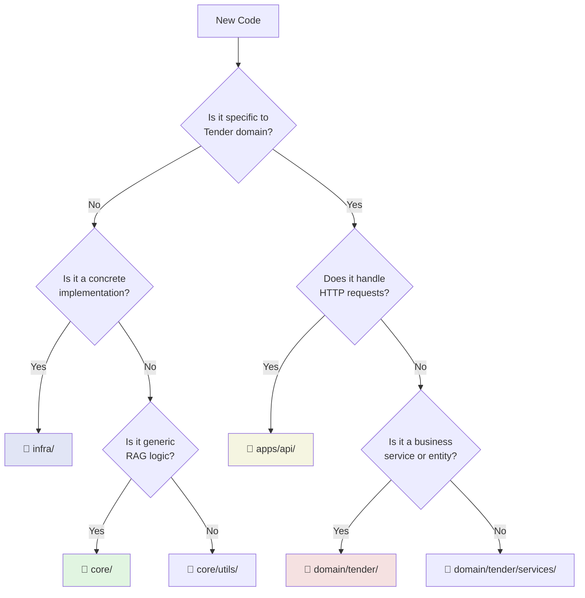

# 📚 Tender-RAG-Lab Documentation

> **Comprehensive documentation for a production-grade RAG system for Italian procurement documents**

Welcome to the Tender-RAG-Lab documentation. This guide will help you understand the architecture, set up the system, and contribute effectively.

---

## 🎯 Quick Navigation

### 🚀 Getting Started
- **[Quick Start Guide](guides/quickstart.md)** - Get up and running in 10 minutes
- **[Environment Setup](guides/environment-setup.md)** - Complete environment configuration
- **[Local Development](guides/local-development.md)** - Development workflow and tools

### 🏗️ Architecture
- **[Architecture Overview](architecture/overview.md)** - Clean architecture principles
- **[Layer Responsibilities](architecture/layers.md)** - Understanding the 4-layer design
- **[Design Decisions](architecture/decisions.md)** - Why we built it this way
- **[File Placement Guide](architecture/where-to-put-code.md)** ⭐ - Decision tree for new code

### 🧠 Core Layer (Generic RAG Engine)
- **[Core Overview](core/README.md)** - Reusable RAG components
- **[Chunking](core/chunking.md)** - Document chunking strategies
- **[Embedding](core/embedding.md)** - Embedding provider abstractions
- **[LLM](core/llm.md)** - LLM client abstractions
- **[Indexing](core/indexing.md)** - Vector store abstractions
- **[Ingestion](core/ingestion.md)** - Document parsing abstractions
- **[RAG Pipeline](core/rag.md)** - RAG orchestration

### 🔌 Infrastructure Layer (Concrete Implementations)
- **[Infrastructure Overview](infra/README.md)** - Vendor integrations
- **[Milvus Setup](infra/milvus.md)** - Vector database configuration
- **[Document Parsers](infra/parsers.md)** - PDF/DOCX parsing
- **[Factory Patterns](infra/factories.md)** - Dependency injection
- **[Adding Integrations](infra/adding-integrations.md)** - Extension guide

### 💼 Domain Layer (Business Logic)
- **[Domain Overview](domain/README.md)** - Tender-specific logic
- **[Entities & Models](domain/entities.md)** - Database schema
- **[Services](domain/services.md)** - Business operations
- **[Search Strategies](domain/search.md)** - Domain-specific search
- **[Indexing](domain/indexing.md)** - Domain-specific indexing

### 🌐 Application Layer (API & UI)
- **[Application Overview](apps/README.md)** - HTTP layer
- **[API Endpoints](apps/api-endpoints.md)** - REST API documentation
- **[Dependency Injection](apps/dependency-injection.md)** - Service providers
- **[Admin UI](apps/admin-ui.md)** - Milvus explorer

### 📖 Operational Guides
- **[Database Migrations](guides/database-migrations.md)** - Schema evolution
- **[Deployment](guides/deployment.md)** - Production deployment
- **[Monitoring](guides/monitoring.md)** - Observability setup
- **[Configuration](guides/configuration.md)** - Settings management

### 🔄 Migration Guides
- **[Index Refactor](migrations/index-refactor.md)** - Core indexing migration
- **[Ingestion Refactor](migrations/ingestion-refactor.md)** - Parsing migration
- **[Index Summary](migrations/index-summary.md)** - Refactor summary
- **[Ingestion Summary](migrations/ingestion-summary.md)** - Refactor summary

### 🔧 API Reference
- **[REST API](api/rest-api.md)** - Complete API reference
- **[Error Codes](api/error-codes.md)** - Error handling

---

## 🗺️ "Where Do I Put This?" Decision Tree



### Quick Rules

| What I'm Adding | Where It Goes | Example File |
|----------------|---------------|--------------|
| Abstract Protocol/Interface | `core/` | `core/embedding/base.py` |
| Milvus/Pinecone implementation | `infra/vectorstores/` | `infra/vectorstores/milvus/service.py` |
| PDF/DOCX parser | `infra/parsers/` | `infra/parsers/pdf/parser.py` |
| Tender/Lot entity | `domain/tender/entities/` | `domain/tender/entities/tenders.py` |
| CRUD service | `domain/tender/services/` | `domain/tender/services/tenders.py` |
| FastAPI router | `apps/api/routers/` | `src/api/routers/tenders.py` |
| HTTP request/response | `apps/api/schemas/` | (planned for apps layer) |
| Generic utility | `core/utils/` | `core/utils/file_utils.py` |

---

## 📚 Reading Paths

### Path 1: New Developer Onboarding (30 min)

1. [Quick Start Guide](guides/quickstart.md) (5 min)
2. [Architecture Overview](architecture/overview.md) (10 min)
3. [Layer Responsibilities](architecture/layers.md) (10 min)
4. [Local Development](guides/local-development.md) (5 min)

### Path 2: Contributing to Core (45 min)

1. [Core Overview](core/README.md) (5 min)
2. [Design Decisions](architecture/decisions.md) (10 min)
3. [RAG Pipeline](core/rag.md) (15 min)
4. [Indexing](core/indexing.md) (10 min)
5. [File Placement Guide](architecture/where-to-put-code.md) (5 min)

### Path 3: Adding Domain Features (30 min)

1. [Domain Overview](domain/README.md) (5 min)
2. [Entities & Models](domain/entities.md) (10 min)
3. [Services](domain/services.md) (10 min)
4. [API Endpoints](apps/api-endpoints.md) (5 min)

### Path 4: Production Deployment (60 min)

1. [Environment Setup](guides/environment-setup.md) (15 min)
2. [Database Migrations](guides/database-migrations.md) (10 min)
3. [Milvus Setup](infra/milvus.md) (15 min)
4. [Deployment](guides/deployment.md) (15 min)
5. [Monitoring](guides/monitoring.md) (5 min)

---

## 🎓 Key Concepts

### Clean Architecture Principles

This project strictly follows **Clean Architecture** with 4 layers:

```
apps (HTTP) → domain (Business) → infra (Vendors) → core (Abstractions)
                                                    ↑
                                            No dependencies!
```

**Core Rule:** `core/` has ZERO dependencies on other layers. It defines abstractions that others implement.

### Dependency Injection via Factories

We use **factory functions** instead of frameworks for simplicity and explicitness.

**Factory Pattern:**
- Factories live in `infra/` layer
- Return configured service instances
- Handle environment-based configuration
- Used by `apps/api/providers.py` for singleton caching

### Protocol-Based Design

We use Python **Protocols** (structural typing) for maximum flexibility:

**Benefits:**
- No inheritance required
- Duck typing with type safety
- Easy to mock in tests
- Implementations can be swapped without code changes

---

## 🤝 Contributing

When adding new features:

1. **Read** [File Placement Guide](architecture/where-to-put-code.md)
2. **Check** if abstraction exists in `core/`
3. **Implement** concrete version in `infra/`
4. **Wire** in domain services if domain-specific
5. **Expose** via API routers in `apps/`
6. **Update** relevant documentation

---

## 📋 Documentation Status

| Section | Status | Last Updated |
|---------|--------|--------------|
| Master Index | ✅ Complete | 2025-12-18 |
| Architecture | 🟡 In Progress | 2025-12-18 |
| Core Layer | 🟡 In Progress | 2025-12-18 |
| Infra Layer | 🟡 In Progress | 2025-12-18 |
| Domain Layer | 🟡 In Progress | 2025-12-18 |
| Apps Layer | 🟡 In Progress | 2025-12-18 |
| Guides | 🟡 In Progress | 2025-12-18 |
| API Reference | ⚪ Planned | - |
| Migration Guides | ✅ Complete | 2025-12-18 |

Legend: ✅ Complete | 🟡 In Progress | ⚪ Planned

---

**[📖 Back to Main README](../README.md)**
