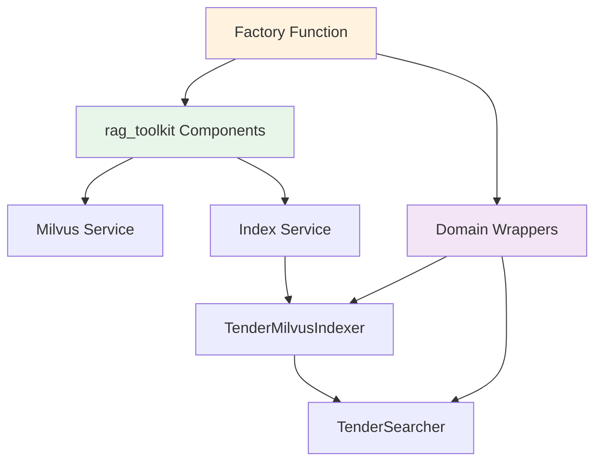

# Infrastructure Factory API

Factory functions for creating domain-specific infrastructure components.

## create_tender_stack

Creates tender-specific indexer and searcher:

```python
def create_tender_stack(
    embed_client: EmbeddingClient,
    embedding_dim: int,
    collection_name: str = "tender_chunks",
) -> Tuple[TenderMilvusIndexer, TenderSearcher]:
    """Create tender-specific infrastructure stack."""
    ...

## Usage Examples

### Basic Usage

```python
from src.infra.factory import create_tender_stack
from rag_toolkit.infra.embedding import OllamaEmbeddingClient

# Initialize embedding client
embed_client = OllamaEmbeddingClient()
embedding_dim = len(embed_client.embed("test"))

# Create tender-specific stack
indexer, searcher = create_tender_stack(
    embed_client=embed_client,
    embedding_dim=embedding_dim,
    collection_name="tender_chunks"
)

# Use indexer
await indexer.index(chunks)

# Use searcher
results = await searcher.search("requirements", top_k=10)
```

### With Dependency Injection

```python
# src/api/deps.py
from src.infra.factory import create_tender_stack
from rag_toolkit.infra.embedding import OllamaEmbeddingClient

def get_tender_indexer():
    """FastAPI dependency for indexer."""
    embed_client = OllamaEmbeddingClient()
    embedding_dim = len(embed_client.embed("test"))
    
    indexer, _ = create_tender_stack(embed_client, embedding_dim)
    return indexer

# In router
@router.post("/index")
async def index_doc(
    file: UploadFile,
    indexer = Depends(get_tender_indexer)
):
    return await indexer.index(file)
```

## Factory Pattern Benefits

1. **Centralized Configuration** - All infrastructure setup in one place
2. **Easy Testing** - Inject mock components
3. **Separation of Concerns** - Infrastructure details hidden from domain
4. **Consistent Initialization** - Same setup across application

## Architecture



## See Also

- [rag_toolkit Integration](../../architecture/rag-toolkit.md) - Generic components
- [Clean Architecture](../../architecture/clean-architecture.md) - Design principles
- [Tender Services](../domain/services.md) - Domain layer usage
