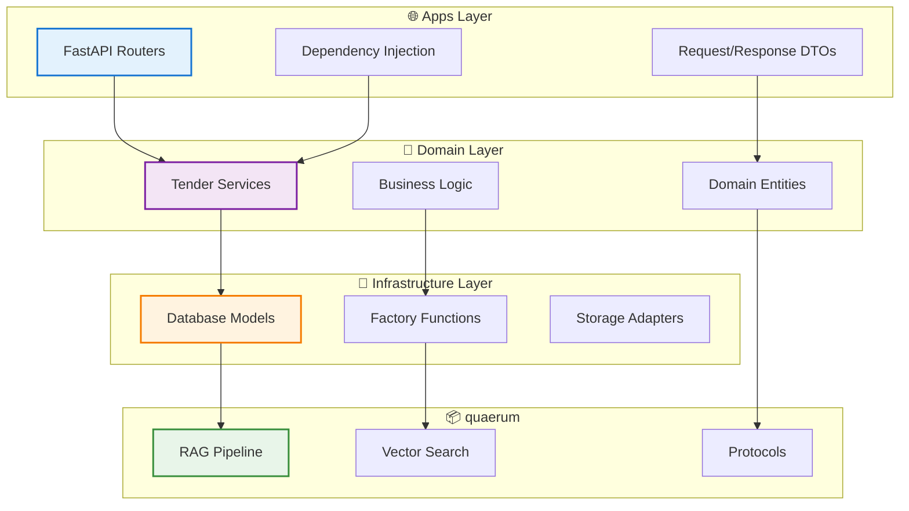

# Clean Architecture

!!! abstract "Overview"
    Tender-RAG-Lab follows **Clean Architecture** principles for maintainability, testability, and flexibility.
    
    This ensures the codebase remains **easy to understand**, **simple to modify**, and **ready to scale**.

---

## :material-layers-triple: Four-Layer Design



### Layer Summary

| Layer | Purpose | Examples |
|-------|---------|----------|
| 🌐 **Apps** | HTTP interface | FastAPI routers, auth middleware |
| 💼 **Domain** | Business logic | TenderService, validation rules |
| 🔌 **Infrastructure** | Technical adapters | DB models, factories, Milvus client |
| 📦 **quaerum** | Generic RAG | Protocols, pipeline, chunking |

---

## Layer Responsibilities

### :material-web: 1. Apps Layer (`src/api/`)

!!! info "Purpose"
    HTTP interface and request handling

=== "✅ Contains"

    - :material-api: **FastAPI routers** — HTTP endpoints
    - :material-file-code: **Request/Response schemas** — HTTP DTOs
    - :material-shield-lock: **Authentication middleware** — JWT, OAuth
    - :material-needle: **Dependency injection setup** — Service providers
    
    ```python title="src/api/routers/documents.py"
    from fastapi import APIRouter, Depends
    from src.domain.tender.services.documents import DocumentService
    
    router = APIRouter()
    
    @router.post("/documents/upload")
    async def upload_document(
        file: UploadFile,
        service: DocumentService = Depends(get_document_service)
    ):
        """Thin router — delegates to domain service."""
        return await service.upload(file)
    ```

=== "❌ Cannot"

    - Contain business logic
    - Access databases directly
    - Know about vector stores or embeddings
    
    ```python
    # ❌ BAD: Logic in router
    @router.post("/documents")
    async def upload(file: UploadFile):
        chunks = parse_pdf(file)  # NO!
        vectors = embed(chunks)   # NO!
        return {"status": "ok"}
    
    # ✅ GOOD: Delegate to service
    @router.post("/documents")
    async def upload(
        file: UploadFile,
        service: DocumentService = Depends()
    ):
        return await service.upload(file)
    ```

---

### :material-briefcase: 2. Domain Layer (`src/domain/tender/`)

!!! info "Purpose"
    Business logic and workflows

=== "✅ Contains"

    - :material-cog-outline: **Domain services** — Business operations
    - :material-file-document: **Business entities** — Domain models
    - :material-check-circle: **Validation rules** — Business constraints
    - :material-play-network: **Orchestration logic** — Workflow coordination
    
    ```python title="src/domain/tender/services/documents.py"
    class DocumentService:
        """Tender document management with business logic."""
        
        def __init__(self, indexer: TenderMilvusIndexer):
            self.indexer = indexer
        
        async def upload(self, file: UploadFile) -> Document:
            # ✅ Business logic here
            self._validate_file(file)
            chunks = await self._parse_and_chunk(file)
            await self.indexer.index(chunks)
            return self._save_metadata(file, chunks)
    ```

=== "❌ Cannot"

    - Import from Apps (FastAPI, HTTP)
    - Access databases directly
    - Know about Milvus/vector stores (use interfaces)
    
    ```python
    # ❌ BAD: Importing from API
    from fastapi import APIRouter  # NO!
    from src.api.routers import documents  # NO!
    
    # ❌ BAD: Direct database access
    from pymilvus import connections  # NO!
    session.query(Document).all()  # NO!
    ```

---

### :material-database: 3. Infrastructure Layer (`src/infra/`)

!!! info "Purpose"
    Technical implementation and adapters

=== "✅ Contains"

    - :material-database-cog: **Database models** — SQLAlchemy ORM
    - :material-factory: **Factory functions** — Component creation
    - :material-connection: **Storage adapters** — External service clients
    - :material-cog: **External service clients** — Milvus, Supabase, etc.
    
    ```python title="src/infra/factory.py"
    def create_tender_stack(
        embed_client: EmbeddingClient,
        embedding_dim: int,
    ) -> Tuple[TenderMilvusIndexer, TenderSearcher]:
        """Create infrastructure components."""
        milvus_service = create_milvus_service()
        index_service = create_index_service(...)
        
        indexer = TenderMilvusIndexer(index_service=index_service)
        searcher = TenderSearcher(indexer=indexer)
        
        return indexer, searcher
    ```

=== "❌ Cannot"

    - Import from Domain or Apps
    - Contain business logic
    
    ```python
    # ❌ BAD: Infrastructure importing domain
    from src.domain.tender.services import TenderService  # NO!
    ```

---

### :material-package-variant: 4. quaerum (External Library)

!!! info "Purpose"
    Generic RAG components (reusable across projects)

=== "✅ Contains"

    - :material-protocol: **Protocol definitions** — `EmbeddingClient`, `ChunkLike`
    - :material-pipeline: **RAG pipeline** — Query, retrieve, generate
    - :material-magnify: **Vector search strategies** — Hybrid, semantic, keyword
    - :material-file-document-multiple: **Chunking algorithms** — Dynamic, token-based
    
    ```python
    from quaerum.rag import RagPipeline
    from quaerum.core.embedding import EmbeddingClient
    ```

=== "❌ Cannot"

    - Have dependencies on app code
    - Contain domain-specific logic
    
    !!! quote "Zero Dependencies Rule"
        quaerum is **protocol-based** and has **zero knowledge** of tender, medical, or legal domains.

---

## :material-arrow-decision: Dependency Rules

!!! success "✅ Allowed Dependencies"

    ```python
    # Apps → Domain
    from src.domain.tender.services.documents import DocumentService
    
    # Domain → Infrastructure (via interfaces)
    from src.infra.factory import create_tender_stack
    
    # Domain → quaerum
    from quaerum.core.embedding import EmbeddingClient
    
    # Infrastructure → quaerum
    from quaerum.infra.vectorstores.factory import create_milvus_service
    ```

!!! danger "❌ Forbidden Dependencies"

    ```python
    # Infrastructure importing Domain ❌
    from src.domain.tender.services import TenderService  # NO!
    
    # Domain importing Apps ❌
    from src.api.routers import documents  # NO!
    
    # quaerum importing app code ❌
    from src.domain import anything  # NO!
    ```

---

## :material-protocol: Protocol-Based Design

!!! abstract "Protocol Pattern"
    quaerum uses **Protocols** (structural typing) for extensibility without inheritance coupling.

=== "Generic Protocol"

    ```python
    # quaerum defines generic protocol
    from quaerum.core.chunking.types import ChunkLike
    
    @dataclass
    class ChunkLike(Protocol):
        id: str
        text: str
        # ... generic fields
        
        def to_dict(self) -> Dict[str, Any]:
            ...
    ```

=== "Domain Extension"

    ```python
    # Domain extends with specific fields
    @dataclass
    class TenderChunk:
        # ✅ Protocol fields
        id: str
        text: str
        
        # 🎯 Tender-specific extensions
        tender_id: str
        lot_id: Optional[str]
        section_type: str
        
        def to_dict(self) -> Dict[str, Any]:
            return asdict(self)
    ```

!!! success "Benefits"
    - ✅ No inheritance coupling
    - ✅ Duck typing compatibility
    - ✅ Easy to extend without modifying library
    - ✅ Type-safe at static analysis time

---

## :material-factory: Factory Pattern

!!! tip "Centralized Component Creation"
    Domain-specific components are created via **factories** that wrap quaerum.

```python title="src/infra/factory.py" hl_lines="8-10 17-20"
from quaerum.infra.vectorstores.factory import create_milvus_service, create_index_service

def create_tender_stack(
    embed_client: EmbeddingClient,
    embedding_dim: int,
) -> Tuple[TenderMilvusIndexer, TenderSearcher]:
    # 1️⃣ Create generic quaerum components
    milvus_service = create_milvus_service()
    index_service = create_index_service(...)
    
    # 2️⃣ Wrap with domain-specific logic
    indexer = TenderMilvusIndexer(
        index_service=index_service,
        # ... tender-specific config
    )
    
    searcher = TenderSearcher(
        indexer=indexer,
        embed_client=embed_client,
    )
    
    return indexer, searcher
```

!!! success "Benefits"
    - ✅ Centralized configuration
    - ✅ Easy to test (inject mocks)
    - ✅ Clear separation of concerns
    - ✅ Single source of truth

---

## :material-test-tube: Testing Strategy

!!! info "Each Layer Has Different Testing Needs"

=== "🌐 Apps Layer"

    **Integration tests with TestClient**
    
    ```python
    from fastapi.testclient import TestClient
    
    def test_upload_endpoint(client: TestClient):
        response = client.post(
            "/documents/upload",
            files={"file": ("test.pdf", pdf_bytes)}
        )
        assert response.status_code == 200
        assert "id" in response.json()
    ```

=== "💼 Domain Layer"

    **Unit tests with mocked infrastructure**
    
    ```python
    from unittest.mock import Mock
    
    def test_document_service():
        # Mock infrastructure
        mock_indexer = Mock(spec=TenderMilvusIndexer)
        service = DocumentService(indexer=mock_indexer)
        
        # Test business logic
        document = service.upload(file)
        
        # Verify interactions
        mock_indexer.index.assert_called_once()
    ```

=== "🔌 Infrastructure Layer"

    **Integration tests with real services**
    
    ```python
    def test_milvus_indexer():
        # Real Milvus connection
        indexer, _ = create_tender_stack(...)
        
        # Index real chunks
        indexer.index(chunks)
        
        # Verify stored correctly
        results = indexer.search(query)
        assert len(results) > 0
    ```

---

## :material-star: Benefits

<div class="grid cards" markdown>

-   :material-test-tube:{ .lg } **Testability**

    ---

    Mock dependencies easily, test business logic in isolation, fast unit tests

-   :material-swap-horizontal:{ .lg } **Flexibility**

    ---

    Swap implementations (Milvus → Qdrant), change UI (FastAPI → gRPC), no ripple effects

-   :material-wrench:{ .lg } **Maintainability**

    ---

    Clear boundaries, Single Responsibility Principle, easy to navigate codebase

-   :material-sync:{ .lg } **Reusability**

    ---

    quaerum reusable across projects, domain logic portable, infrastructure adapters swappable

</div>

---

## :material-alert: Common Pitfalls

!!! danger "Anti-Pattern: Business Logic in Apps"
    ```python
    # ❌ BAD: Logic in router
    @router.post("/documents/upload")
    async def upload(file: UploadFile):
        chunks = parse_document(file)  # Logic here!
        embed_chunks(chunks)
        return {"status": "ok"}
    ```
    
    ```python
    # ✅ GOOD: Delegate to service
    @router.post("/documents/upload")
    async def upload(
        file: UploadFile,
        service: DocumentService = Depends()
    ):
        return await service.upload(file)
    ```

!!! danger "Anti-Pattern: Infrastructure in Domain"
    ```python
    # ❌ BAD: Direct DB access in service
    class TenderService:
        def get_tender(self, id: str):
            return session.query(TenderORM).filter_by(id=id).first()
    ```
    
    ```python
    # ✅ GOOD: Use repository/factory
    class TenderService:
        def __init__(self, repository: TenderRepository):
            self.repo = repository
        
        def get_tender(self, id: str):
            return self.repo.find_by_id(id)
    ```

---

## :material-book-open: See Also

<div class="grid cards" markdown>

-   :material-package-variant:{ .lg } **quaerum Integration**

    ---

    [:octicons-arrow-right-24: How generic components work](rag-toolkit.md)

-   :material-layers-outline:{ .lg } **Architecture Overview**

    ---

    [:octicons-arrow-right-24: High-level system design](overview.md)

-   :material-api:{ .lg } **API Reference**

    ---

    [:octicons-arrow-right-24: Code documentation](../api/core/embedding.md)

</div>

---

<div align="center">

**[← Architecture Overview](overview.md)** | **[quaerum Integration →](rag-toolkit.md)**

*Last updated: 2026-01-05*

</div>
