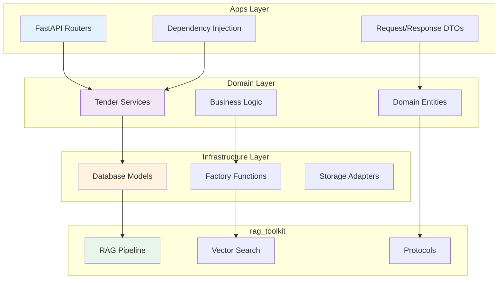

# Clean Architecture

Tender-RAG-Lab follows **Clean Architecture** principles for maintainability, testability, and flexibility.

## Four-Layer Design



## Layer Responsibilities

### 1. Apps Layer (`src/api/`)

**Purpose:** HTTP interface and request handling

**Contains:**
- FastAPI routers
- Request/Response schemas
- Authentication middleware
- Dependency injection setup

**Rules:**
- ✅ Can import from: Domain, Infrastructure, rag_toolkit
- ❌ Cannot: Contain business logic
- ❌ Cannot: Access databases directly

**Example:**
```python
# src/api/routers/documents.py
from fastapi import APIRouter, Depends
from src.domain.tender.services.documents import DocumentService

router = APIRouter()

@router.post("/documents/upload")
async def upload_document(
    file: UploadFile,
    service: DocumentService = Depends(get_document_service)
):
    return await service.upload(file)
```

### 2. Domain Layer (`src/domain/tender/`)

**Purpose:** Business logic and workflows

**Contains:**
- Domain services
- Business entities
- Validation rules
- Orchestration logic

**Rules:**
- ✅ Can import from: Infrastructure (interfaces only), rag_toolkit
- ❌ Cannot: Import from Apps
- ❌ Cannot: Know about HTTP, databases directly

**Example:**
```python
# src/domain/tender/services/documents.py
class DocumentService:
    """Tender document management with business logic."""
    
    def __init__(self, indexer: TenderMilvusIndexer):
        self.indexer = indexer
    
    async def upload(self, file: UploadFile) -> Document:
        # Business logic here
        chunks = await self.parse_and_chunk(file)
        await self.indexer.index(chunks)
        return document
```

### 3. Infrastructure Layer (`src/infra/`)

**Purpose:** Technical implementation and adapters

**Contains:**
- Database models (SQLAlchemy)
- Factory functions
- Storage adapters
- External service clients

**Rules:**
- ✅ Can import from: rag_toolkit
- ❌ Cannot: Import from Domain or Apps
- ❌ Cannot: Contain business logic

**Example:**
```python
# src/infra/factory.py
def create_tender_stack(
    embed_client: EmbeddingClient,
    embedding_dim: int,
) -> Tuple[TenderMilvusIndexer, TenderSearcher]:
    """Create infrastructure components."""
    milvus_service = create_milvus_service()
    index_service = create_index_service(...)
    
    indexer = TenderMilvusIndexer(index_service=index_service)
    searcher = TenderSearcher(indexer=indexer)
    
    return indexer, searcher
```

### 4. rag_toolkit (External Library)

**Purpose:** Generic RAG components (reusable across projects)

**Contains:**
- Protocol definitions
- RAG pipeline
- Vector search strategies
- Chunking algorithms

**Rules:**
- ✅ Zero dependencies on app code
- ✅ Protocol-based for extensibility
- ❌ No domain-specific logic

## Dependency Rules

### ✅ Allowed Dependencies

```python
# Apps → Domain
from src.domain.tender.services.documents import DocumentService

# Domain → Infrastructure (via interfaces)
from src.infra.factory import create_tender_stack

# Domain → rag_toolkit
from rag_toolkit.core.embedding import EmbeddingClient

# Infrastructure → rag_toolkit
from rag_toolkit.infra.vectorstores.factory import create_milvus_service
```

### ❌ Forbidden Dependencies

```python
# Infrastructure importing Domain ❌
from src.domain.tender.services import TenderService  # NO!

# Domain importing Apps ❌
from src.api.routers import documents  # NO!

# rag_toolkit importing app code ❌
from src.domain import anything  # NO!
```

## Protocol-Based Design

rag_toolkit uses **Protocols** (structural typing) for extensibility:

```python
# rag_toolkit defines generic protocol
from rag_toolkit.core.chunking.types import ChunkLike

@dataclass
class ChunkLike(Protocol):
    id: str
    text: str
    # ... generic fields

# Domain extends with specific fields
@dataclass
class TenderChunk:
    # Protocol fields
    id: str
    text: str
    
    # Tender-specific extensions
    tender_id: str
    lot_id: Optional[str]
    section_type: str
```

**Benefits:**
- No inheritance coupling
- Duck typing compatibility
- Easy to extend without modifying library

## Factory Pattern

Domain-specific components are created via **factories**:

```python
# src/infra/factory.py
def create_tender_stack(...):
    # 1. Create generic rag_toolkit components
    milvus_service = create_milvus_service()
    
    # 2. Wrap with domain-specific logic
    indexer = TenderMilvusIndexer(
        index_service=index_service,
        # ... tender-specific config
    )
    
    return indexer, searcher
```

**Benefits:**
- Centralized configuration
- Easy to test (inject mocks)
- Clear separation of concerns

## Testing Strategy

Each layer has different testing needs:

### Apps Layer
```python
# Integration tests with TestClient
from fastapi.testclient import TestClient

def test_upload_endpoint(client: TestClient):
    response = client.post("/documents/upload", files=...)
    assert response.status_code == 200
```

### Domain Layer
```python
# Unit tests with mocked infrastructure
def test_document_service():
    mock_indexer = Mock(spec=TenderMilvusIndexer)
    service = DocumentService(indexer=mock_indexer)
    
    document = service.upload(file)
    mock_indexer.index.assert_called_once()
```

### Infrastructure Layer
```python
# Integration tests with real services
def test_milvus_indexer():
    indexer = create_tender_stack(...)
    indexer.index(chunks)
    
    results = indexer.search(query)
    assert len(results) > 0
```

## Benefits

### 1. Testability
- Mock dependencies easily
- Test business logic in isolation
- Fast unit tests

### 2. Flexibility
- Swap implementations (Milvus → Qdrant)
- Change UI (FastAPI → gRPC)
- No ripple effects

### 3. Maintainability
- Clear boundaries
- Single Responsibility Principle
- Easy to navigate codebase

### 4. Reusability
- rag_toolkit reusable across projects
- Domain logic portable
- Infrastructure adapters swappable

## Common Pitfalls

!!! danger "Anti-Pattern: Business Logic in Apps"
    ```python
    # ❌ BAD: Logic in router
    @router.post("/documents/upload")
    async def upload(file: UploadFile):
        chunks = parse_document(file)  # Logic here!
        embed_chunks(chunks)
        return {"status": "ok"}
    ```
    
    ```python
    # ✅ GOOD: Delegate to service
    @router.post("/documents/upload")
    async def upload(
        file: UploadFile,
        service: DocumentService = Depends()
    ):
        return await service.upload(file)
    ```

!!! danger "Anti-Pattern: Infrastructure in Domain"
    ```python
    # ❌ BAD: Direct DB access in service
    class TenderService:
        def get_tender(self, id: str):
            return session.query(TenderORM).filter_by(id=id).first()
    ```
    
    ```python
    # ✅ GOOD: Use repository/factory
    class TenderService:
        def __init__(self, repository: TenderRepository):
            self.repo = repository
        
        def get_tender(self, id: str):
            return self.repo.find_by_id(id)
    ```

## See Also

- [rag_toolkit Integration](rag-toolkit.md) - How generic components work
- [Architecture Overview](overview.md) - High-level system design
- [API Reference](../api/core/embedding.md) - Code documentation
