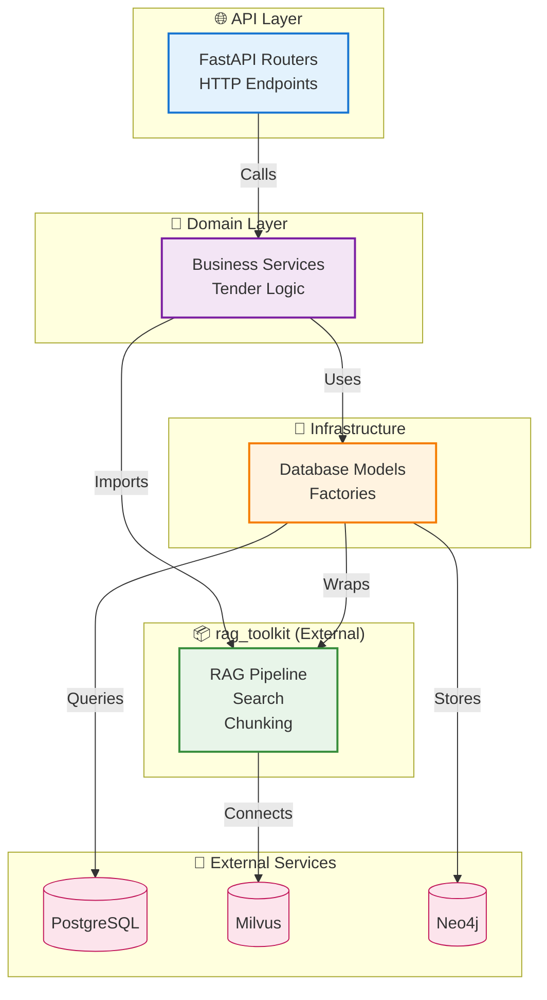
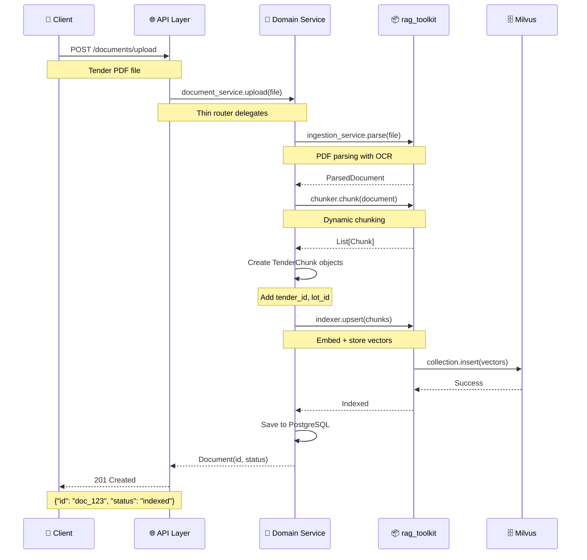
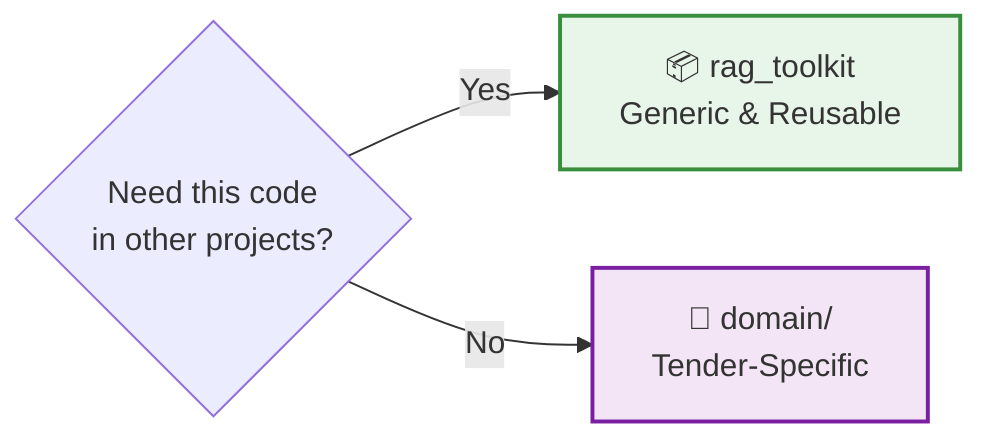

# Architecture Overview

<div class="grid cards" markdown>

-   :material-layers-outline:{ .lg .middle } __Clean Architecture__

    ---

    Four-layer design with strict separation of concerns, protocol-based extensibility, and zero vendor lock-in

    [:octicons-arrow-right-24: Learn more](#design-philosophy)

-   :material-package-variant:{ .lg .middle } __rag_toolkit Integration__

    ---

    Generic RAG components in external library, domain-specific code stays modular and testable

    [:octicons-arrow-right-24: See integration](rag-toolkit.md)

-   :material-chevron-triple-up:{ .lg .middle } __Maximum Reusability__

    ---

    Share RAG logic across projects without code duplication

    [:octicons-arrow-right-24: View patterns](#the-four-layers)

-   :material-lock-open-variant:{ .lg .middle } __Zero Lock-in__

    ---

    Swap implementations (Milvus → Qdrant, FastAPI → gRPC) with minimal changes

    [:octicons-arrow-right-24: See examples](#example-document-upload-flow)

</div>

---

## Design Philosophy

!!! quote "Core Principles"
    This architecture is built on **four fundamental principles** that guide every design decision:

=== "Maximum Reusability"

    **Generic RAG logic lives in rag_toolkit library**
    
    ```python
    # ✅ Reusable across projects
    from rag_toolkit.rag import RagPipeline
    from rag_toolkit.core.embedding import EmbeddingClient
    ```
    
    If you need it in multiple projects, it belongs in `rag_toolkit`.

=== "Clear Separation"

    **Generic vs domain-specific code**
    
    ```mermaid
    graph LR
        A[rag_toolkit<br/>Generic] -.->|"Used by"| B[Tender-RAG<br/>Domain]
        A -.->|"Used by"| C[Medical-RAG<br/>Domain]
        A -.->|"Used by"| D[Legal-RAG<br/>Domain]
        
        style A fill:#e8f5e9
        style B fill:#fff3e0
        style C fill:#fff3e0
        style D fill:#fff3e0
    ```

=== "Zero Lock-in"

    **Easy migration without painful refactors**
    
    | What Changes | Impact |
    |--------------|--------|
    | Vector DB (Milvus → Qdrant) | Update 1 factory |
    | LLM Provider (Ollama → OpenAI) | Change 1 client |
    | Framework (FastAPI → gRPC) | Replace API layer |
    
    Clean interfaces = minimal ripple effects.

=== "Protocol-Based"

    **Duck typing with type safety**
    
    ```python
    from typing import Protocol
    
    class ChunkLike(Protocol):
        id: str
        text: str
        
        def to_dict(self) -> dict: ...
    
    # Any class matching this shape works ✅
    @dataclass
    class TenderChunk:
        id: str
        text: str
        tender_id: str  # Domain extension
        
        def to_dict(self) -> dict:
            return asdict(self)
    ```

!!! danger "Architectural Rules Are Enforced"
    Violating these principles leads to:
    
    - :material-link-variant: Tight coupling
    - :material-lock: Vendor lock-in  
    - :material-currency-usd: Technical debt
    
    **The structure is intentional. Follow it.**

---

## High-Level Architecture



### Project Structure

```bash title="src/"
src/
├── 🌐 api/           # FastAPI routers, deps, auth
├── 💼 domain/        # Tender services, entities, schemas  
├── 🔌 infra/         # Factories, DB models, adapters
└── 📦 rag_toolkit/   # (External library)
    ├── core/         # Protocols, chunking, embedding
    ├── rag/          # Pipeline, rerankers, assembler
    └── infra/        # Vector stores, parsers, LLMs
```

### Dependency Rules

!!! success "Allowed Dependencies"
    
    === "API → Domain"
        ```python
        from src.domain.tender.services import TenderService
        ```
        API calls domain services for business logic.
    
    === "Domain → Infrastructure"
        ```python
        from src.infra.factory import create_tender_stack
        ```
        Domain uses factories for infrastructure.
    
    === "Domain → rag_toolkit"
        ```python
        from rag_toolkit.rag import RagPipeline
        from rag_toolkit.core.embedding import EmbeddingClient
        ```
        Domain imports generic RAG components.
    
    === "Infrastructure → rag_toolkit"
        ```python
        from rag_toolkit.infra.vectorstores.factory import create_milvus_service
        ```
        Infrastructure wraps rag_toolkit services.

!!! danger "Forbidden Dependencies"
    
    === "❌ Infrastructure → Domain"
        ```python
        # ❌ NEVER DO THIS
        from src.domain.tender.services import TenderService
        ```
        Infrastructure must not import business logic.
    
    === "❌ Domain → API"
        ```python
        # ❌ NEVER DO THIS  
        from src.api.routers import documents
        from fastapi import APIRouter
        ```
        Domain must not know about HTTP.
    
    === "❌ rag_toolkit → Application"
        ```python
        # ❌ NEVER DO THIS
        from src.domain import anything
        ```
        External library must stay generic.

---

## :material-package-variant: rag_toolkit Library — Generic RAG Engine

!!! abstract "Purpose"
    Generic, reusable RAG components with **zero domain knowledge** and **zero vendor lock-in**.
    
    Think of it as a "standard library" for RAG systems.

### What rag_toolkit Provides

<div class="grid cards" markdown>

-   :material-protocol:{ .lg } **Protocols**
    
    ---
    
    `EmbeddingClient`, `LLMClient`, `ChunkLike`, `TokenChunkLike`
    
    Type-safe interfaces for extensibility

-   :material-file-document-multiple:{ .lg } **Chunking**
    
    ---
    
    `DynamicChunker`, `TokenChunker`
    
    Smart document segmentation strategies

-   :material-database-search:{ .lg } **Vector Stores**
    
    ---
    
    Milvus, Qdrant integration
    
    Factory pattern for easy swapping

-   :material-pipeline:{ .lg } **RAG Pipeline**
    
    ---
    
    Query rewriting, search, reranking, generation
    
    End-to-end RAG orchestration

-   :material-magnify:{ .lg } **Search Strategies**
    
    ---
    
    Vector, keyword, hybrid search
    
    Pluggable retrieval algorithms

-   :material-file-code:{ .lg } **Parsers**
    
    ---
    
    PDF/DOCX with OCR support
    
    Docling-based document ingestion

</div>

### Integration in Tender-RAG-Lab

!!! tip "Extension Pattern"
    Tender-RAG-Lab **extends** rag_toolkit with domain-specific customizations:

=== "Domain Chunks"

    ```python
    from rag_toolkit.core.chunking.types import ChunkLike
    
    @dataclass
    class TenderChunk:
        """Implements ChunkLike with tender fields."""
        # Protocol fields
        id: str
        text: str
        
        # 🎯 Tender-specific extensions
        tender_id: str
        lot_id: Optional[str]
        section_type: str
    ```

=== "Domain Indexer"

    ```python
    from rag_toolkit.core.index.service import IndexService
    
    class TenderMilvusIndexer:
        """Wraps IndexService with tender schema."""
        def __init__(self, index_service: IndexService):
            self.index_service = index_service
        
        def index(self, tender_chunks: List[TenderChunk]):
            # Tender-specific indexing logic
            ...
    ```

=== "Domain Searcher"

    ```python
    class TenderSearcher:
        """Facade for tender-specific search."""
        def search(self, query: str, filters: TenderFilters):
            # Orchestrate vector + keyword + reranking
            ...
    ```

=== "Factories"

    ```python
    def create_tender_stack(
        embed_client: EmbeddingClient,
        embedding_dim: int,
    ) -> Tuple[TenderMilvusIndexer, TenderSearcher]:
        """Complete tender stack with config."""
        # Wrap rag_toolkit components
        ...
    ```

!!! quote "Golden Rule"
    **If another project needs this code, it belongs in rag_toolkit.**
    
    Domain-specific → `src/domain/tender/`  
    Generic reusable → `rag_toolkit/`

[:octicons-arrow-right-24: Full rag_toolkit Integration Guide](rag-toolkit.md)

---

## :material-layers: The Four Layers

### :material-database: Layer 1: Infrastructure (`infra/`)

!!! info "Purpose"
    Domain-specific infrastructure including database models and factory functions.

=== "✅ Belongs Here"

    - :material-database-cog: **Database Models** — SQLAlchemy ORM for tender domain
    - :material-factory: **Factory Functions** — `create_tender_stack()`, service builders
    - :material-cog: **Configuration** — Environment-specific settings
    
    ```python title="src/infra/factory.py"
    def create_tender_stack(
        embed_client: EmbeddingClient,
        embedding_dim: int,
    ) -> Tuple[TenderMilvusIndexer, TenderSearcher]:
        """Wrap rag_toolkit with tender-specific config."""
        milvus_service = create_milvus_service()
        index_service = create_index_service(...)
        return indexer, searcher
    ```

=== "❌ Does NOT Belong"

    - Business logic
    - RAG orchestration
    - HTTP request handling
    - Generic RAG components (→ use rag_toolkit)

```bash title="Structure"
infra/
├── factory.py           # 🏭 Domain-specific factories
└── database/
    ├── connection.py    # 🔌 DB connection management
    └── models/          # 📋 SQLAlchemy models
```

!!! tip "Key Principle"
    Only **tender-specific** infrastructure lives here. Generic infra is in rag_toolkit.

---

### :material-briefcase: Layer 2: Domain (`domain/`)

!!! info "Purpose"
    Use-case specific business logic. This layer contains tender-specific implementations.

=== "✅ Belongs Here"

    - :material-file-document: **Domain Entities** — `Tender`, `Lot`, `Document` models
    - :material-cog-outline: **Business Services** — CRUD operations + domain rules
    - :material-check-circle: **Domain Validation** — Business constraints
    - :material-play-network: **Orchestration** — Coordinating infra for domain needs
    - :material-language-python: **Domain Schemas** — Pydantic DTOs
    
    ```python title="src/domain/tender/services/tenders.py"
    class TenderService:
        """Tender business logic."""
        def __init__(self, indexer: TenderMilvusIndexer):
            self.indexer = indexer
        
        async def create_tender(self, data: TenderCreate) -> Tender:
            # Business logic + validation
            tender = Tender(**data.dict())
            await self.indexer.index_tender(tender)
            return tender
    ```

=== "❌ Does NOT Belong"

    - FastAPI routers
    - HTTP Request/Response handling
    - Direct vector store or database clients
    - Generic RAG logic

```bash title="Structure"
domain/tender/
├── entities/            # 📄 SQLAlchemy models
│   ├── tenders.py
│   ├── lots.py
│   └── documents.py
├── schemas/             # 📝 Pydantic DTOs
│   ├── tenders.py
│   ├── lots.py
│   └── documents.py
├── services/            # ⚙️ Business services
│   ├── tenders.py
│   ├── lots.py
│   └── documents.py
├── search/              # 🔍 Domain-specific search
│   └── searcher.py
└── indexing/            # 📇 Domain-specific indexing
    └── indexer.py
```

!!! tip "Key Principle"
    If it's specific to **Tender business**, it belongs here.

---

### :material-web: Layer 3: Application (`api/`)

!!! info "Purpose"
    Entry points for HTTP, CLI, and UI. Coordinates services and handles external communication.

=== "✅ Belongs Here"

    - :material-api: **FastAPI Routers** — HTTP endpoints
    - :material-needle: **Dependency Injection** — `deps.py` with singletons
    - :material-shield-lock: **Authentication & Middleware** — JWT, rate limiting
    - :material-file-code: **Request/Response DTOs** — (optional, can reuse domain schemas)
    - :material-monitor-dashboard: **Admin UIs** — Milvus Explorer, monitoring dashboards
    
    ```python title="src/api/routers/documents.py"
    @router.post("/documents/upload")
    async def upload_document(
        file: UploadFile,
        service: DocumentService = Depends(get_document_service)
    ):
        """Thin router delegates to domain service."""
        return await service.upload(file)
    ```

=== "❌ Does NOT Belong"

    - Business logic
    - Direct database or vector store access
    - RAG orchestration (→ use domain services)
    - Document parsing (→ use rag_toolkit)

```bash title="Structure"
api/
├── deps.py              # 💉 FastAPI dependencies
├── providers.py         # 🎯 Singleton service providers
└── routers/
    ├── ingestion.py     # 📥 /api/ingestion/*
    ├── tenders.py       # 📋 /api/tenders
    ├── lots.py          # 🎫 /api/lots
    ├── documents.py     # 📄 /api/documents
    ├── milvus_route.py  # 🔍 /api/milvus (admin)
    └── ui.py            # 🌐 HTML page serving
```

!!! tip "Key Principle"
    Routers should be **thin**. Delegate to domain services.

---

## :material-import: Import Rules

!!! success "✅ Valid Imports"

    === "API → Domain"
        ```python
        # Apps layer calls business logic
        from src.domain.tender.services.tenders import TenderService
        ```
    
    === "Domain → rag_toolkit"
        ```python
        # Domain uses generic RAG components
        from rag_toolkit.rag import RagPipeline
        from rag_toolkit.core.chunking import DynamicChunker
        ```
    
    === "Domain → Infrastructure"
        ```python
        # Domain uses factory pattern
        from src.infra.factory import create_tender_stack
        ```
    
    === "Infrastructure → rag_toolkit"
        ```python
        # Infrastructure wraps generic services
        from rag_toolkit.infra.vectorstores.factory import create_milvus_service
        ```

!!! danger "❌ Invalid Imports"

    === "rag_toolkit → Application"
        ```python
        # ❌ External library importing app code
        from src.domain.tender.entities.tenders import Tender
        ```
        **Why?** rag_toolkit must stay generic, no domain knowledge.
    
    === "Domain → API"
        ```python
        # ❌ Business logic importing HTTP layer
        from fastapi import APIRouter
        from src.api.routers import documents
        ```
        **Why?** Domain must not know about HTTP/REST.
    
    === "API → rag_toolkit (Bypassing Domain)"
        ```python
        # ❌ API directly using generic components
        from rag_toolkit.rag import RagPipeline
        pipeline = RagPipeline(...)  # Should go through domain service!
        ```
        **Why?** API should delegate to domain, not orchestrate directly.

---

## :material-file-document-outline: Example: Document Upload Flow

!!! example "Real-World Scenario"
    User uploads a tender PDF document. System parses, chunks, embeds, and indexes it.

### Sequence Diagram



### Flow Steps

| Step | Layer | Action | Why Here? |
|------|-------|--------|-----------|
| 1️⃣ | **Client** | POST `/documents/upload` | User initiates upload |
| 2️⃣ | **API** | Delegate to `DocumentService.upload()` | Thin router, no logic |
| 3️⃣ | **Domain** | Call `rag_toolkit.parse()` | Orchestrate business flow |
| 4️⃣ | **rag_toolkit** | Parse PDF with Docling | Generic parsing logic |
| 5️⃣ | **Domain** | Chunk via `rag_toolkit.chunker` | Use generic chunking |
| 6️⃣ | **Domain** | Create `TenderChunk` with domain fields | Add tender_id, lot_id |
| 7️⃣ | **rag_toolkit** | Embed + index in Milvus | Generic vector operations |
| 8️⃣ | **Domain** | Save metadata to PostgreSQL | Tender-specific persistence |
| 9️⃣ | **API** | Return 201 Created | HTTP response |

!!! success "Key Observations"
    - ✅ **Each layer stays in its lane**
    - ✅ **API doesn't parse** (delegates to domain)
    - ✅ **Domain orchestrates** (uses rag_toolkit + infrastructure)
    - ✅ **rag_toolkit stays generic** (no tender knowledge)
    - ✅ **Clean separation** (easy to test, modify, scale)

---

## :material-label: Naming Conventions

!!! info "Naming Consistency"
    Consistent naming across layers prevents confusion when the same concept appears in multiple contexts.

| Layer | Type | Naming Convention | Example |
|-------|------|-------------------|---------|
| 💼 **Domain** | Database model | `{Entity}` | `Document` (SQLAlchemy) |
| 💼 **Domain** | Business service | `{Entity}Service` | `DocumentService` |
| 💼 **Domain** | Pydantic DTO | `{Entity}Create/Out` | `DocumentCreate`, `DocumentOut` |
| 🌐 **API** | HTTP request/response | `{Entity}Request/Response` | `DocumentRequest` |

!!! example "In Practice"
    
    ```python
    # Domain layer
    class Document(Base):  # SQLAlchemy model
        __tablename__ = "documents"
        id: str
        tender_id: str
    
    class DocumentCreate(BaseModel):  # Pydantic DTO
        title: str
        file_path: str
    
    class DocumentService:  # Business service
        def create(self, data: DocumentCreate) -> Document:
            ...
    
    # API layer
    class DocumentRequest(BaseModel):  # HTTP request
        title: str
        file: UploadFile
    
    @router.post("/documents")
    def upload(req: DocumentRequest, service: DocumentService = Depends()):
        return service.create(DocumentCreate(**req.dict()))
    ```

---

## :material-lightbulb: Core Principle

!!! quote "The Golden Rule"
    **"Domain logic changes per use case. Generic RAG components stay in rag_toolkit."**
    
    If you need something in **multiple projects**, it's not domain logic — it belongs in `rag_toolkit` library.



---

## :material-book-open: Related Documentation

<div class="grid cards" markdown>

-   :material-package-variant-closed:{ .lg } **rag_toolkit Integration**

    ---

    How to extend generic RAG components with domain-specific logic
    
    [:octicons-arrow-right-24: Integration Guide](rag-toolkit.md)

-   :material-layers-triple:{ .lg } **Clean Architecture Deep Dive**

    ---

    Detailed layer responsibilities, testing strategies, and patterns
    
    [:octicons-arrow-right-24: Clean Architecture](clean-architecture.md)

-   :material-briefcase:{ .lg } **Domain Layer**

    ---

    Tender-specific business logic, services, and entities
    
    [:octicons-arrow-right-24: Domain Documentation](../domain/README.md)

-   :material-home:{ .lg } **Main Documentation**

    ---

    Complete project documentation index
    
    [:octicons-arrow-right-24: Documentation Home](../index.md)

</div>

---

<div align="center">

**[← Back to Home](../index.md)** | **[rag_toolkit Guide →](rag-toolkit.md)**

*Last updated: 2026-01-05*

</div>
