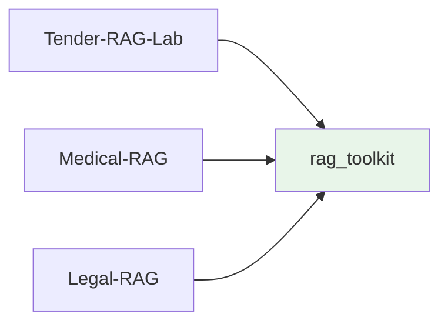

# rag_toolkit Integration

Learn how Tender-RAG-Lab integrates with **rag_toolkit** for generic RAG components.

## What is rag_toolkit?

**rag_toolkit** is a standalone Python library providing **generic, reusable RAG components** that work across different domains and use cases.



### Design Philosophy

1. **Protocol-Based** - Structural typing for flexibility
2. **Zero Domain Knowledge** - No tender/medical/legal specifics
3. **Composable** - Mix and match components
4. **Tested** - Comprehensive test coverage

## Installation

rag_toolkit is installed in **editable mode** for local development:

```bash
# Clone rag_toolkit
git clone https://github.com/yourusername/Rag-Toolkit.git

# Install in editable mode
cd Tender-RAG-Lab
uv pip install -e ../Rag-Toolkit
```

## Core Components

### 1. Protocols (Interfaces)

rag_toolkit defines **Protocols** that domain code implements:

```python
# rag_toolkit.core.chunking.types
from typing import Protocol, runtime_checkable

@runtime_checkable
class ChunkLike(Protocol):
    """Generic chunk interface."""
    id: str
    text: str
    title: str
    heading_level: int
    blocks: List[Dict[str, Any]]
    page_numbers: List[int]
    
    def to_dict(self, *, include_blocks: bool = True) -> Dict[str, Any]:
        ...
```

**Domain Extension:**

```python
# src/domain/tender/schemas/chunking.py
from rag_toolkit.core.chunking.types import ChunkLike

@dataclass
class TenderChunk:
    """Implements ChunkLike with tender-specific fields."""
    
    # Protocol fields
    id: str
    text: str
    title: str
    heading_level: int
    blocks: List[Dict[str, Any]] = field(default_factory=list)
    page_numbers: List[int] = field(default_factory=list)
    
    # Tender-specific extensions
    tender_id: str = ""
    lot_id: Optional[str] = None
    section_type: str = ""
    
    def to_dict(self, *, include_blocks: bool = True) -> Dict[str, Any]:
        # Implementation...
```

**Key Protocols:**

| Protocol | Purpose | Location |
|----------|---------|----------|
| `ChunkLike` | Document chunks | `rag_toolkit.core.chunking.types` |
| `TokenChunkLike` | Token-optimized chunks | `rag_toolkit.core.chunking.types` |
| `EmbeddingClient` | Embedding models | `rag_toolkit.core.embedding` |
| `LLMClient` | Language models | `rag_toolkit.core.llm` |
| `VectorStoreClient` | Vector databases | `rag_toolkit.core.vectorstore` |

### 2. RAG Pipeline

Generic orchestration for retrieval and generation:

```python
from rag_toolkit.rag import RagPipeline
from rag_toolkit.rag.rewriter import QueryRewriter
from rag_toolkit.rag.assembler import ContextAssembler

pipeline = RagPipeline(
    retriever=indexer,
    rewriter=QueryRewriter(llm_client),
    assembler=ContextAssembler(),
    llm_client=llm_client,
)

result = await pipeline.query("What are the requirements?")
```

### 3. Vector Store Abstractions

```python
from rag_toolkit.infra.vectorstores.factory import (
    create_milvus_service,
    create_index_service
)

# Generic Milvus service
milvus_service = create_milvus_service()

# Index service with embedding function
index_service = create_index_service(
    embedding_dim=768,
    embed_fn=embed_fn,
    collection_name="my_collection",
    vector_store=milvus_service,
)
```

### 4. Chunking Strategies

```python
from rag_toolkit.core.chunking import DynamicChunker, TokenChunker

# Dynamic chunking by document structure
chunker = DynamicChunker(
    max_tokens=512,
    overlap_tokens=50,
)

chunks = chunker.chunk_document(document)

# Token-optimized chunking
token_chunker = TokenChunker(
    max_tokens=512,
    overlap=50,
)

token_chunks = token_chunker.create_token_chunks(chunks)
```

## Import Mapping

After migration (Phases 1-3), imports changed:

| Old (Deleted) | New (rag_toolkit) |
|---------------|-------------------|
| `src.core.rag.pipeline` | `rag_toolkit.rag.pipeline` |
| `src.core.embedding.base` | `rag_toolkit.core.embedding` |
| `src.core.llm.base` | `rag_toolkit.core.llm` |
| `src.core.chunking` | `rag_toolkit.core.chunking` |
| `src.core.index` | `rag_toolkit.core.index` |

**Example:**

```python
# ❌ Old (deleted)
from src.core.rag.pipeline import RagPipeline
from src.core.embedding.base import EmbeddingClient

# ✅ New (rag_toolkit)
from rag_toolkit.rag import RagPipeline
from rag_toolkit.core.embedding import EmbeddingClient
```

## Factory Pattern Integration

Domain-specific components wrap rag_toolkit via **factories**:

```python
# src/infra/factory.py
from rag_toolkit.core.embedding import EmbeddingClient
from rag_toolkit.core.index.service import IndexService
from rag_toolkit.infra.vectorstores.factory import (
    create_milvus_service,
    create_index_service
)

def create_tender_stack(
    embed_client: EmbeddingClient,
    embedding_dim: int,
    collection_name: str = "tender_chunks",
) -> Tuple[TenderMilvusIndexer, TenderSearcher]:
    """Create tender-specific stack wrapping rag_toolkit."""
    
    # 1. Generic rag_toolkit components
    milvus_service = create_milvus_service()
    index_service = create_index_service(
        embedding_dim=embedding_dim,
        embed_fn=lambda texts: [embed_client.embed(t) for t in texts],
        collection_name=collection_name,
        vector_store=milvus_service,
    )
    
    # 2. Domain-specific wrappers
    indexer = TenderMilvusIndexer(
        index_service=index_service,
        # ... tender-specific config
    )
    
    searcher = TenderSearcher(
        indexer=indexer,
        embed_client=embed_client,
    )
    
    return indexer, searcher
```

**Pattern:**
1. Use rag_toolkit factories for generic components
2. Wrap with domain-specific classes
3. Inject domain-specific configuration

## Dependency Injection

FastAPI deps use factory functions:

```python
# src/api/deps.py
from rag_toolkit.infra.embedding import OllamaEmbeddingClient
from src.infra.factory import create_tender_stack

def get_tender_indexer() -> TenderMilvusIndexer:
    """Dependency for indexer."""
    embed_client = OllamaEmbeddingClient()
    embedding_dim = len(embed_client.embed("test"))
    
    indexer, _ = create_tender_stack(embed_client, embedding_dim)
    return indexer

# Usage in router
@router.post("/documents/index")
async def index_document(
    file: UploadFile,
    indexer: TenderMilvusIndexer = Depends(get_tender_indexer)
):
    return await indexer.index(file)
```

## Migration Status

### ✅ Completed (Phases 1-3)

- **Phase 1:** Protocol imports (`EmbeddingClient`, `LLMClient`)
- **Phase 2:** RAG modules (`pipeline`, `rerankers`, `assembler`)
- **Phase 3:** Chunking modules (`DynamicChunker`, `TokenChunker`)

**Result:** ~17 files eliminated, ~60% code reduction in core

### ⚠️ Pending

- **Phase 4:** Vector store verification
- **Phase 5:** Final cleanup

## Benefits

### 1. Code Reuse
- Generic RAG logic shared across projects
- No need to reimplement pipelines

### 2. Separation of Concerns
- rag_toolkit = generic components
- Tender-RAG-Lab = domain logic

### 3. Upgradability
- Update rag_toolkit independently
- Bug fixes benefit all projects

### 4. Testability
- rag_toolkit has its own tests
- Domain tests focus on business logic

## Common Patterns

### Pattern 1: Protocol Compliance

```python
# Domain class implements protocol
@dataclass
class TenderChunk:
    # All ChunkLike fields
    id: str
    text: str
    # ...
    
    # Domain extensions
    tender_id: str
    
    def to_dict(self, *, include_blocks: bool = True) -> Dict[str, Any]:
        # Required by protocol
        return {...}
```

### Pattern 2: Embedding Client Usage

```python
from rag_toolkit.infra.embedding import OllamaEmbeddingClient

# Initialize
embed_client = OllamaEmbeddingClient(
    model="nomic-embed-text",
    base_url="http://localhost:11434"
)

# Embed single text
vector = embed_client.embed("sample text")  # List[float]

# Embed batch
vectors = [embed_client.embed(t) for t in texts]
```

### Pattern 3: Search Strategies

```python
from rag_toolkit.core.index.search_strategies import (
    VectorSearch,
    HybridSearch
)

# Vector search only
vector_strategy = VectorSearch(top_k=10)

# Hybrid (vector + keyword)
hybrid_strategy = HybridSearch(
    vector_weight=0.7,
    keyword_weight=0.3,
    top_k=10
)

# Use in index service
results = index_service.search(
    query="requirements",
    strategy=hybrid_strategy
)
```

## Troubleshooting

### ImportError: cannot import name 'X'

Check import paths match rag_toolkit structure:

```python
# ❌ Wrong
from rag_toolkit.core.index.base import IndexService

# ✅ Correct
from rag_toolkit.core.index.service import IndexService
```

### Protocol Compliance Error

Ensure domain classes implement all required protocol methods:

```python
# Missing to_dict() causes runtime error
@dataclass
class MyChunk:
    id: str
    text: str
    # ❌ Missing to_dict()!
    
# ✅ Add required method
def to_dict(self, *, include_blocks: bool = True) -> Dict[str, Any]:
    return {"id": self.id, "text": self.text}
```

## See Also

- [Clean Architecture](clean-architecture.md) - Layer design principles
- [Architecture Overview](overview.md) - System design
- [API Reference](../api/core/embedding.md) - rag_toolkit API docs
