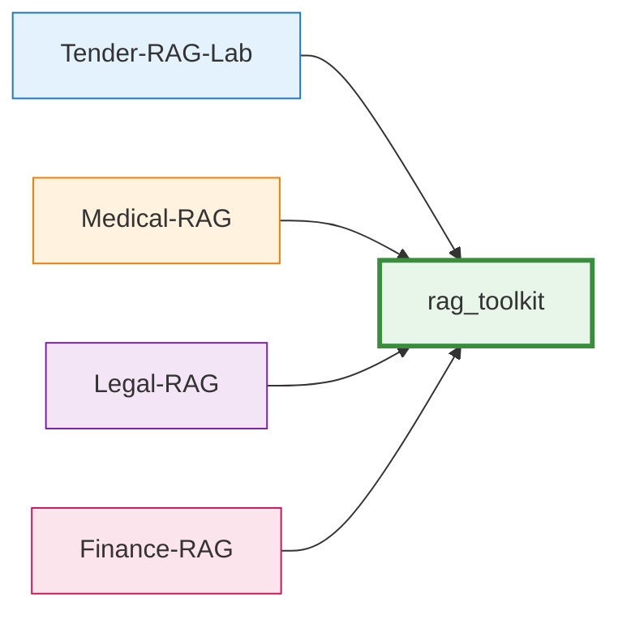

# rag_toolkit Integration

!!! abstract "Overview"
    Learn how Tender-RAG-Lab integrates with **rag_toolkit** for generic RAG components.
    
    rag_toolkit is a **standalone library** providing reusable RAG primitives that work across domains.

---

## :material-package-variant: What is rag_toolkit?

**rag_toolkit** is a standalone Python library providing **generic, reusable RAG components** that work across different domains and use cases.



### Design Philosophy

<div class="grid cards" markdown>

-   :material-protocol:{ .lg } **Protocol-Based**

    ---

    Structural typing for flexibility without inheritance

-   :material-domain:{ .lg } **Zero Domain Knowledge**

    ---

    No tender/medical/legal specifics — pure generic logic

-   :material-puzzle:{ .lg } **Composable**

    ---

    Mix and match components like LEGO blocks

-   :material-check-circle:{ .lg } **Tested**

    ---

    Comprehensive test coverage for reliability

</div>

---

## :material-download: Installation

!!! tip "Editable Mode for Development"
    rag_toolkit is installed in **editable mode** for local development:

```bash title="Install rag_toolkit"
# Clone rag_toolkit repository
git clone https://github.com/yourusername/Rag-Toolkit.git

# Install in editable mode
cd Tender-RAG-Lab
uv pip install -e ../Rag-Toolkit
```

!!! info "Why Editable Mode?"
    - ✅ Changes to rag_toolkit immediately available
    - ✅ No need to reinstall after edits
    - ✅ Perfect for parallel development

---

## :material-cube-outline: Core Components

### :material-protocol: 1. Protocols (Interfaces)

!!! abstract "Protocol Pattern"
    rag_toolkit defines **Protocols** that domain code implements for type-safe duck typing.

=== "Generic Protocol"

    ```python title="rag_toolkit/core/chunking/types.py"
    from typing import Protocol, runtime_checkable
    
    @runtime_checkable
    class ChunkLike(Protocol):
        """Generic chunk interface."""
        id: str
        text: str
        title: str
        heading_level: int
        blocks: List[Dict[str, Any]]
        page_numbers: List[int]
        
        def to_dict(self, *, include_blocks: bool = True) -> Dict[str, Any]:
            ...
    ```

=== "Domain Extension"

    ```python title="src/domain/tender/schemas/chunking.py"
    from rag_toolkit.core.chunking.types import ChunkLike
    
    @dataclass
    class TenderChunk:
        """Implements ChunkLike with tender-specific fields."""
        
        # ✅ Protocol fields (required)
        id: str
        text: str
        title: str
        heading_level: int
        blocks: List[Dict[str, Any]] = field(default_factory=list)
        page_numbers: List[int] = field(default_factory=list)
        
        # 🎯 Tender-specific extensions
        tender_id: str = ""
        lot_id: Optional[str] = None
        section_type: str = ""
        
        def to_dict(self, *, include_blocks: bool = True) -> Dict[str, Any]:
            # Implementation...
            return asdict(self)
    ```

### Key Protocols

| Protocol | Purpose | Location |
|----------|---------|----------|
| `ChunkLike` | Document chunks | `rag_toolkit.core.chunking.types` |
| `TokenChunkLike` | Token-optimized chunks | `rag_toolkit.core.chunking.types` |
| `EmbeddingClient` | Embedding models | `rag_toolkit.core.embedding` |
| `LLMClient` | Language models | `rag_toolkit.core.llm` |
| `VectorStoreClient` | Vector databases | `rag_toolkit.core.vectorstore` |

---

### :material-pipeline: 2. RAG Pipeline

!!! info "Generic Orchestration"
    End-to-end retrieval and generation workflow.

```python title="Using RagPipeline"
from rag_toolkit.rag import RagPipeline
from rag_toolkit.rag.rewriter import QueryRewriter
from rag_toolkit.rag.assembler import ContextAssembler

pipeline = RagPipeline(
    retriever=indexer,
    rewriter=QueryRewriter(llm_client),
    assembler=ContextAssembler(),
    llm_client=llm_client,
)

# Query with automatic rewriting, search, reranking, generation
result = await pipeline.query("What are the requirements?")
```

---

### :material-database-search: 3. Vector Store Abstractions

!!! tip "Factory Pattern"
    Create vector store services with factories for easy swapping.

```python title="Factory Usage"
from rag_toolkit.infra.vectorstores.factory import (
    create_milvus_service,
    create_index_service
)

# Generic Milvus service
milvus_service = create_milvus_service()

# Index service with embedding function
index_service = create_index_service(
    embedding_dim=768,
    embed_fn=embed_fn,
    collection_name="my_collection",
    vector_store=milvus_service,
)
```

---

### :material-file-document-multiple: 4. Chunking Strategies

=== "Dynamic Chunking"

    ```python
    from rag_toolkit.core.chunking import DynamicChunker
    
    # Chunk by document structure
    chunker = DynamicChunker(
        max_tokens=512,
        overlap_tokens=50,
    )
    
    chunks = chunker.chunk_document(document)
    ```

=== "Token Chunking"

    ```python
    from rag_toolkit.core.chunking import TokenChunker
    
    # Token-optimized chunking
    token_chunker = TokenChunker(
        max_tokens=512,
        overlap=50,
    )
    
    token_chunks = token_chunker.create_token_chunks(chunks)
    ```

---

## :material-import: Import Mapping

!!! warning "After Migration (Phases 1-3)"
    Imports changed from local `src.core.*` to external `rag_toolkit.*`.

| Old (Deleted) | New (rag_toolkit) |
|---------------|-------------------|
| `src.core.rag.pipeline` | `rag_toolkit.rag.pipeline` |
| `src.core.embedding.base` | `rag_toolkit.core.embedding` |
| `src.core.llm.base` | `rag_toolkit.core.llm` |
| `src.core.chunking` | `rag_toolkit.core.chunking` |
| `src.core.index` | `rag_toolkit.core.index` |

=== "❌ Old (Deleted)"

    ```python
    # These imports no longer work
    from src.core.rag.pipeline import RagPipeline
    from src.core.embedding.base import EmbeddingClient
    from src.core.chunking.dynamic_chunker import DynamicChunker
    ```

=== "✅ New (rag_toolkit)"

    ```python
    # Use these instead
    from rag_toolkit.rag import RagPipeline
    from rag_toolkit.core.embedding import EmbeddingClient
    from rag_toolkit.core.chunking import DynamicChunker
    ```

---

## :material-factory: Factory Pattern Integration

!!! tip "Wrapping rag_toolkit Components"
    Domain-specific components wrap rag_toolkit via **factories** for centralized configuration.

```python title="src/infra/factory.py" hl_lines="11-15 21-25"
from rag_toolkit.core.embedding import EmbeddingClient
from rag_toolkit.core.index.service import IndexService
from rag_toolkit.infra.vectorstores.factory import (
    create_milvus_service,
    create_index_service
)

def create_tender_stack(
    embed_client: EmbeddingClient,
    embedding_dim: int,
    collection_name: str = "tender_chunks",
) -> Tuple[TenderMilvusIndexer, TenderSearcher]:
    """Create tender-specific stack wrapping rag_toolkit."""
    
    # 1️⃣ Generic rag_toolkit components
    milvus_service = create_milvus_service()
    index_service = create_index_service(
        embedding_dim=embedding_dim,
        embed_fn=lambda texts: [embed_client.embed(t) for t in texts],
        collection_name=collection_name,
        vector_store=milvus_service,
    )
    
    # 2️⃣ Domain-specific wrappers
    indexer = TenderMilvusIndexer(
        index_service=index_service,
        # ... tender-specific config
    )
    
    searcher = TenderSearcher(
        indexer=indexer,
        embed_client=embed_client,
    )
    
    return indexer, searcher
```

!!! success "Factory Pattern Benefits"
    1. Use rag_toolkit factories for generic components
    2. Wrap with domain-specific classes
    3. Inject domain-specific configuration
    4. Single source of truth for infrastructure

---

## :material-chart-timeline: Migration Status

=== "✅ Completed (Phases 1-3)"

    - [x] **Phase 1:** Protocol imports (`EmbeddingClient`, `LLMClient`)
    - [x] **Phase 2:** RAG modules (`pipeline`, `rerankers`, `assembler`)
    - [x] **Phase 3:** Chunking modules (`DynamicChunker`, `TokenChunker`)
    
    !!! success "Result"
        ~17 files eliminated, ~60% code reduction in core logic

=== "⚠️ Pending (Phases 4-5)"

    - [ ] **Phase 4:** Vector store verification
    - [ ] **Phase 5:** Final cleanup

---

## :material-star: Benefits

<div class="grid cards" markdown>

-   :material-sync:{ .lg } **Code Reuse**

    ---

    Generic RAG logic shared across projects — no need to reimplement pipelines

-   :material-layers-outline:{ .lg } **Separation of Concerns**

    ---

    rag_toolkit = generic components | Tender-RAG-Lab = domain logic

-   :material-update:{ .lg } **Upgradability**

    ---

    Update rag_toolkit independently — bug fixes benefit all projects

-   :material-test-tube:{ .lg } **Testability**

    ---

    rag_toolkit has its own tests — domain tests focus on business logic

</div>

---

## :material-code-braces: Common Patterns

### Pattern 1: Protocol Compliance

```python
# Domain class implements protocol
@dataclass
class TenderChunk:
    # ✅ All ChunkLike fields
    id: str
    text: str
    # ...
    
    # 🎯 Domain extensions
    tender_id: str
    
    def to_dict(self, *, include_blocks: bool = True) -> Dict[str, Any]:
        # Required by protocol
        return {...}
```

### Pattern 2: Embedding Client Usage

```python
from rag_toolkit.infra.embedding import OllamaEmbeddingClient

# Initialize
embed_client = OllamaEmbeddingClient(
    model="nomic-embed-text",
    base_url="http://localhost:11434"
)

# Embed single text
vector = embed_client.embed("sample text")  # List[float]

# Embed batch
vectors = [embed_client.embed(t) for t in texts]
```

### Pattern 3: Search Strategies

```python
from rag_toolkit.core.index.search_strategies import (
    VectorSearch,
    HybridSearch
)

# Vector search only
vector_strategy = VectorSearch(top_k=10)

# Hybrid (vector + keyword)
hybrid_strategy = HybridSearch(
    vector_weight=0.7,
    keyword_weight=0.3,
    top_k=10
)

# Use in index service
results = index_service.search(
    query="requirements",
    strategy=hybrid_strategy
)
```

---

## :material-bug: Troubleshooting

!!! failure "ImportError: cannot import name 'X'"
    Check import paths match rag_toolkit structure:
    
    ```python
    # ❌ Wrong
    from rag_toolkit.core.index.base import IndexService
    
    # ✅ Correct
    from rag_toolkit.core.index.service import IndexService
    ```

!!! failure "Protocol Compliance Error"
    Ensure domain classes implement all required protocol methods:
    
    ```python
    # ❌ Missing to_dict() causes runtime error
    @dataclass
    class MyChunk:
        id: str
        text: str
        # Missing to_dict()!
    
    # ✅ Add required method
    def to_dict(self, *, include_blocks: bool = True) -> Dict[str, Any]:
        return {"id": self.id, "text": self.text}
    ```

---

## :material-book-open: See Also

<div class="grid cards" markdown>

-   :material-layers-triple:{ .lg } **Clean Architecture**

    ---

    [:octicons-arrow-right-24: Layer design principles](clean-architecture.md)

-   :material-layers-outline:{ .lg } **Architecture Overview**

    ---

    [:octicons-arrow-right-24: System design](overview.md)

-   :material-api:{ .lg } **API Reference**

    ---

    [:octicons-arrow-right-24: rag_toolkit API docs](../api/core/embedding.md)

</div>

---

<div align="center">

**[← Clean Architecture](clean-architecture.md)** | **[Architecture Overview →](overview.md)**

*Last updated: 2026-01-05*

</div>
