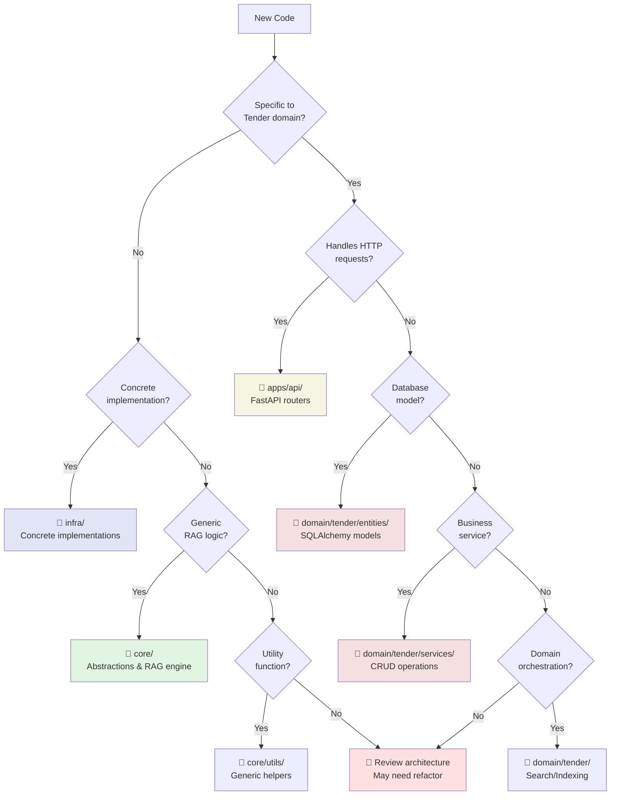

# 🎯 File Placement Guide

> **Decision tree and examples for placing new code in the right layer**

This guide helps you decide where to put new code based on the **Clean Architecture** principles.

---

## 📋 Quick Checklist

Before writing code, ask yourself these 8 questions:

- [ ] **Q1:** Is this code specific to the Tender domain? → If YES, go to `domain/`
- [ ] **Q2:** Does this code handle HTTP requests/responses? → If YES, go to `apps/`
- [ ] **Q3:** Is this an abstraction (Protocol/Interface)? → If YES, go to `core/`
- [ ] **Q4:** Is this a concrete implementation of a Protocol? → If YES, go to `infra/`
- [ ] **Q5:** Is this generic RAG logic (reusable)? → If YES, go to `core/`
- [ ] **Q6:** Is this a database model (ORM)? → If YES, go to `domain/tender/entities/`
- [ ] **Q7:** Is this a business service (CRUD)? → If YES, go to `domain/tender/services/`
- [ ] **Q8:** Is this a utility function? → If YES, go to `core/utils/`

---

## 🗺️ Detailed Decision Tree



---

## 📚 Examples with Explanations

### Example 1: Adding a New Embedding Provider

**Scenario:** You want to add Cohere embeddings support.

**Decision Process:**
1. Is it Tender-specific? → **No** (generic embedding)
2. Is it a concrete implementation? → **Yes**
3. Does a Protocol exist? → **Yes** (`core/embedding/base.py::EmbeddingClient`)

**Placement:**
```
✅ infra/embedding/cohere.py
   (or create infra/embedding/ if needed)
```

**Why?**
- It's a concrete implementation of `EmbeddingClient` Protocol
- Infrastructure layer handles vendor integrations
- Not domain-specific, not RAG logic, not HTTP layer

### Example 2: Adding Query Expansion

**Scenario:** You want to add query expansion (rewrite query → multiple queries).

**Decision Process:**
1. Is it Tender-specific? → **No** (generic RAG technique)
2. Is it RAG orchestration? → **Yes**
3. Is it reusable? → **Yes**

**Placement:**
```
✅ core/rag/query_expander.py
   - Define QueryExpander Protocol
   - Implement LLMQueryExpander
```

**Why?**
- Generic RAG pattern (not Tender-specific)
- Part of RAG pipeline orchestration
- Reusable across domains

### Example 3: Adding Tender Status Validation

**Scenario:** Business rule: can't close tender if has open lots.

**Decision Process:**
1. Is it Tender-specific? → **Yes**
2. Does it handle HTTP? → **No**
3. Is it business logic? → **Yes**

**Placement:**
```
✅ domain/tender/services/tenders.py
   - Add validation in TenderService.update_status()
```

**Why?**
- Business rule specific to Tender domain
- Lives in service layer (orchestrates entities)
- Not HTTP layer, not infrastructure

### Example 4: Adding /tenders/{id}/export Endpoint

**Scenario:** New API endpoint to export tender as PDF.

**Decision Process:**
1. Is it Tender-specific? → **Yes**
2. Does it handle HTTP? → **Yes**

**Placement:**
```
✅ apps/api/routers/tenders.py
   - Add @router.get("/{tender_id}/export")
```

**Why?**
- HTTP endpoint (API layer responsibility)
- Calls domain services for business logic
- Returns HTTP response

### Example 5: Adding Pinecone Vector Store

**Scenario:** Support Pinecone as alternative to Milvus.

**Decision Process:**
1. Is it Tender-specific? → **No**
2. Is it a concrete implementation? → **Yes**
3. Does Protocol exist? → **Yes** (`core/index/base.py::VectorStore`)

**Placement:**
```
✅ infra/vectorstores/pinecone/
   ├── service.py        # PineconeService
   ├── connection.py     # Connection management
   ├── config.py         # PineconeConfig
   └── __init__.py
```

**Why?**
- Concrete vector store implementation
- Infrastructure layer (vendor integration)
- Implements VectorStore Protocol from core

### Example 6: Adding Document Upload Validation

**Scenario:** Validate file size, type before upload.

**Decision Process:**
1. Is it Tender-specific? → **Yes** (validates against Tender rules)
2. Does it handle HTTP? → **No** (business validation)
3. Is it a service operation? → **Yes**

**Placement:**
```
✅ domain/tender/services/documents.py
   - Add DocumentService.validate_upload()
```

**Why?**
- Business rule (file types allowed for tender docs)
- Service layer orchestrates validation
- Called by API router before processing

### Example 7: Adding Reranking

**Scenario:** Add cross-encoder reranking.

**Decision Process:**
1. Is it Tender-specific? → **No** (generic RAG)
2. Is it RAG logic? → **Yes**
3. Concrete or abstract? → **Both needed**

**Placement:**
```
✅ core/rag/reranker.py
   - Reranker Protocol (abstract)
   
✅ infra/rerankers/cross_encoder.py
   - CrossEncoderReranker (concrete)
```

**Why?**
- Protocol in `core/` (abstraction)
- Implementation in `infra/` (concrete)
- RAG pipeline component

### Example 8: Adding Lot Summary Generation

**Scenario:** Generate AI summary for lot.

**Decision Process:**
1. Is it Tender-specific? → **Yes**
2. Does it handle HTTP? → **No**
3. Is it business logic? → **Yes**

**Placement:**
```
✅ domain/tender/services/lots.py
   - Add LotService.generate_summary()
   - Uses core/llm/base.py::LLMClient
```

**Why?**
- Domain-specific business operation
- Service orchestrates (fetch lot, call LLM, save)
- Not generic RAG (Tender context matters)

---

## ❌ Anti-Patterns (What NOT to Do)

### ❌ Anti-Pattern 1: Domain Logic in Core

**Bad:**
```
❌ core/rag/tender_retriever.py
   # Core should not know about "Tender"!
```

**Why Wrong?**
- Core layer must be domain-agnostic
- Violates clean architecture
- Prevents reusability

**Fix:**
```
✅ core/rag/retriever.py          # Generic Retriever Protocol
✅ domain/tender/search/searcher.py  # TenderSearcher uses it
```

### ❌ Anti-Pattern 2: FastAPI in Domain

**Bad:**
```python
# domain/tender/services/tenders.py
from fastapi import HTTPException  # ❌ NEVER!

class TenderService:
    def get_tender(self, id: UUID):
        if not tender:
            raise HTTPException(404)  # ❌ HTTP in domain!
```

**Why Wrong?**
- Domain layer shouldn't know about HTTP
- Breaks clean architecture
- Hard to reuse in CLI/batch jobs

**Fix:**
```python
# domain/tender/services/tenders.py
class TenderService:
    def get_tender(self, id: UUID) -> Tender | None:
        return self.repository.get(id)  # ✅ Return None

# apps/api/routers/tenders.py
@router.get("/{id}")
def get_tender(id: UUID):
    tender = service.get_tender(id)
    if not tender:
        raise HTTPException(404)  # ✅ HTTP in API layer
    return tender
```

### ❌ Anti-Pattern 3: Concrete Implementation in Core

**Bad:**
```
❌ core/index/milvus_client.py
   # Core should only have abstractions!
```

**Why Wrong?**
- Core should be vendor-agnostic
- Tight coupling to Milvus
- Can't swap vector stores

**Fix:**
```
✅ core/index/base.py              # VectorStore Protocol
✅ infra/vectorstores/milvus/      # Milvus implementation
```

### ❌ Anti-Pattern 4: Database Models in Apps

**Bad:**
```
❌ apps/api/routers/tenders.py
from db.models.tender import TenderORM  # ❌ Direct DB access!
```

**Why Wrong?**
- API should use domain services
- Bypasses business logic
- No validation

**Fix:**
```python
# apps/api/routers/tenders.py
from domain.tender.services import TenderService  # ✅ Use service

@router.get("/")
def list_tenders(service: TenderService = Depends(get_tender_service)):
    return service.list_all()  # ✅ Service handles DB
```

### ❌ Anti-Pattern 5: Business Logic in Routers

**Bad:**
```python
# apps/api/routers/tenders.py
@router.post("/{id}/close")
def close_tender(id: UUID):
    tender = db.query(Tender).get(id)
    if tender.lots.filter(status="open").count() > 0:  # ❌ Business logic!
        raise HTTPException(400, "Has open lots")
    tender.status = "closed"
    db.commit()
```

**Why Wrong?**
- Business rules scattered in routers
- Hard to test
- Can't reuse in other contexts

**Fix:**
```python
# domain/tender/services/tenders.py
class TenderService:
    def close_tender(self, id: UUID) -> Result:
        # ✅ Business logic in service
        if self.has_open_lots(id):
            return Failure("Cannot close: has open lots")
        return self.update_status(id, TenderStatus.CLOSED)

# apps/api/routers/tenders.py
@router.post("/{id}/close")
def close_tender(id: UUID):
    result = service.close_tender(id)  # ✅ Delegate to service
    if result.is_failure:
        raise HTTPException(400, result.error)
    return result.value
```

---

## 🎯 Common Scenarios

| Scenario | Correct Location | Reasoning |
|----------|-----------------|-----------|
| New LLM provider | `infra/llm/` | Concrete implementation of LLMClient |
| RAG pipeline step | `core/rag/` | Generic RAG logic |
| Tender validation rule | `domain/tender/services/` | Business logic |
| API rate limiting | `apps/api/middleware/` | HTTP concern |
| Parsing PDF | `infra/parsers/pdf/` | Infrastructure integration |
| Chunking strategy | `core/chunking/` | Generic RAG component |
| Database migration | `db/migrations/` | Schema evolution |
| Tender CRUD | `domain/tender/services/` | Business operations |
| Authentication | `apps/api/auth.py` | HTTP security |
| Logging utility | `core/utils/` | Generic helper |

---

## 📖 Related Documentation

- [Architecture Overview](overview.md) - Clean architecture principles
- [Layer Responsibilities](layers.md) - Deep dive on each layer
- [Design Decisions](decisions.md) - Why we chose this architecture

---

**[⬅️ Architecture](overview.md) | [⬆️ Documentation Home](../README.md) | [Core Layer ➡️](../core/README.md)**

*Last updated: 2025-12-18*
