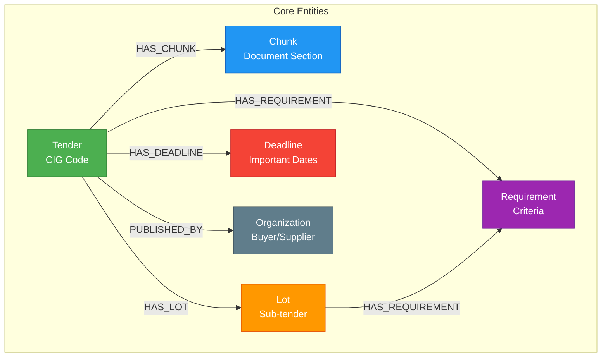
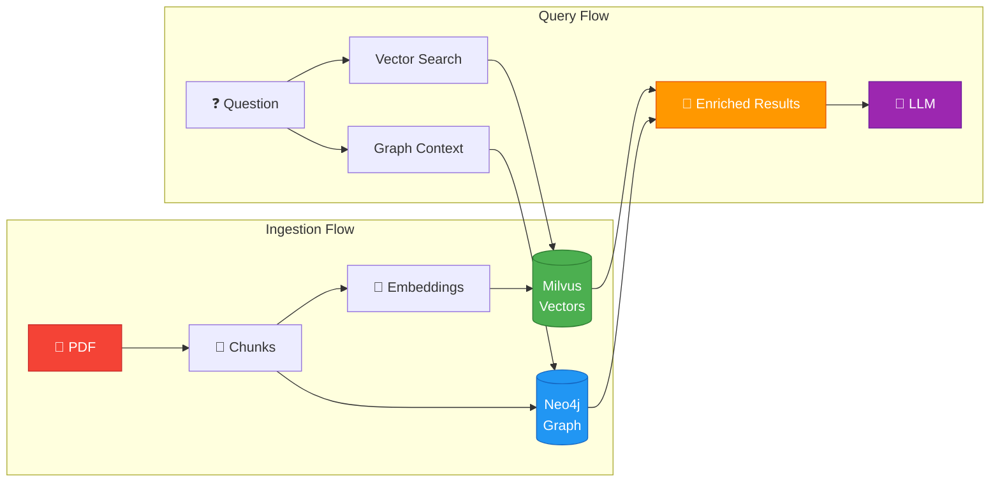

# Knowledge Graph (Neo4j)

!!! abstract "Graph-Powered Tender Intelligence"
    Neo4j Knowledge Graph stores **structured tender entities** and **explicit relationships**, 
    enabling graph-based reasoning alongside vector search.

---

## :material-graph: Overview

!!! info "Complementary Storage"
    The Knowledge Graph works **alongside** Milvus to provide dual-mode retrieval:
    
    - **Milvus** → Semantic similarity (embeddings)
    - **Neo4j** → Structured relationships (graph)

### Entity Relationships

<div class="grid cards" markdown>

-   :material-file-document:{ .lg } **Tenders**

    ---
    
    Core entities with metadata:
    - Buyer information
    - CPV codes
    - Amounts & dates

-   :material-text-box-multiple:{ .lg } **Chunks**

    ---
    
    Document sections linked to:
    - Parent tenders
    - Specific lots
    - Related requirements

-   :material-package-variant:{ .lg } **Lots**

    ---
    
    Sub-tender divisions with:
    - Individual CPV codes
    - Separate budgets
    - Specific requirements

-   :material-checkbox-marked-circle:{ .lg } **Requirements**

    ---
    
    Structured criteria:
    - Technical specs
    - Economic thresholds
    - Administrative rules

</div>

---

## :material-rocket-launch: Quick Start

### :material-numeric-1-circle: Start Neo4j

```bash title="Launch Neo4j container"
# Start Neo4j container
docker-compose up -d neo4j

# Wait for initialization (~30 seconds)
docker logs -f tender-neo4j
```

!!! tip "Health Check"
    Wait until you see `Remote interface available at http://localhost:7474/`

### :material-numeric-2-circle: Initialize Schema

```bash title="Setup graph structure"
# Run setup script
uv run python scripts/setup_neo4j.py
```

**Creates:**

<div class="grid cards" markdown>

-   ✅ **Constraints**

    ---
    
    - Unique tender codes
    - Unique chunk IDs

-   ⚡ **Indexes**

    ---
    
    - CPV codes
    - Buyer names
    - Publication dates

-   🧪 **Test Data**

    ---
    
    - Sample tenders
    - Validation queries

</div>

### :material-numeric-3-circle: Access Browser

!!! success "Neo4j Browser Ready"
    Open [:material-open-in-new: http://localhost:7474](http://localhost:7474)
    
    **Credentials:**
    
    - Username: `neo4j`
    - Password: `tendergraph2025`

---

## :material-sitemap: Architecture

### Graph Structure



### RAG Pipeline Integration



---

## :material-code-braces: Usage Patterns

### Pattern 1: Index Tender with Graph

!!! example "Store Tender in Graph"

```python title="src/infra/graph/graph_indexer.py"
from src.infra.graph.graph_indexer import index_tender_to_graph

# After indexing to Milvus, also index to graph
await index_tender_to_graph(
    tender_code="2025-001-IT",
    tender_metadata={
        "title": "IT Infrastructure Services",
        "cpv_code": "72000000",  # IT services
        "base_amount": 500000.0,
        "buyer_name": "Ministero dell'Interno",
        "publication_date": "2025-01-15"
    },
    chunks=chunks  # Already indexed to Milvus
)
```

**Creates graph structure:**

- ✅ `Tender` node with metadata
- ✅ `HAS_CHUNK` relationships to document sections
- ✅ `PUBLISHED_BY` relationship to buyer organization

---

### Pattern 2: Enrich Search Results

!!! example "Add Graph Context to Vector Results"

=== "Code"

    ```python title="Enrich vector search with graph metadata"
    from src.infra.graph.graph_indexer import get_tender_context_for_chunks
    
    # After vector search
    vector_results = await milvus_search(query, top_k=10)
    
    # Get graph context
    chunk_ids = [r.id for r in vector_results]
    contexts = await get_tender_context_for_chunks(chunk_ids)
    
    # Enrich results with tender metadata
    for result in vector_results:
        context = contexts.get(result.id)
        if context:
            result.tender_title = context["tender_title"]
            result.buyer_name = context["buyer_name"]
            result.base_amount = context["base_amount"]
    ```

=== "Benefits"

    **Why enrich results?**
    
    - 📊 **Context**: See which tender each chunk belongs to
    - 💰 **Metadata**: Display amounts, buyers, dates
    - 🔗 **Navigation**: Link to full tender details
    - 🎯 **Filtering**: Group by tender, sort by amount

---

### Pattern 3: Find Related Tenders

!!! example "Graph-Based Similarity"

=== "Code"

    ```python title="Find similar tenders via graph relationships"
    from src.infra.graph.graph_indexer import find_related_tenders
    
    # Find tenders with similar CPV code or same buyer
    related = await find_related_tenders(
        tender_code="2025-001-IT",
        limit=5
    )
    
    # Use for query expansion or recommendations
    for tender in related:
        print(f"{tender['code']}: {tender['title']}")
        print(f"  Similarity: {tender['similarity_score']}")
    ```

=== "Use Cases"

    **Applications:**
    
    - 🔍 **Query Expansion**: Find related procurement contexts
    - 💡 **Recommendations**: "Similar tenders you may be interested in"
    - 📈 **Trend Analysis**: Track buyer procurement patterns
    - 🎯 **Market Intelligence**: Identify recurring requirements

---

## :material-cog: Configuration

!!! abstract "Connection Settings"

=== "🖥️ Local Development"

    ```bash title=".env - Docker setup"
    NEO4J_URI=bolt://localhost:7687
    NEO4J_USER=neo4j
    NEO4J_PASSWORD=tendergraph2025
    NEO4J_DATABASE=neo4j
    NEO4J_ENV=local
    ```
    
    !!! info "Local Mode"
        - Unencrypted connection (`bolt://`)
        - Docker container on localhost
        - Development credentials

=== "☁️ Production (Aura Cloud)"

    ```bash title=".env - Neo4j Aura"
    NEO4J_URI=neo4j+s://xxxxx.databases.neo4j.io
    NEO4J_USER=neo4j
    NEO4J_PASSWORD=your-secure-password
    NEO4J_DATABASE=neo4j
    NEO4J_ENV=aura
    ```
    
    !!! success "Managed Service"
        - TLS encrypted (`neo4j+s://`)
        - Automatic backups
        - Enterprise features
        - Free tier available

!!! tip "Auto-Detection"
    The client automatically detects environment based on URI scheme:
    
    - `bolt://` → Local mode (unencrypted)
    - `neo4j+s://` → Aura mode (TLS encrypted)

---

## :material-arrow-right-circle: Next Steps

<div class="grid cards" markdown>

-   :material-robot-outline:{ .lg } **[RAG Pipeline](rag-pipeline.md)**

    ---
    
    **Complete RAG orchestration** with vector + graph integration

-   :material-cog-outline:{ .lg } **[Neo4j Setup](neo4j-setup.md)**

    ---
    
    Detailed configuration, schema design, indexes

-   :material-puzzle:{ .lg } **[Neo4j Integration](neo4j-integration.md)**

    ---
    
    Advanced RAG patterns, graph queries, optimization

-   :material-flask:{ .lg } **Examples**

    ---
    
    ```bash
    uv run python examples/graph_integration_examples.py
    ```

</div>

