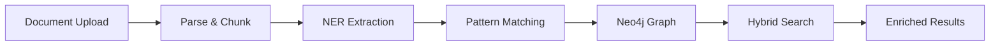

# NER → Neo4j → Hybrid Search Integration

This guide explains how to use the integrated NER and Knowledge Graph features for tender analysis.

## Overview

The system now supports:

1. **Entity Extraction** (NER) - Extract organizations, people, locations, dates, and monetary amounts
2. **Graph Population** - Automatically create Requirements, Deadlines, and Organizations in Neo4j
3. **Hybrid Search** - Combine vector search with graph context enrichment
4. **Graph-First Queries** - Direct queries for structured data (requirements, deadlines)

## Architecture



### Components

- **TenderNER** - spaCy-based NER for Italian documents
- **EntityExtractionService** - Orchestrates extraction and graph population
- **GraphEnrichedRetriever** - Hybrid search with graph context
- **TenderGraphClient** - Neo4j operations for tender domain

## Quick Start

### Option A: One-Shot API (Recommended)

The easiest way to process a tender document:

```bash
# Upload document - everything is automatic!
curl -X POST "http://localhost:8000/ingestion/extract-all" \
  -F "file=@tender_document.pdf"
```

That's it! The system will:
- Generate tender code (FY26-0001, FY26-0002, ...)
- Parse, chunk, and index the document
- Extract entities and populate Neo4j
- Make it ready for search

### Option B: Manual Setup

If you prefer step-by-step control:

#### 1. Setup Neo4j Schema

First time only:

```python
from src.infra.graph import get_tender_graph_client

async def setup():
    client = get_tender_graph_client()
    await client.create_tender_schema()
    await client.close()
```

Or use the test script:

```bash
python scripts/test_ner_graph_pipeline.py
```

#### 2. Extract Entities and Populate Graph

```python
from src.domain.tender.services.entity_extraction import create_entity_extraction_service
from src.infra.graph import get_tender_graph_client

# Create service
graph_client = get_tender_graph_client()
service = create_entity_extraction_service(neo4j_client=graph_client)

# Extract and populate
result = await service.extract_and_populate(
    chunks=tender_chunks,
    tender_id="tender-123",
    tender_code="CIG-2025-001",
)

print(f"Entities: {result['entity_count']}")
print(f"Graph stats: {result['graph_stats']}")
```

#### 3. Hybrid Search with Graph Context

```python
from src.domain.tender.services.graph_retriever import create_graph_enriched_retriever

retriever = create_graph_enriched_retriever(vector_searcher=milvus_search)

# Vector search + graph enrichment
results = await retriever.search_with_graph_context(
    query="Quali certificazioni sono obbligatorie?",
    tender_code="CIG-2025-001",
    top_k=5,
)

for result in results:
    print(f"Chunk: {result['text'][:100]}...")
    print(f"Graph context: {result['graph_context']}")
```

#### 4. Graph-First Queries

```python
# Get all mandatory requirements
requirements = await retriever.search_requirements(
    tender_code="CIG-2025-001",
    mandatory_only=True,
)

for req in requirements:
    print(f"[{req['requirement_id']}] {req['description']}")
    print(f"  Mandatory: {req['mandatory']}")
    print(f"  Mentioned in chunks: {req['chunk_ids']}")

# Get all deadlines
deadlines = await retriever.search_deadlines(tender_code="CIG-2025-001")

for deadline in deadlines:
    print(f"[{deadline['type']}] {deadline['date_text']}")
```

## API Endpoints

### POST /ingestion/extract-all ⭐ **Recommended**

**One-shot complete pipeline**: Upload a document and get everything done automatically.

This endpoint performs the complete end-to-end processing:
1. Auto-generates tender code (FY26-0001, FY26-0002, ...)
2. Parses document (PDF/DOCX)
3. Creates chunks
4. Creates tender in PostgreSQL + Neo4j
5. Extracts entities + populates graph
6. Indexes in Milvus for vector search
7. Links everything together

**Request:**

```bash
curl -X POST "http://localhost:8000/ingestion/extract-all" \
  -F "file=@tender_document.pdf"
```

**Response:**

```json
{
  "tender_id": "123e4567-e89b-12d3-a456-426614174000",
  "tender_code": "FY26-0004",
  "filename": "tender_document.pdf",
  "chunks_created": 25,
  "entities_extracted": 42,
  "graph_populated": true,
  "milvus_indexed": true,
  "graph_stats": {
    "organizations_created": 5,
    "requirements_created": 8,
    "deadlines_created": 3,
    "relationships_created": 16,
    "chunks_linked": 25
  },
  "entities_by_type": {
    "ORGANIZATION": ["Comune di Milano", "Regione Lombardia"],
    "PERSON": ["Mario Rossi", "Luigi Bianchi"],
    "LOCATION": ["Milano", "Via Roma 10"],
    "DATE": ["31 marzo 2025", "15 febbraio 2025"],
    "MONEY": ["€500.000", "€100.000"]
  },
  "next_steps": [
    "View tender in Neo4j: MATCH (t:Tender {code: 'FY26-0004'}) RETURN t",
    "GET /graph/requirements/FY26-0004",
    "GET /graph/deadlines/FY26-0004",
    "POST /rag/search-with-graph with tender_code='FY26-0004'"
  ]
}
```

**Key Features:**
- ✅ No manual tender code needed - auto-increments
- ✅ Creates tender in both PostgreSQL and Neo4j
- ✅ Full NER + graph population
- ✅ Ready for vector search immediately
- ✅ All chunks linked to tender

---

### POST /extract-entities-and-populate-graph

NER → Graph pipeline (requires manual tender creation).

**Request:**

```bash
curl -X POST "http://localhost:8000/extract-entities-and-populate-graph" \
  -F "file=@tender.pdf" \
  -F "tender_id=tender-123" \
  -F "tender_code=CIG-2025-001" \
  -F "populate_graph=true"
```

**Response:**

```json
{
  "tender_id": "tender-123",
  "tender_code": "CIG-2025-001",
  "entities_extracted": 42,
  "graph_populated": true,
  "graph_stats": {
    "organizations_created": 5,
    "requirements_created": 8,
    "deadlines_created": 3,
    "relationships_created": 16
  },
  "entities_by_type": {
    "ORGANIZATION": ["Comune di Milano", "Regione Lombardia"],
    "PERSON": ["Mario Rossi", "Luigi Bianchi"],
    "LOCATION": ["Milano", "Via Roma 10"],
    "DATE": ["31 marzo 2025", "15 febbraio 2025"],
    "MONEY": ["€500.000", "€100.000"]
  }
}
```

### POST /rag/search-with-graph

Hybrid search with graph enrichment.

**Request:**

```bash
curl -X POST "http://localhost:8000/rag/search-with-graph" \
  -H "Content-Type: application/json" \
  -d '{
    "query": "certificazioni richieste",
    "tender_code": "CIG-2025-001",
    "top_k": 5,
    "use_graph_enrichment": true
  }'
```

**Response:**

```json
{
  "query": "certificazioni richieste",
  "tender_code": "CIG-2025-001",
  "results": [
    {
      "chunk_id": "chunk-abc",
      "text": "È richiesta certificazione ISO 27001...",
      "score": 0.89,
      "graph_context": {
        "requirements": [
          {
            "id": "req-001",
            "description": "Certificazione ISO 27001 obbligatoria",
            "mandatory": true,
            "type": "extracted"
          }
        ],
        "deadlines": [],
        "organizations": [
          {
            "name": "Comune di Milano",
            "role": "mentioned"
          }
        ]
      }
    }
  ]
}
```

### GET /graph/requirements/{tender_code}

Get all requirements for a tender (graph-first).

**Request:**

```bash
curl "http://localhost:8000/graph/requirements/CIG-2025-001?mandatory_only=true"
```

**Response:**

```json
{
  "tender_code": "CIG-2025-001",
  "lot_id": null,
  "mandatory_only": true,
  "count": 3,
  "requirements": [
    {
      "requirement_id": "req-001",
      "description": "Certificazione ISO 27001 obbligatoria",
      "type": "extracted",
      "mandatory": true,
      "chunk_ids": ["chunk-abc"]
    }
  ]
}
```

### GET /graph/deadlines/{tender_code}

Get all deadlines for a tender (graph-first).

**Request:**

```bash
curl "http://localhost:8000/graph/deadlines/CIG-2025-001"
```

**Response:**

```json
{
  "tender_code": "CIG-2025-001",
  "count": 3,
  "deadlines": [
    {
      "deadline_id": "deadline-001",
      "type": "scadenza_offerta",
      "date_text": "31 marzo 2025",
      "chunk_ids": ["chunk-abc"]
    },
    {
      "deadline_id": "deadline-002",
      "type": "sopralluogo",
      "date_text": "15 febbraio 2025",
      "chunk_ids": ["chunk-def"]
    }
  ]
}
```

## Pattern Matching Rules

### Requirements

Detected when chunks contain:

- `"obbligatorio"` → mandatory=true
- `"deve"` → mandatory=false (unless combined with other keywords)
- `"pena esclusione"` / `"pena di esclusione"` → mandatory=true
- `"è richiesto"`, `"necessario"`, `"requisito"` → mandatory=false

### Deadlines

Detected when:

1. DATE entity is present (extracted by spaCy NER)
2. Chunk contains deadline context keywords:
   - `"scadenza"` → type: `scadenza_generica`
   - `"presentazione offerta"` → type: `scadenza_offerta`
   - `"sopralluogo"` → type: `sopralluogo`
   - `"chiarimenti"`, `"quesiti"` → type: `qna`

### Organizations

All ORGANIZATION entities extracted by spaCy are added to the graph with:

- role: `"mentioned"` (default)
- Linked to tender via `ISSUED_BY` relationship

## Neo4j Schema

### Nodes

- **Tender** - Main tender node
  - Properties: code, title, cpv_code, base_amount, buyer_name, publication_date
- **Chunk** - Document chunk
  - Properties: id, text_preview, page_number, chunk_index
- **Requirement** - Extracted requirement
  - Properties: id, description, type, mandatory
- **Deadline** - Extracted deadline
  - Properties: id, date_text, type
- **Organization** - Extracted organization
  - Properties: name, role

### Relationships

- `(Tender)-[:HAS_CHUNK]->(Chunk)`
- `(Tender)-[:HAS_REQUIREMENT]->(Requirement)`
- `(Tender)-[:HAS_DEADLINE]->(Deadline)`
- `(Tender)-[:ISSUED_BY]->(Organization)`
- `(Requirement)-[:MENTIONED_IN]->(Chunk)`
- `(Deadline)-[:MENTIONED_IN]->(Chunk)`

## Testing

### Run Full Pipeline Test

```bash
# Run test
python scripts/test_ner_graph_pipeline.py

# Cleanup test data
python scripts/test_ner_graph_pipeline.py --cleanup
```

### Browse Neo4j

1. Open Neo4j Browser: http://localhost:7474
2. Login with credentials from `.env`
3. Run queries:

```cypher
// View all nodes
MATCH (n) RETURN n LIMIT 25

// View tender with all requirements
MATCH (t:Tender {code: 'TEST-2025-001'})-[:HAS_REQUIREMENT]->(r:Requirement)
RETURN t, r

// View deadlines
MATCH (t:Tender {code: 'TEST-2025-001'})-[:HAS_DEADLINE]->(d:Deadline)
RETURN t, d
ORDER BY d.date_text

// View full graph for a tender
MATCH (t:Tender {code: 'TEST-2025-001'})
OPTIONAL MATCH (t)-[r1]->(related)
OPTIONAL MATCH (related)-[r2]->(chunk:Chunk)
RETURN t, r1, related, r2, chunk
```

## Next Steps

1. **Improve NER Accuracy**
   - Fine-tune BERT for Italian tender domain
   - Increase F1 score from 0.78 to >0.90

2. **LLM-Based Extraction**
   - Use GPT-4/Claude for complex requirement extraction
   - Better context understanding vs pattern matching

3. **Graph Visualization**
   - Build UI to visualize tender knowledge graph
   - Interactive exploration of requirements/deadlines

4. **Evaluation Harness**
   - Create test dataset with golden annotations
   - Measure precision/recall for entity extraction

## Troubleshooting

### Neo4j Connection Failed

```bash
# Check Neo4j is running
docker-compose ps neo4j

# Start Neo4j
docker-compose up -d neo4j

# Check logs
docker-compose logs neo4j
```

### No Entities Extracted

- Verify spaCy model is installed: `python -m spacy download it_core_news_lg`
- Check chunk text is not empty
- Enable debug logging: `log.setLevel(logging.DEBUG)`

### Graph Population Failed

- Check constraints are created (run `create_tender_schema()`)
- Verify tender exists before adding requirements
- Check Neo4j logs for Cypher query errors

## References

- [spaCy Italian Model](https://spacy.io/models/it)
- [Neo4j Python Driver](https://neo4j.com/docs/python-manual/current/)
- [Project Roadmap](../roadmap.md) - Q1 2025 Graph RAG section
