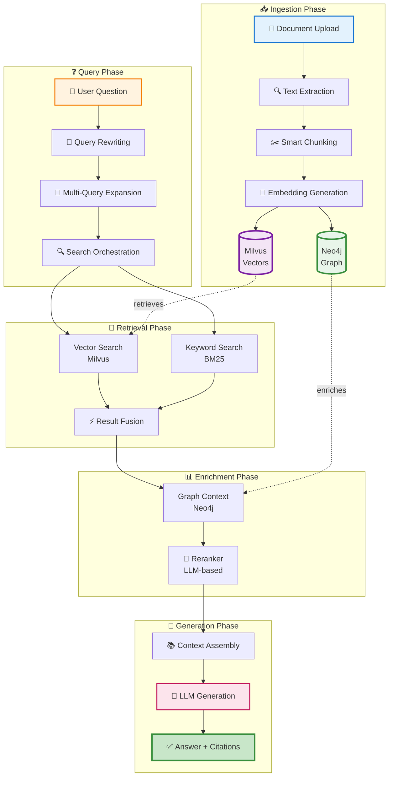
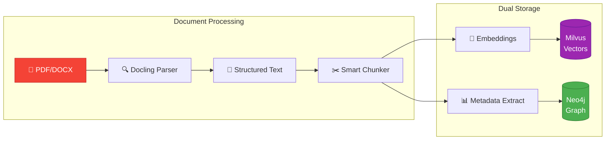
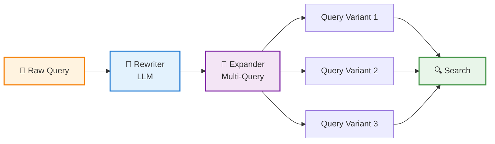
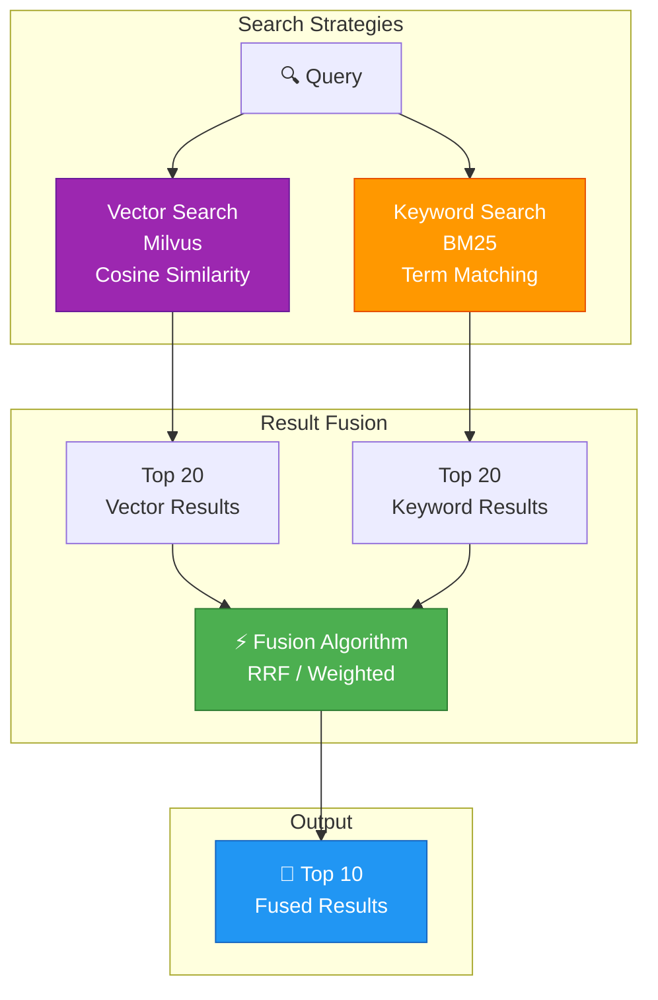
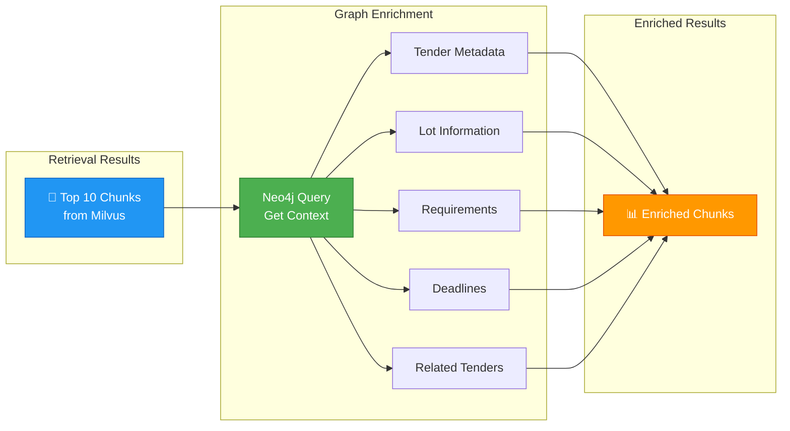
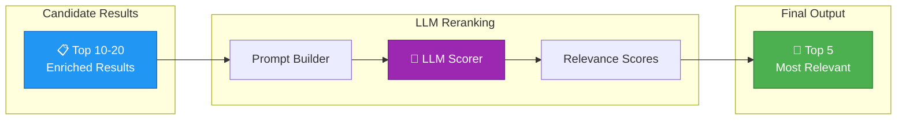
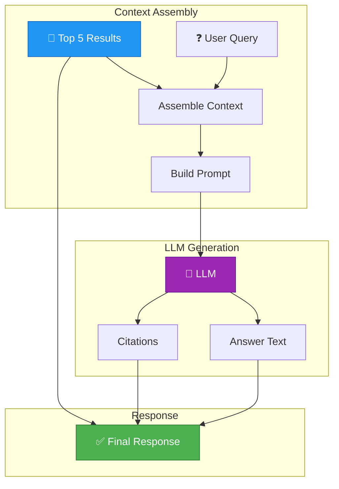

# RAG Pipeline

!!! abstract "Complete RAG Architecture"
    Master the **full Retrieval-Augmented Generation pipeline** in Tender-RAG-Lab.
    
    From document ingestion to intelligent answers with citations.

---

## :material-sitemap: Overview

!!! info "End-to-End RAG System"
    Tender-RAG-Lab implements a **multi-stage RAG pipeline** that combines:
    
    - **Vector retrieval** (semantic similarity)
    - **Graph enrichment** (structured relationships)
    - **Hybrid reranking** (fusion strategies)
    - **LLM generation** (contextualized answers)

### Complete Pipeline Flow



---

## :material-file-upload: Phase 1: Document Ingestion

!!! abstract "Prepare Documents for RAG"
    Transform raw documents into searchable vectors and structured graph entities.

### Ingestion Flow



### Complete Example

```python title="Full ingestion pipeline"
from src.domain.tender.services.documents import DocumentService
from src.infra.factory import create_tender_stack
from src.infra.graph.graph_indexer import index_tender_to_graph

# Initialize services
stack = create_tender_stack()
doc_service = DocumentService(
    storage_client=stack.storage_client,
    indexer=stack.indexer
)

async def ingest_tender_document(
    file_path: str,
    tender_id: str,
    tender_metadata: dict
):
    """Complete dual-storage ingestion"""
    
    print("📥 Phase 1: Document Ingestion\n")
    
    # Step 1: Upload
    print("1️⃣ Uploading document...")
    document = await doc_service.upload(
        file_path=file_path,
        tender_id=tender_id
    )
    
    # Step 2: Parse with Docling
    print("2️⃣ Parsing with Docling...")
    parsed = await doc_service.parse(document.id)
    print(f"   ✓ Extracted: {parsed.page_count} pages, {len(parsed.text):,} chars")
    
    # Step 3: Smart chunking
    print("3️⃣ Smart chunking...")
    chunks = await doc_service.chunk(parsed)
    print(f"   ✓ Created: {len(chunks)} chunks")
    
    # Step 4: Generate embeddings
    print("4️⃣ Generating embeddings...")
    await doc_service.embed(chunks)
    print(f"   ✓ Embeddings: {len(chunks)} × {stack.embedding_dim}d")
    
    # Step 5: Index to Milvus (vectors)
    print("5️⃣ Indexing to Milvus...")
    milvus_result = await doc_service.index(chunks, tender_id=tender_id)
    print(f"   ✓ Milvus: {milvus_result.chunk_count} chunks indexed")
    
    # Step 6: Index to Neo4j (graph)
    print("6️⃣ Indexing to Neo4j...")
    await index_tender_to_graph(
        tender_code=tender_id,
        tender_metadata=tender_metadata,
        chunks=chunks
    )
    print(f"   ✓ Neo4j: Tender node + {len(chunks)} chunk relationships")
    
    print("\n✅ Ingestion complete!\n")
    return milvus_result

# Usage
result = await ingest_tender_document(
    file_path="data/input/tender_2025_IT.pdf",
    tender_id="2025-001-IT",
    tender_metadata={
        "title": "IT Infrastructure Services",
        "cpv_code": "72000000",
        "base_amount": 500000.0,
        "buyer_name": "Ministero dell'Interno",
        "publication_date": "2025-01-15"
    }
)
```

!!! success "Dual Storage Benefits"
    - **Milvus** → Fast semantic search (cosine similarity)
    - **Neo4j** → Structured relationships (tender → chunks → requirements)
    - **Combined** → Best of both worlds! 🎯

---

## :material-magnify: Phase 2: Query Processing

!!! abstract "Transform User Questions"
    Optimize queries for better retrieval through rewriting and expansion.

### Query Enhancement Flow



### Query Rewriting

!!! tip "Make Queries More Precise"

```python title="LLM-powered query rewriting"
from src.domain.tender.services.query import QueryRewriter

rewriter = QueryRewriter(llm_client=llm)

# Example: Vague user query
original = "What docs needed?"

# Rewrite with context
rewritten = await rewriter.rewrite(
    query=original,
    context="Italian public procurement tender application"
)

print(f"Original:  {original}")
print(f"Rewritten: {rewritten}")
# → "What documentation is required for the tender application submission?"
```

---

### Multi-Query Expansion

!!! tip "Generate Multiple Perspectives"

```python title="Query expansion for better coverage"
# Generate 3 variations
queries = await rewriter.generate_variations(
    query="submission deadlines",
    num_variations=3
)

for i, q in enumerate(queries, 1):
    print(f"{i}. {q}")

# Output:
# 1. What are the submission deadlines for this tender?
# 2. When is the tender application due?
# 3. What are the key deadline dates I need to know?
```

!!! success "Why Multi-Query?"
    - ✅ **Higher recall** (catch more relevant documents)
    - ✅ **Multiple angles** (semantic diversity)
    - ✅ **Ambiguity handling** (cover different interpretations)

---

## :material-database-search: Phase 3: Hybrid Retrieval

!!! abstract "Multi-Strategy Search"
    Combine vector similarity and keyword matching for optimal results.

### Retrieval Architecture



### Implementation

=== "Vector Search"

    ```python title="Semantic similarity with Milvus"
    from src.domain.tender.search import TenderSearcher
    
    searcher = TenderSearcher(
        vector_store=milvus_client,
        embedding_client=embedding_client
    )
    
    # Pure vector search
    vector_results = await searcher.vector_search(
        query="cybersecurity compliance requirements",
        top_k=20,
        score_threshold=0.7
    )
    
    print(f"Vector search: {len(vector_results)} results")
    for r in vector_results[:3]:
        print(f"  {r.score:.3f} - {r.text[:80]}...")
    ```

=== "Keyword Search"

    ```python title="BM25 exact term matching"
    # Keyword search (BM25)
    keyword_results = await searcher.keyword_search(
        query="ISO 27001 GDPR compliance",
        top_k=20
    )
    
    print(f"Keyword search: {len(keyword_results)} results")
    for r in keyword_results[:3]:
        print(f"  {r.score:.3f} - {r.text[:80]}...")
    ```

=== "Hybrid Fusion"

    ```python title="Best of both worlds"
    # Hybrid search with fusion
    hybrid_results = await searcher.hybrid_search(
        query="cybersecurity compliance requirements ISO 27001",
        top_k=10,
        alpha=0.7  # 70% vector + 30% keyword
    )
    
    print(f"Hybrid search: {len(hybrid_results)} results")
    for r in hybrid_results:
        print(f"  {r.final_score:.3f} - {r.text[:80]}...")
    ```

### Fusion Algorithms

!!! info "Result Merging Strategies"

=== "Weighted Average"

    ```python
    # Simple weighted combination
    final_score = (alpha * vector_score) + ((1 - alpha) * keyword_score)
    
    # Example with alpha=0.7
    # Vector score: 0.85
    # Keyword score: 0.60
    # Final: (0.7 * 0.85) + (0.3 * 0.60) = 0.595 + 0.18 = 0.775
    ```

=== "Reciprocal Rank Fusion (RRF)"

    ```python title="Position-based fusion"
    def reciprocal_rank_fusion(results_list: list, k: int = 60):
        """Fuse multiple result lists using RRF"""
        scores = {}
        
        for results in results_list:
            for rank, result in enumerate(results, 1):
                if result.id not in scores:
                    scores[result.id] = 0
                scores[result.id] += 1 / (k + rank)
        
        return sorted(scores.items(), key=lambda x: x[1], reverse=True)
    
    # Usage
    fused = reciprocal_rank_fusion([vector_results, keyword_results])
    ```

---

## :material-graph: Phase 4: Graph Enrichment

!!! abstract "Add Structured Context"
    Enhance retrieval results with relationship data from Neo4j knowledge graph.

### Graph Context Flow



### Implementation

```python title="Enrich vector results with graph data"
from src.infra.graph.graph_indexer import (
    get_tender_context_for_chunks,
    find_related_tenders
)

async def enrich_search_results(search_results: list, tender_id: str):
    """Add graph context to search results"""
    
    print("📊 Phase 4: Graph Enrichment\n")
    
    # Step 1: Get chunk IDs
    chunk_ids = [r.id for r in search_results]
    
    # Step 2: Query Neo4j for context
    print("1️⃣ Fetching graph context...")
    contexts = await get_tender_context_for_chunks(chunk_ids)
    print(f"   ✓ Retrieved context for {len(contexts)} chunks")
    
    # Step 3: Find related tenders
    print("2️⃣ Finding related tenders...")
    related = await find_related_tenders(tender_id, limit=5)
    print(f"   ✓ Found {len(related)} related tenders")
    
    # Step 4: Enrich results
    print("3️⃣ Enriching results...")
    for result in search_results:
        context = contexts.get(result.id, {})
        
        # Add tender metadata
        result.tender_title = context.get("tender_title")
        result.buyer_name = context.get("buyer_name")
        result.base_amount = context.get("base_amount")
        result.cpv_code = context.get("cpv_code")
        
        # Add relationships
        result.lot_id = context.get("lot_id")
        result.has_requirements = context.get("has_requirements", False)
        result.has_deadlines = context.get("has_deadlines", False)
        result.related_chunks = context.get("related_chunk_ids", [])
    
    # Step 5: Add related tenders to metadata
    for result in search_results:
        result.related_tenders = [
            {
                "code": t["code"],
                "title": t["title"],
                "similarity": t["similarity_score"]
            }
            for t in related
        ]
    
    print(f"   ✓ Enriched {len(search_results)} results\n")
    return search_results

# Usage
enriched_results = await enrich_search_results(
    search_results=hybrid_results,
    tender_id="2025-001-IT"
)

# Display enriched data
for r in enriched_results[:3]:
    print(f"📄 {r.tender_title}")
    print(f"   🏢 Buyer: {r.buyer_name}")
    print(f"   💰 Amount: €{r.base_amount:,.2f}")
    print(f"   📊 CPV: {r.cpv_code}")
    print(f"   🔗 Related: {len(r.related_tenders)} similar tenders\n")
```

!!! success "Graph Enhancement Benefits"
    - **Rich metadata** (buyer, amount, CPV codes)
    - **Relationships** (lots, requirements, deadlines)
    - **Context expansion** (related tenders, similar chunks)
    - **Better answers** (LLM has structured information)

---

## :material-sort-variant: Phase 5: Reranking

!!! abstract "Final Result Refinement"
    Use LLM to rerank results based on query relevance.

### Reranking Flow



### Implementation

```python title="LLM-based reranking"
from src.domain.tender.services.reranking import LLMReranker

async def rerank_results(results: list, query: str, top_k: int = 5):
    """Rerank using LLM for better relevance"""
    
    print("🎯 Phase 5: Reranking\n")
    
    reranker = LLMReranker(llm_client=llm)
    
    # Create reranking prompt
    print(f"1️⃣ Scoring {len(results)} candidates...")
    scored_results = await reranker.rerank(
        query=query,
        documents=results,
        top_k=top_k
    )
    
    print(f"   ✓ Reranked to top {len(scored_results)} results\n")
    
    # Display scores
    for i, r in enumerate(scored_results, 1):
        print(f"{i}. Score: {r.rerank_score:.3f}")
        print(f"   {r.text[:100]}...\n")
    
    return scored_results

# Usage
final_results = await rerank_results(
    results=enriched_results,
    query="What are the mandatory cybersecurity certifications?",
    top_k=5
)
```

### Reranking Strategies

=== "LLM Scoring"

    ```python title="Prompt-based relevance scoring"
    prompt = f"""
    Query: {query}
    
    Rate the relevance of this document on a scale of 0-10:
    
    Document: {document.text}
    
    Consider:
    - Direct answer to query
    - Completeness of information
    - Specificity and precision
    
    Return only a number between 0 and 10.
    """
    
    score = await llm.generate(prompt)
    ```

=== "Cross-Encoder"

    ```python title="Sentence transformer reranking"
    from sentence_transformers import CrossEncoder
    
    model = CrossEncoder('cross-encoder/ms-marco-MiniLM-L-6-v2')
    
    # Score query-document pairs
    pairs = [(query, doc.text) for doc in results]
    scores = model.predict(pairs)
    
    # Sort by score
    reranked = sorted(
        zip(results, scores),
        key=lambda x: x[1],
        reverse=True
    )
    ```

---

## :material-robot: Phase 6: Answer Generation

!!! abstract "LLM-Powered Responses"
    Generate natural language answers with proper citations.

### Generation Flow



### Complete RAG Implementation

```python title="Full RAG pipeline execution"
from src.domain.tender.services.rag import TenderRAGService

async def complete_rag_pipeline(
    query: str,
    tender_id: str,
    stream: bool = False
):
    """
    Execute complete RAG pipeline:
    1. Query rewriting
    2. Multi-query expansion
    3. Hybrid retrieval (vector + keyword)
    4. Graph enrichment
    5. LLM reranking
    6. Answer generation with citations
    """
    
    print("🚀 COMPLETE RAG PIPELINE\n")
    print("=" * 60)
    print(f"Query: {query}")
    print(f"Tender: {tender_id}\n")
    
    # Initialize RAG service
    rag = TenderRAGService(
        searcher=searcher,
        llm_client=llm,
        graph_client=neo4j_client
    )
    
    # Phase 1: Query Processing
    print("📝 Phase 1: Query Enhancement")
    rewritten = await rag.rewrite_query(query)
    print(f"   Original:  {query}")
    print(f"   Rewritten: {rewritten}\n")
    
    queries = await rag.expand_query(rewritten, num_variations=3)
    print(f"   Expanded to {len(queries)} variations\n")
    
    # Phase 2: Hybrid Retrieval
    print("🔍 Phase 2: Hybrid Retrieval")
    all_results = []
    for q in queries:
        results = await rag.hybrid_search(
            query=q,
            top_k=10,
            filters={"tender_id": tender_id},
            alpha=0.7
        )
        all_results.extend(results)
    
    # Deduplicate
    unique_results = {r.id: r for r in all_results}.values()
    print(f"   Retrieved {len(unique_results)} unique chunks\n")
    
    # Phase 3: Graph Enrichment
    print("📊 Phase 3: Graph Enrichment")
    enriched = await rag.enrich_with_graph(
        results=list(unique_results),
        tender_id=tender_id
    )
    print(f"   Enriched with graph metadata\n")
    
    # Phase 4: Reranking
    print("🎯 Phase 4: Reranking")
    reranked = await rag.rerank(
        results=enriched,
        query=query,
        top_k=5
    )
    print(f"   Selected top {len(reranked)} results\n")
    
    # Phase 5: Answer Generation
    print("💬 Phase 5: Answer Generation")
    
    if stream:
        print("   Streaming answer...\n")
        async for chunk in rag.generate_answer_stream(
            query=query,
            context=reranked
        ):
            print(chunk, end="", flush=True)
        print("\n")
    else:
        response = await rag.generate_answer(
            query=query,
            context=reranked,
            include_citations=True
        )
        
        print(f"\n{'='*60}")
        print("ANSWER:")
        print(f"{'='*60}\n")
        print(response.answer)
        
        print(f"\n{'='*60}")
        print("CITATIONS:")
        print(f"{'='*60}\n")
        
        for i, citation in enumerate(response.citations, 1):
            print(f"{i}. Source: {citation.source}")
            print(f"   Page: {citation.page_number}")
            print(f"   Score: {citation.score:.3f}")
            print(f"   Text: \"{citation.text[:150]}...\"\n")
        
        print(f"{'='*60}")
        print(f"✅ Pipeline completed in {response.elapsed_time:.2f}s")
        print(f"{'='*60}\n")
        
        return response

# Usage
response = await complete_rag_pipeline(
    query="What are the mandatory cybersecurity certifications required for this tender?",
    tender_id="2025-001-IT",
    stream=False
)
```

---

## :material-lightning-bolt: Advanced Patterns

### 1. Streaming Responses

!!! tip "Real-Time Answer Generation"

```python title="Stream tokens as they're generated"
async def stream_rag_answer(query: str, tender_id: str):
    """Stream answer token-by-token for better UX"""
    
    rag = TenderRAGService()
    
    print(f"Q: {query}\n\nA: ", end="", flush=True)
    
    async for token in rag.query_stream(
        query=query,
        tender_id=tender_id
    ):
        print(token, end="", flush=True)
    
    print("\n")

# Usage
await stream_rag_answer(
    "What is the project budget and timeline?",
    "2025-001-IT"
)
```

---

### 2. Conversational RAG

!!! tip "Multi-Turn Context"

```python title="Maintain conversation history"
from src.domain.tender.services.rag import ConversationalRAG

async def conversational_rag_demo():
    """Multi-turn conversation with context"""
    
    conv_rag = ConversationalRAG(
        rag_service=rag,
        memory_length=5  # Keep last 5 turns
    )
    
    # Turn 1
    response1 = await conv_rag.query(
        query="What are the main requirements?",
        tender_id="2025-001-IT"
    )
    print(f"Q: What are the main requirements?")
    print(f"A: {response1.answer}\n")
    
    # Turn 2 (uses context from Turn 1)
    response2 = await conv_rag.query(
        query="Which ones are mandatory?",  # Refers to "requirements"
        tender_id="2025-001-IT"
    )
    print(f"Q: Which ones are mandatory?")
    print(f"A: {response2.answer}\n")
    
    # Turn 3 (uses context from Turn 1 & 2)
    response3 = await conv_rag.query(
        query="How can I prove compliance?",
        tender_id="2025-001-IT"
    )
    print(f"Q: How can I prove compliance?")
    print(f"A: {response3.answer}\n")

await conversational_rag_demo()
```

---

### 3. Multi-Document RAG

!!! tip "Search Across Multiple Tenders"

```python title="Cross-tender retrieval"
async def multi_tender_rag(query: str, tender_ids: list):
    """Search and answer across multiple tenders"""
    
    print(f"🔍 Searching across {len(tender_ids)} tenders\n")
    
    all_results = []
    
    # Retrieve from each tender
    for tender_id in tender_ids:
        results = await rag.hybrid_search(
            query=query,
            filters={"tender_id": tender_id},
            top_k=5
        )
        all_results.extend(results)
    
    # Rerank globally
    reranked = await rag.rerank(
        results=all_results,
        query=query,
        top_k=10
    )
    
    # Generate comparative answer
    response = await rag.generate_answer(
        query=query,
        context=reranked,
        instruction="Compare and contrast information across different tenders."
    )
    
    print(f"Answer:\n{response.answer}\n")
    
    # Group citations by tender
    by_tender = {}
    for citation in response.citations:
        tid = citation.metadata.get("tender_id")
        if tid not in by_tender:
            by_tender[tid] = []
        by_tender[tid].append(citation)
    
    print("Sources by tender:")
    for tender_id, citations in by_tender.items():
        print(f"\n  {tender_id}: {len(citations)} citations")

# Usage
await multi_tender_rag(
    query="What are common security requirements across all IT tenders?",
    tender_ids=["2025-001-IT", "2025-002-IT", "2025-003-IT"]
)
```

---

### 4. Confidence Scoring

!!! tip "Answer Quality Metrics"

```python title="Evaluate answer confidence"
async def rag_with_confidence(query: str, tender_id: str):
    """Generate answer with confidence metrics"""
    
    response = await rag.query_with_confidence(
        query=query,
        tender_id=tender_id
    )
    
    print(f"Answer: {response.answer}\n")
    print(f"Confidence Metrics:")
    print(f"  Overall: {response.confidence:.2%}")
    print(f"  Retrieval: {response.retrieval_confidence:.2%}")
    print(f"  Generation: {response.generation_confidence:.2%}")
    print(f"  Citation coverage: {response.citation_coverage:.2%}\n")
    
    if response.confidence < 0.7:
        print("⚠️  Low confidence - answer may be uncertain")
        print(f"   Reason: {response.low_confidence_reason}")

await rag_with_confidence(
    "What is the submission deadline for lot 3?",
    "2025-001-IT"
)
```

---

## :material-chart-line: Performance Optimization

### Caching Strategy

```python title="Multi-level caching"
from functools import lru_cache
from redis import asyncio as aioredis

class CachedRAGService:
    """RAG service with multi-level caching"""
    
    def __init__(self):
        self.rag = TenderRAGService()
        self.redis = aioredis.from_url("redis://localhost")
    
    @lru_cache(maxsize=100)
    def _cache_key(self, query: str, tender_id: str) -> str:
        """Generate cache key"""
        return f"rag:{tender_id}:{hash(query)}"
    
    async def query(self, query: str, tender_id: str):
        """Query with caching"""
        
        # 1. Check memory cache (LRU)
        cache_key = self._cache_key(query, tender_id)
        
        # 2. Check Redis cache
        cached = await self.redis.get(cache_key)
        if cached:
            return json.loads(cached)
        
        # 3. Execute RAG pipeline
        response = await self.rag.query(query, tender_id)
        
        # 4. Store in Redis (24h TTL)
        await self.redis.setex(
            cache_key,
            86400,  # 24 hours
            json.dumps(response.to_dict())
        )
        
        return response
```

---

### Batch Processing

```python title="Parallel RAG queries"
import asyncio

async def batch_rag_queries(queries: list, tender_id: str):
    """Process multiple queries in parallel"""
    
    rag = TenderRAGService()
    
    # Create tasks
    tasks = [
        rag.query(query=q, tender_id=tender_id)
        for q in queries
    ]
    
    # Execute in parallel
    responses = await asyncio.gather(*tasks)
    
    return list(zip(queries, responses))

# Usage
queries = [
    "What is the budget?",
    "What are the deadlines?",
    "What certifications are required?"
]

results = await batch_rag_queries(queries, "2025-001-IT")

for query, response in results:
    print(f"Q: {query}")
    print(f"A: {response.answer}\n")
```

---

## :material-alert-circle: Troubleshooting

??? failure "Low Quality Answers"

    **Problem**: Answers are vague or incorrect
    
    **Solutions**:
    
    1. **Check retrieval quality**:
       ```python
       # Inspect retrieved chunks
       results = await rag.hybrid_search(query, top_k=10)
       for r in results:
           print(f"Score: {r.score:.3f}")
           print(f"Text: {r.text[:200]}\n")
       ```
    
    2. **Increase context window**:
       ```python
       response = await rag.query(
           query=query,
           top_k=10  # More context
       )
       ```
    
    3. **Use query rewriting**:
       ```python
       rewritten = await rag.rewrite_query(query)
       response = await rag.query(rewritten, tender_id)
       ```

??? failure "Missing Citations"

    **Problem**: Answer doesn't include sources
    
    **Solutions**:
    
    1. **Enable citation extraction**:
       ```python
       response = await rag.query(
           query=query,
           include_citations=True
       )
       ```
    
    2. **Check prompt template**:
       ```python
       # Ensure prompt includes citation instruction
       prompt = """
       Answer the question based on the context.
       Include [SOURCE: document_id] after each claim.
       """
       ```

??? failure "Slow Response Time"

    **Problem**: Pipeline takes >5 seconds
    
    **Solutions**:
    
    1. **Enable caching**:
       ```python
       cached_rag = CachedRAGService()
       response = await cached_rag.query(query, tender_id)
       ```
    
    2. **Reduce retrieval candidates**:
       ```python
       results = await rag.hybrid_search(
           query=query,
           top_k=5  # Instead of 20
       )
       ```
    
    3. **Skip reranking for simple queries**:
       ```python
       response = await rag.query(
           query=query,
           skip_reranking=True
       )
       ```

---

## :material-arrow-right-circle: Next Steps

<div class="grid cards" markdown>

-   :material-magnify:{ .lg } **[Search & Retrieval](search-retrieval.md)**

    ---
    
    Deep dive into search strategies and optimization

-   :material-graph:{ .lg } **[Knowledge Graph](knowledge-graph.md)**

    ---
    
    Learn Neo4j integration and graph queries

-   :material-file-document-multiple:{ .lg } **[Index Documents](indexing-documents.md)**

    ---
    
    Master document ingestion and chunking

-   :material-cog-outline:{ .lg } **[Environment Setup](environment-setup.md)**

    ---
    
    Configure LLM providers and parameters

</div>
