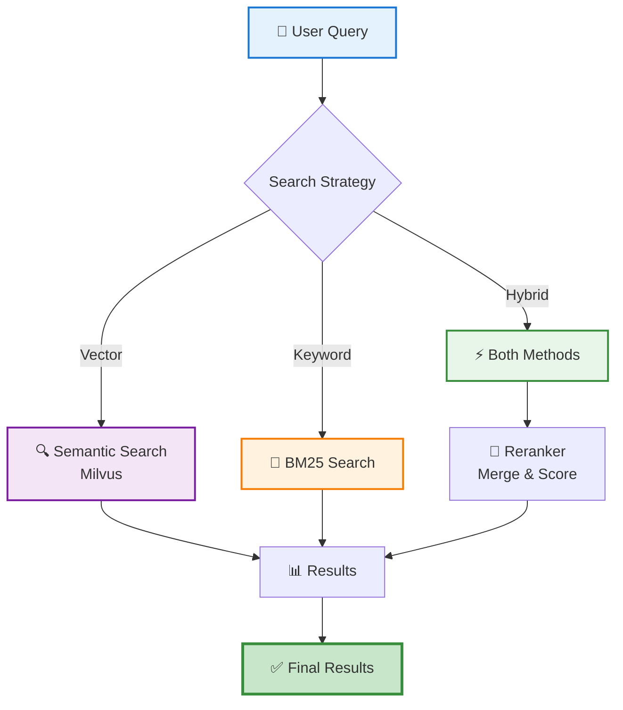

# Search & Retrieval

!!! abstract "Complete Search Guide"
    Master all search methods in **Tender-RAG-Lab**: vector similarity, keyword search, and hybrid retrieval.
    
    From basic semantic search to advanced multi-strategy retrieval.

---

## :material-magnify: Overview

!!! info "Three Search Strategies"
    Tender-RAG-Lab supports multiple search approaches for different use cases:

<div class="grid cards" markdown>

-   :material-vector-difference:{ .lg } **Vector Search**

    ---

    Semantic similarity using embeddings (Milvus)
    
    Best for: Natural language queries

-   :material-text-search:{ .lg } **Keyword Search**

    ---

    Exact term matching with BM25 algorithm
    
    Best for: Specific terminology

-   :material-merge:{ .lg } **Hybrid Search**

    ---

    Combines both methods with reranking
    
    Best for: Production use

</div>

### Search Flow



---

## :material-rocket-launch: Quick Start

### Basic Semantic Search

```python title="Simple vector search"
from src.domain.tender.services.search import TenderSearchService

search = TenderSearchService()

# Simple semantic search
results = search.search(
    query="What are the mandatory technical requirements?",
    top_k=5
)

for i, result in enumerate(results, 1):
    print(f"{i}. {result.text[:100]}...")
    print(f"   📊 Score: {result.score:.3f}")
    print(f"   📄 Source: {result.metadata['source_file']}\n")
```

---

### Search with Filters

!!! tip "Narrow Down Results"
    Apply metadata filters for precision:

```python title="Filtered search"
# Search within specific tender
results = search.search(
    query="budget constraints",
    top_k=10,
    filters={
        "tender_id": "TENDER-2025-001",
        "has_requirements": True,
        "section_type": "technical"
    }
)
```

---

## :material-strategy: Search Strategies

### :material-vector-difference: 1. Vector Search (Default)

!!! info "Pure Semantic Similarity"
    Uses embeddings to find conceptually similar content:

```python title="Vector-only search"
from src.domain.tender.search import TenderSearcher

searcher = TenderSearcher(
    vector_store=milvus_client,
    embedding_client=embedding_client
)

# Semantic search
results = searcher.vector_search(
    query="compliance requirements for data security",
    top_k=5,
    score_threshold=0.7  # Only results with score > 0.7
)
```

=== "✅ Best For"

    - **Natural language queries** ("What is this tender about?")
    - **Conceptual questions** (understanding themes)
    - **Cross-lingual search** (semantic matching across languages)
    - **Fuzzy matching** (typos, synonyms)

=== "❌ Not Ideal For"

    - Exact code/ID searches (use keyword instead)
    - Legal term matching (combine with keyword)
    - Acronym searches
### :material-text-search: 2. Keyword Search (BM25)

!!! info "Exact Term Matching"
    Uses BM25 algorithm for precise term matching with TF-IDF weighting.

```python title="Keyword-based search"
# Keyword-based search
results = searcher.keyword_search(
    query="ISO 27001 AND GDPR",
    top_k=5
)
```

=== "✅ Best For"

    - **Specific identifiers** (CIG codes, certification IDs)
    - **Boolean queries** (AND, OR, NOT operators)
    - **Acronyms** (ISO, GDPR, ANAC)
    - **Technical jargon** (exact terminology)

=== "❌ Not Ideal For"

    - Natural language questions
    - Conceptual understanding
    - Synonym matching
    - Cross-lingual search

**Example queries:**
```python
queries = [
    'CIG:"12345678AB"',           # Exact CIG code
    "ISO 27001 OR ISO 9001",       # Boolean OR
    "ANAC compliance -optional",   # Exclude term
    '"data protection"',           # Exact phrase
]
```

---

### :material-merge: 3. Hybrid Search (Recommended)

!!! success "Best of Both Worlds"
    Combines vector + keyword search with intelligent reranking for optimal results.

```python title="Hybrid search (production-ready)"
# Hybrid search (best results)
results = searcher.hybrid_search(
    query="mandatory cybersecurity certifications ISO 27001",
    top_k=10,
    alpha=0.7  # 0.7 vector + 0.3 keyword
)
```

**Ranking Formula:**

```python
final_score = (alpha × vector_score) + ((1 - alpha) × keyword_score)
```

=== "⚙️ Alpha Tuning"

    | Alpha | Vector | Keyword | Best For |
    |-------|--------|---------|----------|
    | **0.8** | 80% | 20% | Natural questions |
    | **0.7** | 70% | 30% | **Balanced (default)** ⭐ |
    | **0.5** | 50% | 50% | Mixed queries |
    | **0.3** | 30% | 70% | Technical searches |

=== "✅ Best For"

    - **Production deployments** (most reliable)
    - **Complex queries** (concepts + specific terms)
    - **Maximum recall & precision**
    - **User-facing search** (handles any query type)

---

## :material-magnify-plus: Advanced Queries

### Query Rewriting

!!! abstract "Automatic Query Enhancement"
    Uses LLM to expand and clarify user queries for better retrieval.

```python title="Query rewriting with LLM"
from src.domain.tender.services.query import QueryRewriter

rewriter = QueryRewriter(llm_client=llm)

# Original query
original = "What docs do I need?"

# Rewritten with context
rewritten = rewriter.rewrite(
    query=original,
    context="tender application requirements"
)
# → "What documentation is required for the tender application?"

results = searcher.search(query=rewritten, top_k=5)
```

!!! tip "When to Use"
    - Vague user queries
    - Short questions (< 5 words)
    - Ambiguous terminology

---

### Multi-Query Fusion

!!! abstract "Query Expansion Strategy"
    Generate multiple query variations and merge results for comprehensive coverage.

```python title="Multi-query with result fusion"
# Generate query variations
queries = rewriter.generate_variations(
    query="submission deadlines",
    num_variations=3
)
# → [
#     "What are the submission deadlines?",
#     "When is the tender due?",
#     "Application deadline dates"
# ]

# Search with all variations
all_results = []
for q in queries:
    results = searcher.search(query=q, top_k=5)
    all_results.extend(results)

# Deduplicate and rerank
final_results = searcher.rerank(all_results, original_query="submission deadlines")
```

!!! success "Benefits"
    - ✅ Higher recall (find more relevant documents)
    - ✅ Multiple perspectives on same question
    - ✅ Handles query ambiguity

---

### Contextual Search

!!! abstract "Chain Search Queries"
    Search within previous results to refine and narrow down.

```python title="Iterative refinement"
# First query
initial = searcher.search(
    query="technical requirements",
    top_k=10
)

# Narrow down results
refined = searcher.search(
    query="minimum server specifications",
    top_k=5,
    context_results=initial  # Search within these results only
)
```

!!! tip "Use Case"
    Perfect for conversational search where users progressively refine their query.

---

## :material-filter: Filters and Metadata

### Filter by Tender

```python title="Tender-specific search"
results = searcher.search(
    query="budget breakdown",
    filters={"tender_id": "TENDER-2025-001"}
)
```

---

### Filter by Date Range

```python title="Time-based filtering"
from datetime import datetime, timedelta

# Tenders from last 30 days
cutoff = datetime.now() - timedelta(days=30)

results = searcher.search(
    query="infrastructure projects",
    filters={
        "upload_date": {"$gte": cutoff.isoformat()}
    }
)
```

---

### Filter by Entity Type

```python title="Content type filtering"
# Only chunks with deadlines
results = searcher.search(
    query="submission process",
    filters={
        "has_deadlines": True,
        "entity_types": {"$contains": "deadline"}
    }
)
```

---

### Complex Filters

```python title="Multi-condition filtering"
# Multiple conditions with boolean logic
results = searcher.search(
    query="evaluation criteria",
    filters={
        "$and": [
            {"tender_id": {"$in": ["TENDER-2025-001", "TENDER-2025-002"]}},
            {"has_requirements": True},
            {"page_number": {"$lte": 50}}
        ]
    }
)
```

---

## :material-speedometer: Performance Optimization

### Caching

!!! tip "Speed Up Frequent Queries"

```python title="LRU cache for queries"
from functools import lru_cache

@lru_cache(maxsize=100)
def cached_search(query: str, tender_id: str):
    return searcher.search(query=query, filters={"tender_id": tender_id})

# Subsequent calls are instant
results1 = cached_search("requirements", "TENDER-2025-001")  # 200ms
results2 = cached_search("requirements", "TENDER-2025-001")  # <1ms
```

---

### Batch Queries

!!! tip "Parallel Execution"

```python title="Batch search for multiple queries"
queries = [
    "budget constraints",
    "technical specifications",
    "submission deadlines"
]

# Batch search (parallel execution)
results = searcher.batch_search(
    queries=queries,
    top_k=5,
    filters={"tender_id": "TENDER-2025-001"}
)

for query, result_list in zip(queries, results):
    print(f"{query}: {len(result_list)} results")
```

---

### Index Optimization

!!! tip "Tune Milvus for Speed"

=== "IVF_FLAT (Balanced)"

    ```python title="Speed/accuracy balance"
    from pymilvus import Collection
    
    collection = Collection("tender_documents")
    
    collection.create_index(
        field_name="embedding",
        index_params={
            "metric_type": "COSINE",
            "index_type": "IVF_FLAT",
            "params": {"nlist": 1024}
        }
    )
    ```

=== "HNSW (Fast)"

    ```python title="Fastest search"
    collection.create_index(
        field_name="embedding",
        index_params={
            "metric_type": "IP",
            "index_type": "HNSW",
            "params": {
                "M": 16,
                "efConstruction": 200
            }
        }
    )
    ```

---

## :material-code-block-tags: Complete Example

!!! example "End-to-End RAG Workflow"

```python title="Full search & answer pipeline"
from src.domain.tender.services.search import TenderSearchService
from src.infra.factory import create_tender_stack

# Initialize
stack = create_tender_stack()
search = TenderSearchService(
    searcher=stack.searcher,
    llm_client=stack.llm_client
)

def answer_tender_question(tender_id: str, question: str):
    """Complete RAG pipeline"""
    
    print(f"Question: {question}\n")
    
    # 1. Rewrite query
    print("1. Rewriting query...")
    rewritten = search.rewrite_query(question)
    print(f"   → {rewritten}\n")
    
    # 2. Hybrid search
    print("2. Searching documents...")
    results = search.hybrid_search(
        query=rewritten,
        top_k=10,
        filters={"tender_id": tender_id},
        alpha=0.7
    )
    print(f"   Found {len(results)} relevant chunks\n")
    
    # 3. Rerank
    print("3. Reranking results...")
    top_results = search.rerank(results, query=question, top_k=5)
    
    # 4. Generate answer
    print("4. Generating answer...\n")
    answer = search.generate_answer(
        query=question,
        context=top_results
    )
    
    print(f"Answer: {answer.text}\n")
    print("Sources:")
    for i, source in enumerate(answer.sources, 1):
        print(f"  {i}. {source.metadata['source_file']} (page {source.metadata['page_number']})")
        print(f"     Score: {source.score:.3f}")
        print(f"     \"{source.text[:100]}...\"")
    
    return answer

# Usage
answer = answer_tender_question(
    tender_id="TENDER-2025-001",
    question="What are the minimum technical requirements for server infrastructure?"
)
```

---

## :material-alert-circle: Troubleshooting

??? failure "No Results Found"

    **Problem**: Search returns empty results
    
    **Solutions**:
    
    1. **Check indexing**:
       ```python
       from pymilvus import Collection
       
       collection = Collection("tender_documents")
       print(f"Total documents: {collection.num_entities}")
       ```
    
    2. **Relax thresholds**:
       ```python
       results = searcher.search(
           query="budget",
           score_threshold=0.5,  # Lower threshold
           top_k=20  # More results
       )
       ```
    
    3. **Verify filters**:
       ```python
       # Remove filters temporarily
       results = searcher.search(query="budget", filters={})
       ```

??? failure "Poor Result Quality"

    **Problem**: Irrelevant results returned
    
    **Solutions**:
    
    1. **Use hybrid search** (not just vector):
       ```python
       results = searcher.hybrid_search(query=q, alpha=0.7)
       ```
    
    2. **Add reranking**:
       ```python
       results = searcher.search(query=q, top_k=20)
       reranked = searcher.rerank(results, query=q, top_k=5)
       ```
    
    3. **Query rewriting**:
       ```python
       rewritten = rewriter.rewrite(query)
       results = searcher.search(query=rewritten)
       ```

??? failure "Slow Search Performance"

    **Problem**: Queries taking >1 second
    
    **Solutions**:
    
    1. **Optimize index**:
       - Use HNSW instead of IVF_FLAT
       - Increase `nprobe` value
    
    2. **Enable caching**:
       ```python
       @lru_cache(maxsize=100)
       def cached_search(q): ...
       ```
    
    3. **Reduce `top_k`**:
       ```python
       results = searcher.search(query=q, top_k=5)  # Instead of 50
       ```

---

## :material-arrow-right-circle: Next Steps

<div class="grid cards" markdown>

-   :material-robot-outline:{ .lg } **[RAG Pipeline](rag-pipeline.md)**

    ---
    
    **Complete end-to-end RAG** with retrieval + graph + generation

-   :material-file-document-multiple:{ .lg } **[Index Documents](indexing-documents.md)**

    ---
    
    Learn how to process and index tender documents

-   :material-graph:{ .lg } **[Knowledge Graph](knowledge-graph.md)**

    ---
    
    Enhance search with Neo4j graph relationships

-   :material-cog-outline:{ .lg } **[Environment Setup](environment-setup.md)**

    ---
    
    Configure advanced search parameters

</div>

)
```

### Poor Result Quality

```python
# Analyze query embedding
query_vec = embedding_client.embed(query)

# Check embedding quality
print(f"Query embedding norm: {np.linalg.norm(query_vec)}")

# Try different search strategy
results_vector = search.vector_search(query, top_k=10)
results_hybrid = search.hybrid_search(query, top_k=10, alpha=0.5)

print(f"Vector only: {len(results_vector)} results")
print(f"Hybrid: {len(results_hybrid)} results")
```

### Slow Queries

```python
import time

start = time.time()
results = search.search(query="requirements", top_k=5)
duration = time.time() - start

print(f"Search took {duration:.2f}s")

if duration > 1.0:
    print("Consider:")
    print("  - Reduce top_k")
    print("  - Add more specific filters")
    print("  - Optimize Milvus index (IVF_FLAT → HNSW)")
```

---

## Related Documentation

- [Indexing Documents](indexing-documents.md) - Upload and index documents
- [RAG Toolkit](../quaerum/index.md) - Generic search components
- [Domain Layer](../domain/README.md) - Tender-specific search logic
