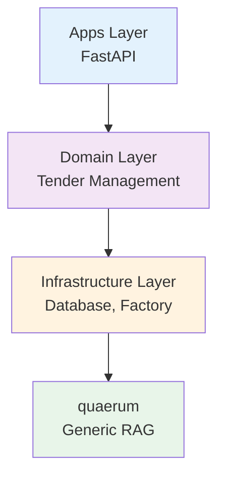

# Tender-RAG-Lab Documentation


**Tender-RAG-Lab** is a production-grade Retrieval-Augmented Generation system for analyzing Italian public procurement tender documents, built with clean architecture principles and the quaerum library.

## Quick Links

<div class="grid cards" markdown>

-   :material-rocket-launch:{ .lg .middle } **Quick Start**

    ---

    Get the system running in 10 minutes with Docker Compose and basic configuration.

    [:octicons-arrow-right-24: Get Started](guides/quickstart.md)

-   :material-sitemap:{ .lg .middle } **Architecture**

    ---

    Learn about clean architecture, quaerum integration, and design principles.

    [:octicons-arrow-right-24: Learn More](architecture/overview.md)

-   :material-magnify:{ .lg .middle } **Search & Retrieval**

    ---

    Query the system with vector search, hybrid retrieval, and reranking strategies.

    [:octicons-arrow-right-24: Explore](guides/search-retrieval.md)

-   :material-graph:{ .lg .middle } **Knowledge Graph**

    ---

    Use Neo4j for structured tender metadata, relationships, and graph-based reasoning.

    [:octicons-arrow-right-24: Discover](guides/knowledge-graph.md)

-   :material-calendar-clock:{ .lg .middle } **Project Roadmap**

    ---

    Complete 2025-2026 implementation plan with Graph RAG and external integrations.

    [:octicons-arrow-right-24: View Roadmap](roadmap.md)

-   :material-code-braces:{ .lg .middle } **API Reference**

    ---

    Auto-generated API documentation from Python docstrings.

    [:octicons-arrow-right-24: Browse API](api/core/embedding.md)

</div>

## Features

### :material-vector-combine: Hybrid RAG System
Combines vector search (Milvus) with graph-based reasoning (Neo4j) for comprehensive document analysis and structured metadata tracking.

### :material-floor-plan: Clean Architecture
Four-layer design with clear separation: Apps → Domain → Infrastructure → quaerum, following dependency inversion principles.

### :material-file-document: Document Processing
PDF, DOCX, and TXT parsing with OCR support for scanned documents. Multi-language support for Italian and English tenders.

### :material-briefcase-check: Business Workflows
Compliance checking, requirement extraction, and bid/no-bid decision support (planned).

### :material-swap-horizontal: Vendor Agnostic
Protocol-based design allows swapping vector stores (Milvus ↔ Qdrant) and LLM providers (Ollama ↔ OpenAI) without code changes.

### :material-check-decagram: Production Ready
Async-first architecture, comprehensive testing, Docker deployment, and PostgreSQL for structured data.

## Quick Example

=== "Bash"

    ```bash
    # Clone and setup
    git clone https://github.com/gmottola00/Tender-RAG-Lab.git
    cd Tender-RAG-Lab
    
    # Install dependencies
    uv sync
    
    # Configure environment
    cp .env.example .env
    
    # Start services
    docker-compose up -d
    
    # Run application
    uv run uvicorn main:app --reload
    ```

=== "Python"

    ```python
    # Upload and index a tender document
    from src.domain.tender.services.documents import DocumentService
    
    service = DocumentService()
    document = service.upload(
        file_path="tender.pdf",
        tender_id="TENDER-2025-001"
    )
    
    # Search with hybrid retrieval
    results = service.search(
        query="What are the mandatory requirements?",
        top_k=5
    )
    
    for result in results:
        print(f"Score: {result.score}")
        print(f"Text: {result.text}")
    ```

## Why Tender-RAG-Lab?

!!! success "Domain-Specific"
    Purpose-built for Italian public procurement documents with specialized entity extraction and compliance workflows.

!!! tip "Hybrid Retrieval"
    Combines vector similarity search with graph-based reasoning for better accuracy on structured tender data.

!!! abstract "Extensible Architecture"
    Generic RAG logic lives in quaerum library, while tender-specific logic stays focused in the domain layer.

!!! example "Developer Experience"
    Clear documentation, working examples, type hints throughout, and comprehensive test coverage.

## System Architecture

Tender-RAG-Lab follows clean architecture with four layers:



**Key Principle:** Outer layers depend on inner layers, never the reverse. Generic RAG components live in quaerum, domain logic stays in the domain layer.

## Technology Stack

| Component | Technology | Purpose |
|-----------|-----------|---------|
| **API Framework** | FastAPI | Async HTTP endpoints |
| **Vector DB** | Milvus | Semantic search |
| **Graph DB** | Neo4j | Relationship queries |
| **SQL DB** | PostgreSQL | Structured data |
| **Embedding** | Ollama (nomic-embed-text) | Text vectorization |
| **LLM** | Ollama (llama3) | Text generation |
| **RAG Library** | quaerum | Generic RAG components |
| **NER** | spaCy | Entity extraction |
| **Document Parser** | Docling | PDF/DOCX processing |

## Getting Started

1. **[Quick Start Guide](guides/quickstart.md)** - Get running in 10 minutes
2. **[Environment Setup](guides/environment-setup.md)** - Configure your development environment
3. **[Architecture Overview](architecture/overview.md)** - Understand the system design
4. **[Document Ingestion](guides/indexing-documents.md)** - Index your first tender document

## Community & Support

- :fontawesome-brands-github: **GitHub**: [gmottola00/Tender-RAG-Lab](https://github.com/gmottola00/Tender-RAG-Lab)
- :fontawesome-solid-book: **Documentation**: You're reading it!
- :fontawesome-solid-bug: **Issues**: [Report bugs](https://github.com/gmottola00/Tender-RAG-Lab/issues)
- :fontawesome-solid-lightbulb: **Discussions**: [Ask questions](https://github.com/gmottola00/Tender-RAG-Lab/discussions)

---

<div class="text-center">
    <p><strong>Built with ❤️ for Italian Public Procurement</strong></p>
    <p>Licensed under MIT · Copyright © 2025 Gianmarco Mottola</p>
</div>
