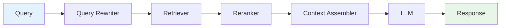

# RAG Pipeline

Complete guide to the RAG pipeline in quaerum.

## Overview

The RAG pipeline orchestrates retrieval and generation:



## Basic Usage

```python
from quaerum.rag import RagPipeline
from quaerum.rag.rewriter import QueryRewriter
from quaerum.rag.assembler import ContextAssembler
from quaerum.rag.rerankers import LLMReranker

pipeline = RagPipeline(
    retriever=indexer,
    llm_client=llm_client,
    rewriter=QueryRewriter(llm_client),
    assembler=ContextAssembler(),
    reranker=LLMReranker(llm_client),
)

result = await pipeline.query(
    query="What are the technical requirements?",
    top_k=10
)

print(result.answer)
print(f"Sources: {len(result.sources)}")
```

## Components

### Query Rewriter

Reformulates queries for better retrieval:

```python
from quaerum.rag.rewriter import QueryRewriter

rewriter = QueryRewriter(llm_client)

# Original query
query = "What is required?"

# Rewritten
rewritten = await rewriter.rewrite(query, context="tender documents")
# "What are the mandatory technical requirements for this tender?"
```

### Context Assembler

Combines retrieved chunks into LLM context:

```python
from quaerum.rag.assembler import ContextAssembler

assembler = ContextAssembler(
    max_tokens=2048,
    format="markdown"
)

context = assembler.assemble(chunks)
```

### Rerankers

Reorder results by relevance:

```python
from quaerum.rag.rerankers import LLMReranker

reranker = LLMReranker(llm_client)

reranked = await reranker.rerank(
    query="requirements",
    chunks=chunks,
    top_k=5
)
```

## Advanced Configuration

```python
pipeline = RagPipeline(
    retriever=indexer,
    llm_client=llm_client,
    
    # Query optimization
    rewriter=QueryRewriter(
        llm_client=llm_client,
        prompt_template="..."
    ),
    
    # Context assembly
    assembler=ContextAssembler(
        max_tokens=2048,
        format="markdown",
        include_metadata=True
    ),
    
    # Reranking
    reranker=LLMReranker(
        llm_client=llm_client,
        top_k=5
    ),
    
    # Response generation
    generation_config={
        "temperature": 0.7,
        "max_tokens": 1024,
    }
)
```

## See Also

- [Search Strategies](search.md) - Retrieval methods
- [Extending quaerum](extending.md) - Custom components
- [LLM API](../api/core/llm.md) - LLM client details
