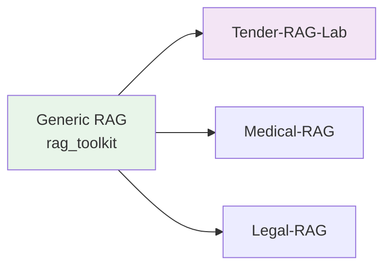

# rag_toolkit Overview

Integration guide for the rag_toolkit library in Tender-RAG-Lab.

## What is rag_toolkit?

**rag_toolkit** is a generic, reusable Python library for building Retrieval-Augmented Generation (RAG) systems. It provides protocol-based components that work across different domains.



## Key Features

- **Protocol-Based** - Structural typing for flexibility
- **Zero Domain Knowledge** - Works for any use case
- **Composable** - Mix and match components
- **Well-Tested** - Comprehensive test coverage

## Core Components

### 1. Embedding & LLM Protocols

```python
from rag_toolkit.core.embedding import EmbeddingClient
from rag_toolkit.core.llm import LLMClient

# Any class implementing these protocols works
embed_client: EmbeddingClient = OllamaEmbeddingClient()
llm_client: LLMClient = OllamaLLMClient()
```

### 2. RAG Pipeline

```python
from rag_toolkit.rag import RagPipeline

pipeline = RagPipeline(
    retriever=indexer,
    llm_client=llm_client,
)

result = await pipeline.query("What are the requirements?")
```

### 3. Vector Store Abstractions

```python
from rag_toolkit.infra.vectorstores.factory import (
    create_milvus_service,
    create_index_service
)

milvus = create_milvus_service()
index = create_index_service(
    embedding_dim=768,
    embed_fn=embed_fn,
    vector_store=milvus,
)
```

### 4. Chunking Strategies

```python
from rag_toolkit.core.chunking import DynamicChunker

chunker = DynamicChunker(max_tokens=512)
chunks = chunker.chunk_document(document)
```

## Installation

```bash
# From local clone (editable mode)
uv pip install -e ../Rag-Toolkit

# From PyPI (when published)
pip install rag-toolkit
```

## Usage in Tender-RAG-Lab

Tender-RAG-Lab uses rag_toolkit for generic components and adds domain-specific logic:

```python
# Generic rag_toolkit component
from rag_toolkit.core.chunking.types import ChunkLike

# Domain-specific extension
@dataclass
class TenderChunk:
    """Implements ChunkLike + tender fields."""
    # Protocol fields
    id: str
    text: str
    
    # Tender-specific
    tender_id: str
    lot_id: Optional[str]
```

## Migration Status

### ✅ Completed (Phases 1-3)

- Protocol imports migrated
- RAG modules migrated
- Chunking modules migrated
- **Result:** ~17 files eliminated, ~60% code reduction

### See Also

- [rag_toolkit Integration Guide](../architecture/rag-toolkit.md) - Detailed integration
- [Pipeline Documentation](pipeline.md) - RAG pipeline details
- [Search Strategies](search.md) - Vector and hybrid search
