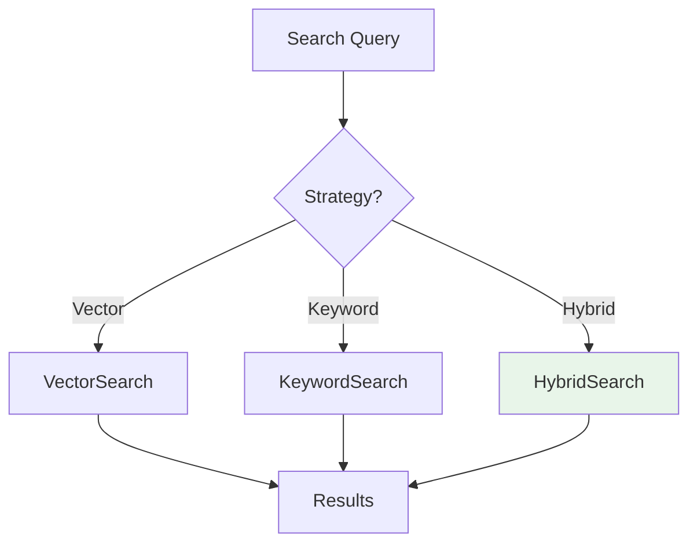

# Search Strategies

Vector and hybrid search strategies in rag_toolkit.

## Overview

rag_toolkit provides multiple search strategies:



## Vector Search

Semantic similarity using embeddings:

```python
from rag_toolkit.core.index.search_strategies import VectorSearch

strategy = VectorSearch(
    top_k=10,
    min_score=0.7
)

results = await index_service.search(
    query="technical requirements",
    strategy=strategy
)
```

## Keyword Search

BM25-based lexical matching:

```python
from rag_toolkit.core.index.search_strategies import KeywordSearch

strategy = KeywordSearch(
    top_k=10,
    boost=1.5
)

results = await index_service.search(
    query="mandatory requirements",
    strategy=strategy
)
```

## Hybrid Search

Combines vector + keyword:

```python
from rag_toolkit.core.index.search_strategies import HybridSearch

strategy = HybridSearch(
    vector_weight=0.7,
    keyword_weight=0.3,
    top_k=10,
    min_score=0.6
)

results = await index_service.search(
    query="technical specifications",
    strategy=strategy
)
```

## Custom Search Strategy

Implement your own:

```python
from rag_toolkit.core.index.search_strategies import SearchStrategy
from typing import List

class CustomSearch(SearchStrategy):
    def search(
        self,
        query: str,
        index_service: IndexService,
        **kwargs
    ) -> List[SearchResult]:
        # Custom logic
        return results

# Use it
strategy = CustomSearch(top_k=5)
results = await index_service.search(query, strategy=strategy)
```

## Best Practices

### When to Use Vector Search

- Semantic similarity important
- Query synonyms and paraphrasing
- Cross-language search

### When to Use Keyword Search

- Exact term matching needed
- Technical jargon/codes
- Short queries

### When to Use Hybrid

- **Most cases** - Best of both worlds
- Unknown query types
- Production systems

## Configuration

```python
# Vector-heavy (semantic focus)
HybridSearch(
    vector_weight=0.8,
    keyword_weight=0.2
)

# Keyword-heavy (exact match focus)
HybridSearch(
    vector_weight=0.3,
    keyword_weight=0.7
)

# Balanced
HybridSearch(
    vector_weight=0.5,
    keyword_weight=0.5
)
```

## See Also

- [Pipeline](pipeline.md) - Full RAG pipeline
- [Tender Search](../domain/tender-search.md) - Domain-specific search
- [Search Guide](../guides/search-retrieval.md) - User guide
