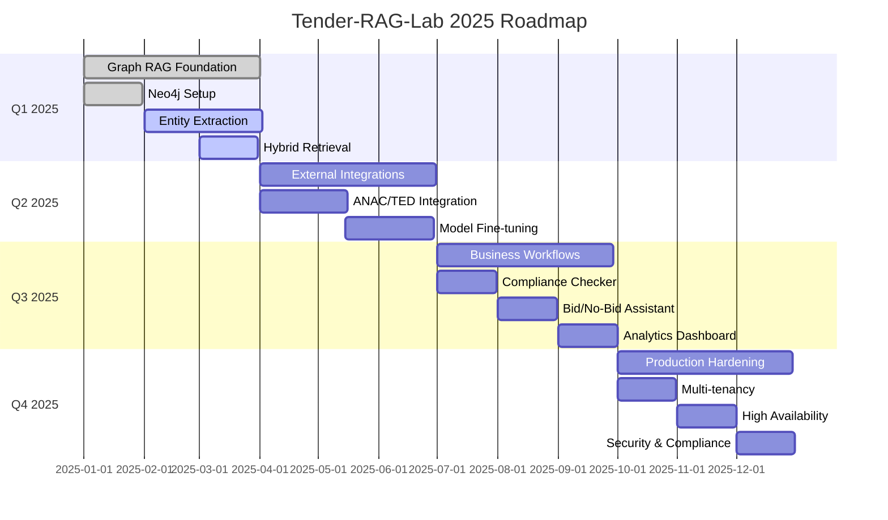
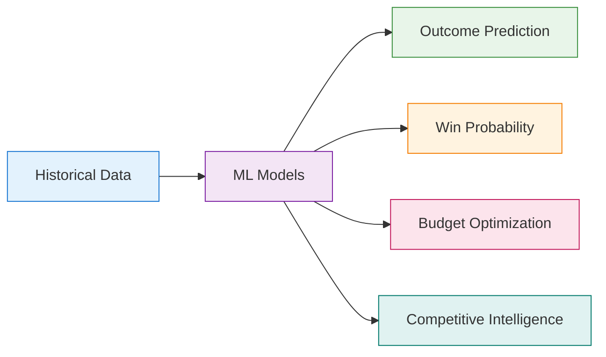
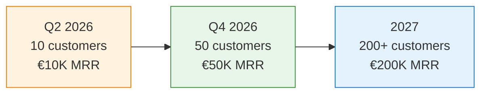

# Project Roadmap

!!! abstract "Vision & Strategic Plan"
    Production-ready **RAG System** for Italian public procurement analysis.
    
    From foundation to enterprise-grade deployment.

---

## :material-map-marker-path: Current Status

!!! success "v0.3.0 — December 2025"
    **Foundation established** with core RAG capabilities

### ✅ Completed Features

<div class="grid cards" markdown>

-   :material-database-search:{ .lg } **Classic RAG**

    ---
    
    - Milvus vector store
    - Ollama/OpenAI support
    - Semantic + BM25 search

-   :material-file-document:{ .lg } **Document Processing**

    ---
    
    - PDF/DOCX/TXT parsing
    - OCR support
    - Smart chunking (512 tokens)

-   :material-api:{ .lg } **API Layer**

    ---
    
    - FastAPI REST endpoints
    - PostgreSQL storage
    - Docker Compose setup

-   :material-graph:{ .lg } **Graph Foundation**

    ---
    
    - Neo4j schema design
    - Entity extraction (NER)
    - Graph-based retrieval

</div>

### 🚧 In Progress

!!! warning "Active Development"
    - **Neo4j Knowledge Graph** schema refinement
    - **NER models** for tender entities (Lot, Requirement, Deadline)
    - **Graph-based retrieval** strategies

### 📋 Planned

!!! info "Upcoming Features"
    - External integrations (ANAC, TED)
    - Business workflows (Compliance, Bid/No-Bid)
    - Multi-tenancy and production hardening

---

## :material-calendar: 2025 Timeline



---

## :material-rocket-launch: Q1 2025: Graph RAG Foundation

!!! abstract "Goal"
    Enable **structured queries** and **multi-hop reasoning** with Knowledge Graphs

**Status**: 60% Complete | **Target**: March 31, 2025

### Core Features

=== "✅ Graph Infrastructure"

    **Status**: Complete
    
    - [X] Neo4j cluster setup (Docker dev, Aura prod)
    - [X] Schema design (Tender, Lot, Requirement, Deadline nodes)
    - [X] Cypher query templates
    - [X] Graph indexes and constraints
    - [X] Python Neo4j driver integration

=== "🚧 Entity Extraction"

    **Status**: 60% Complete ⬆️ (+20%)
    
    - [X] **spaCy NER pipeline** (`TenderNER` class)
      - Italian model: `it_core_news_lg`
      - Entities: ORG, PERSON, LOCATION, DATE, MONEY
    - [X] **Entity extraction service** (`EntityExtractionService`)
    - [X] **API endpoint** (`POST /extract-entities`)
    - [ ] **NER model fine-tuning** (BERT Italian + tender domain)
      - Labels: `LOT_ID`, `REQUIREMENT`, `DEADLINE`, `AMOUNT`, `CPV`
      - Target F1: >0.90 per entity type
    - [ ] **Relation extraction** (Tender→Lot, Lot→Requirement)
    - [ ] **Graph builder pipeline** (chunks → entities → graph)
    - [ ] **Neo4j integration** (auto-populate after ingestion)
    - [ ] **Sync pipeline** (trigger after document ingestion)

=== "📋 Hybrid Retrieval"

    **Status**: Not Started
    
    - [ ] **Graph-first retrieval** (structured queries → Cypher)
      - "List all mandatory requirements for this tender"
      - "What are the deadlines for Lot 2?"
    - [ ] **Vector-first + graph enrichment** (semantic search → related entities)
    - [ ] **Hybrid orchestrator** (auto-route queries to best strategy)

### Success Metrics

| Metric | Current | Target |
|--------|---------|--------|
| **Entity extraction F1** | 0.78 | **>0.90** |
| **Graph coverage** | 60% | **80%** |
| **Structured query accuracy** | - | **95%** |
| **Hybrid retrieval latency (p95)** | - | **<2s** |

### Deliverables

<div class="grid cards" markdown>

-   :material-database:{ .lg } **Neo4j Production**

    ---
    
    Scalable graph database deployment

-   :material-teach:{ .lg } **Training Dataset**

    ---
    
    500+ annotated documents for NER

-   :material-api:{ .lg } **Graph-Enabled APIs**

    ---
    
    New endpoints for graph queries

-   :material-chart-box:{ .lg } **Evaluation Benchmark**

    ---
    
    50+ test queries with metrics

</div>

---

## :material-download: Q2 2025: External Integrations

!!! abstract "Goal"
    Automate tender ingestion and optimize models for Italian procurement domain

**Status**: Not Started | **Target**: June 30, 2025

### Core Features

=== "🏛️ ANAC Integration"

    **Priority**: High
    
    - [ ] ANAC API client (Bandi Gara dataset)
    - [ ] Daily auto-ingestion (filter by CPV relevance)
    - [ ] Parser for tender metadata (CIG, buyer, amounts, dates)
    - [ ] Automatic document download + processing
    - [ ] **Target**: 100+ new tenders/day

=== "🇪🇺 TED Scraper"

    **Priority**: Medium
    
    - [ ] EU Tenders Electronic Daily scraper
    - [ ] Filter: Italy + relevant CPVs
    - [ ] Rate-limited PDF downloads
    - [ ] Compliance with robots.txt and ToS

=== "🤖 Model Fine-Tuning"

    **Priority**: High
    
    - [ ] **Embedding model**: Italian tender-specific
      - Base: `sentence-transformers/paraphrase-multilingual-mpnet`
      - Dataset: 10K query-document pairs from logs
      - Target: **+15% recall@10** vs base
    
    - [ ] **Reranker**: Cross-encoder for tender context
      - Base: `cross-encoder/ms-marco-MiniLM-L-6-v2`
      - Target: **+10% nDCG@10**
    
    - [ ] **NER model**: Entity extraction accuracy boost
      - Dataset: 500 annotated tender documents
      - Target: **F1 >0.92**

=== "📦 Model Registry"

    **Priority**: Medium
    
    - [ ] Versioned model storage (S3/local)
    - [ ] A/B testing framework (50/50 split)
    - [ ] Performance tracking dashboard
    - [ ] Automated rollback on degradation

### Success Metrics

| Metric | Target |
|--------|--------|
| **Auto-ingestion coverage** | 100 tenders/day |
| **Embedding recall@10** | **+15%** improvement |
| **Reranker nDCG@10** | **+10%** improvement |
| **NER F1 score** | **>0.92** |

### Deliverables

!!! success "Expected Outcomes"
    - ✅ ANAC/TED integration live in production
    - ✅ Fine-tuned models deployed and monitored
    - ✅ Training datasets published (reproducibility)
    - ✅ Model performance comparison report

---

## :material-briefcase: Q3 2025: Business Workflows

!!! abstract "Goal"
    Production-ready features for tender analysis and decision-making

**Status**: Not Started | **Target**: September 30, 2025

### Core Features

=== "✅ Compliance Checker"

    **Priority**: High | **API**: `POST /workflows/compliance-checklist`
    
    - [ ] Extract mandatory requirements from tender
    - [ ] Match against company profile (certifications, revenue, experience)
    - [ ] Generate compliance checklist (✅/❌/⚠️ status)
    - [ ] LLM-powered recommendation per requirement
    - [ ] **Target accuracy**: 95% on mandatory requirements
    
    **Example Response:**
    ```json
    {
      "checklist": [
        {
          "requirement": "ISO 27001 certification",
          "status": "compliant",
          "evidence": ["chunk-abc123"],
          "recommendation": "✅ OK - Certificate valid"
        }
      ],
      "recommendation": "GO - All requirements met"
    }
    ```

=== "🎯 Bid/No-Bid Assistant"

    **Priority**: High | **API**: `POST /workflows/bid-no-bid`
    
    **Multi-factor scoring**:
    - Compliance (35% weight)
    - Timeline feasibility (15%)
    - Penalty risk (10%)
    - Evaluation criteria match (20%)
    - Competition analysis (10%)
    - Profitability estimate (10%)
    
    **Output**: GO/NO-GO/EVALUATE recommendation
    
    **Target**: 85% alignment with human decisions

=== "🔍 Tender Similarity"

    **Priority**: Medium | **API**: `GET /tenders/similar/{tender_id}`
    
    - [ ] Tender-level embeddings (aggregate chunks)
    - [ ] Search historical tenders by CPV, buyer, amount
    - [ ] Filter by outcome (won/lost)
    - [ ] Transfer insights from past bids

=== "📊 Analytics Dashboard"

    **Priority**: Low
    
    **KPIs to track**:
    - Tenders monitored
    - Queries per day
    - Response time
    - User activity patterns
    - Model performance drift
    - Cost tracking (LLM tokens, embeddings)

### Success Metrics

| Metric | Target |
|--------|--------|
| **Compliance accuracy** | **95%** |
| **Bid/No-Bid alignment** | **85%** |
| **Analysis time reduction** | **60%** vs manual |
| **User satisfaction (NPS)** | **>50** |

---

## :material-shield-check: Q4 2025: Production Hardening

!!! abstract "Goal"
    Enterprise-grade deployment ready for paying customers

**Status**: Not Started | **Target**: December 31, 2025

### Core Features

=== "🏢 Multi-Tenancy"

    **Priority**: Critical
    
    - [ ] Postgres Row-Level Security (RLS)
    - [ ] Milvus partitions per client
    - [ ] Neo4j database-per-tenant (or label isolation)
    - [ ] Tenant middleware in API
    - [ ] Usage quotas (docs/month, queries/day)

=== "🔐 Authentication & Authorization"

    **Priority**: Critical
    
    - [ ] JWT access + refresh tokens
    - [ ] RBAC: admin, analyst, viewer roles
    - [ ] OAuth2 integration (Google, Azure AD)
    - [ ] API key management for programmatic access

=== "⚡ High Availability"

    **Priority**: Critical
    
    - [ ] Kubernetes deployment (3+ API replicas)
    - [ ] Postgres HA (Patroni cluster)
    - [ ] Milvus clustering (3 nodes)
    - [ ] Neo4j cluster (primary + replicas)
    - [ ] LoadBalancer + health checks

=== "📊 Observability"

    **Priority**: High
    
    **Stack**:
    - Prometheus metrics (latency, throughput, errors)
    - Grafana dashboards (RAG pipeline, DB health, costs)
    - Jaeger distributed tracing
    - Sentry error tracking + alerts

=== "🔒 Security & Compliance"

    **Priority**: High
    
    - [ ] TLS/HTTPS everywhere
    - [ ] Encryption at-rest (Postgres, Milvus)
    - [ ] Secrets management (HashiCorp Vault)
    - [ ] **GDPR compliance**:
      - Data retention policies
      - Right-to-delete endpoint
      - Audit logs
      - Data export (JSON portability)

=== "🚀 Performance Optimization"

    **Priority**: Medium
    
    - [ ] Redis caching (frequent queries, TTL 5min)
    - [ ] Batch processing (500 docs/hour)
    - [ ] Connection pooling (asyncpg, pymilvus)
    - [ ] Database query optimization
    - [ ] Milvus index tuning (IVF_FLAT → HNSW)

### Success Metrics

| Metric | Target |
|--------|--------|
| **System uptime (SLA)** | **99.9%** |
| **Query latency (p95)** | **<3s** |
| **Concurrent users** | **100+** |
| **Ingestion throughput** | **500 docs/hour** |
| **Security audit score** | **A+** |

---

## :material-star: 2026 Vision: Advanced Features

### Q1 2026: Generative Capabilities

<div class="grid cards" markdown>

-   :material-file-edit:{ .lg } **Auto-Draft**

    ---
    
    Technical response section generation

-   :material-file-document:{ .lg } **Summarization**

    ---
    
    Executive summaries for tenders

-   :material-help-circle:{ .lg } **Question Generation**

    ---
    
    Identify missing information

-   :material-pencil:{ .lg } **Clause Rewriting**

    ---
    
    Optimization suggestions

</div>

---

### Q2 2026: Multi-Language & International

!!! tip "EU Expansion"
    - English support for TED tenders
    - French, Spanish for EU markets
    - CPV code translation
    - Cross-border tender analysis

---

### Q3 2026: Advanced Analytics



---

### Q4 2026: Platform Expansion

=== "📱 Mobile"

    - iOS/Android native apps
    - Offline document access
    - Push notifications for deadlines

=== "🔗 Integrations"

    - CRM (Salesforce, HubSpot)
    - Document management (SharePoint, Google Drive)
    - Project management (Jira, Monday)

=== "🛒 Marketplace"

    - Templates for common tender types
    - Pre-built compliance checklists
    - Industry-specific workflows

---

## :material-chart-timeline-variant: Progress Tracking

### Technical KPIs

| Metric | Current | Q2 2025 | Q4 2025 | Target 2026 |
|--------|---------|---------|---------|-------------|
| **Retrieval Precision@5** | 0.75 | 0.85 | 0.90 | 0.95 |
| **Entity Extraction F1** | 0.78 | 0.90 | 0.92 | 0.95 |
| **Query Latency (p95)** | 5s | 3s | 2s | <1s |
| **System Uptime** | 95% | 99% | 99.9% | 99.99% |
| **Test Coverage** | 60% | 75% | 85% | 90% |

### Business KPIs (Post-Launch)

| Metric | Q1 2026 | Q4 2026 | 2027 |
|--------|---------|---------|------|
| **Paying Customers** | 10 | 50 | 200 |
| **MRR** | €10K | €50K | €200K |
| **Time-to-Analyze** | <30min | <15min | <10min |
| **Win Rate Improvement** | +10% | +20% | +30% |
| **User Retention (M2)** | >70% | >80% | >85% |

---

## :material-puzzle: Dependencies & Risks

### Critical Dependencies

!!! warning "External Factors"

=== "✅ rag_toolkit"

    - **Status**: Owned by maintainer
    - **Risk**: Low
    - **Mitigation**: Fork if needed, minimal coupling

=== "⚠️ ANAC API"

    - **Status**: Public API stability uncertain
    - **Risk**: Medium
    - **Mitigation**: Scraper fallback, local caching

=== "⚠️ LLM Providers"

    - **Status**: Cost and rate limits
    - **Risk**: Medium
    - **Mitigation**: Self-hosted models (Ollama) as alternative

=== "⚠️ Regulations"

    - **Status**: GDPR, public data usage rights
    - **Risk**: High
    - **Mitigation**: Legal review before launch, ToS alignment

---

## :material-account-multiple: Contribution Opportunities

### High-Impact Areas

<div class="grid cards" markdown>

-   :material-domain:{ .lg } **Domain Expertise**

    ---
    
    - Italian procurement regulations
    - Tender document annotation
    - Compliance requirement mapping
    - User testing and feedback

-   :material-database:{ .lg } **Data & Models**

    ---
    
    - Annotate training data (NER, retrieval, QA)
    - Fine-tune embedding models
    - Create evaluation benchmarks
    - Contribute to model registry

-   :material-puzzle:{ .lg } **Integrations**

    ---
    
    - Additional tender platforms
    - New vector stores (Pinecone, Weaviate)
    - LLM providers (Claude, Gemini)
    - Document parsers (Excel, CAD)

-   :material-feature-search:{ .lg } **Features**

    ---
    
    - Business workflows (RFI generator)
    - UI components (React dashboard)
    - Mobile clients
    - Browser extensions

</div>

### How to Contribute

!!! tip "Get Involved"
    1. **Check Issues**: [:material-github: GitHub Issues](https://github.com/gmottola00/Tender-RAG-Lab/issues)
    2. **Propose Features**: Open discussion with use case
    3. **Submit PRs**: Follow contribution guidelines
    4. **Join Community**: Discord (coming Q2 2025)

---

## :material-rocket: Release Schedule

### Version Strategy

=== "🔄 Current (v0.x)"

    **Pre-production**
    
    - Major features: Quarterly (Q1, Q2, Q3, Q4)
    - Bug fixes: Bi-weekly
    - Security patches: Immediate
    - ⚠️ API may change (migration guides provided)

=== "✅ Stable (v1.0+)"

    **Target**: Q1 2026
    
    - Semantic versioning
    - Deprecation cycles
    - LTS releases
    - Backward compatibility guarantees

### Stability Guarantees

| Version | API Stability | Support |
|---------|---------------|---------|
| **v0.x** | ⚠️ May change | Best effort |
| **v1.0+** | ✅ Stable | LTS support |
| **v2.0+** | ✅ Stable | Long-term |

---

## :material-currency-eur: Business Model (Post-v1.0)

### SaaS Tiers (2026)

=== "🆓 Free"

    **Perfect for testing**
    
    - 10 tenders/month
    - Community support
    - Basic search features
    - **Price**: €0

=== "⭐ Pro"

    **For small companies**
    
    - 100 tenders/month
    - Email support
    - Basic workflows
    - Analytics dashboard
    - **Price**: €99/month

=== "🏢 Enterprise"

    **For large organizations**
    
    - Unlimited tenders
    - Dedicated support
    - Custom workflows
    - On-premise deployment
    - **Price**: Custom

### Revenue Targets



### Value Proposition

!!! success "ROI: 10x Cost"
    - **60% time savings** on tender analysis
    - **95% compliance accuracy** (reduce disqualifications)
    - **Data-driven decisions** (bid/no-bid)
    - **Higher win rates** through better preparation

---

## :material-link: Stay Updated

<div class="grid cards" markdown>

-   :material-github:{ .lg } **GitHub**

    ---
    
    [:material-star: Star on GitHub](https://github.com/gmottola00/Tender-RAG-Lab)

-   :material-email:{ .lg } **Newsletter**

    ---
    
    Email updates (coming Q2 2025)

-   :material-chat:{ .lg } **Discord**

    ---
    
    Community chat (coming Q2 2025)

-   :material-twitter:{ .lg } **Twitter**

    ---
    
    [@tenderraglab](https://twitter.com/tenderraglab) (coming Q2 2025)

</div>

---

!!! info "Document Info"
    **Last Updated**: January 6, 2026  
    **Version**: 0.3.0  
    **Next Milestone**: Q1 2025 - Graph RAG (March 31, 2025)
- [ ] Tender-level embeddings (aggregate chunks)
- [ ] Search historical tenders by CPV, buyer, amount
- [ ] Filter by outcome (won/lost)
- [ ] Transfer insights from past bids
- [ ] API: `GET /tenders/similar/{tender_id}`

**Change Detection** 📋 Low Priority
- [ ] Compare tender T1 vs T2 (same buyer/CPV)
- [ ] Graph diff (added/removed/modified requirements)
- [ ] Text diff (clause modifications)
- [ ] Alert on significant changes

**Analytics Dashboard** 📋 Low Priority
- [ ] KPIs: tenders monitored, queries/day, response time
- [ ] User activity: most searched tenders, common questions
- [ ] Model performance: accuracy drift, user feedback
- [ ] Cost tracking: LLM tokens, embeddings

### Success Metrics
| Metric | Target |
|--------|--------|
| Compliance accuracy | 95% |
| Bid/No-Bid alignment | 85% |
| Analysis time reduction | 60% vs manual |
| User satisfaction (NPS) | >50 |

### Deliverables
- [ ] All workflows API + UI
- [ ] User acceptance testing (5+ companies)
- [ ] Workflow documentation + tutorials
- [ ] Success case studies

---

## Q4 2025: Production Hardening

**Goal**: Enterprise-grade deployment ready for paying customers

**Status**: Not Started | Target: December 31, 2025

### Core Features

**Multi-Tenancy** 📋 Critical
- [ ] Postgres Row-Level Security (RLS)
- [ ] Milvus partitions per client
- [ ] Neo4j database-per-tenant (or label isolation)
- [ ] Tenant middleware in API
- [ ] Usage quotas (docs/month, queries/day)

**Authentication & Authorization** 📋 Critical
- [ ] JWT access + refresh tokens
- [ ] RBAC: admin, analyst, viewer roles
- [ ] OAuth2 integration (Google, Azure AD)
- [ ] API key management for programmatic access

**High Availability** 📋 Critical
- [ ] Kubernetes deployment (3+ API replicas)
- [ ] Postgres HA (Patroni cluster)
- [ ] Milvus clustering (3 nodes)
- [ ] Neo4j cluster (primary + replicas)
- [ ] LoadBalancer + health checks

**Observability** 📋 High Priority
- [ ] Prometheus metrics (latency, throughput, errors)
- [ ] Grafana dashboards:
  - RAG pipeline performance
  - Database health
  - Cost tracking (LLM calls, embeddings)
- [ ] Jaeger distributed tracing
- [ ] Sentry error tracking + alerts

**Security & Compliance** 📋 High Priority
- [ ] TLS/HTTPS everywhere
- [ ] Encryption at-rest (Postgres, Milvus)
- [ ] Secrets management (HashiCorp Vault)
- [ ] GDPR compliance:
  - Data retention policies
  - Right-to-delete endpoint
  - Audit logs (who accessed what)
  - Data export (JSON portability)

**Performance Optimization** 📋 Medium Priority
- [ ] Redis caching (frequent queries, TTL 5min)
- [ ] Batch processing for ingestion (500 docs/hour)
- [ ] Connection pooling (asyncpg, pymilvus)
- [ ] Database query optimization
- [ ] Milvus index tuning (IVF_FLAT → HNSW)

### Success Metrics
| Metric | Target |
|--------|--------|
| System uptime (SLA) | 99.9% |
| Query latency (p95) | <3s |
| Concurrent users | 100+ |
| Ingestion throughput | 500 docs/hour |
| Security audit score | A+ |

### Deliverables
- [ ] Production Kubernetes manifests
- [ ] Deployment runbook
- [ ] Disaster recovery plan
- [ ] Security audit report
- [ ] Load testing results (100+ concurrent users)

---

## 2026 Roadmap: Advanced Features

### Q1 2026: Generative Capabilities
- [ ] Auto-draft technical response sections
- [ ] Tender summarization (executive summary)
- [ ] Question generation (for missing info)
- [ ] Clause rewriting suggestions

### Q2 2026: Multi-Language & International
- [ ] English support for TED tenders
- [ ] French, Spanish for EU expansion
- [ ] CPV code translation
- [ ] Cross-border tender analysis

### Q3 2026: Advanced Analytics
- [ ] Tender outcome prediction (ML model)
- [ ] Win probability scoring
- [ ] Budget optimization (maximize win rate)
- [ ] Competitive intelligence (track competitors)

### Q4 2026: Platform Expansion
- [ ] Mobile app (iOS/Android)
- [ ] CRM integration (Salesforce, HubSpot)
- [ ] Document management (SharePoint, Google Drive)
- [ ] Marketplace: templates for common tender types

---

## Technical Debt & Maintenance

### Ongoing Priorities

**Code Quality**
- [ ] Test coverage >80%
- [ ] Type hints throughout codebase
- [ ] Docstring completeness
- [ ] Linting (ruff, mypy, black)

**Documentation**
- [ ] API reference (OpenAPI/Swagger)
- [ ] Architecture decision records (ADRs)
- [ ] Deployment guides
- [ ] Troubleshooting playbooks

**Dependencies**
- [ ] Monthly security updates
- [ ] Quarterly major version upgrades
- [ ] Deprecated package migration

**Performance**
- [ ] Monthly load testing
- [ ] Quarterly cost optimization review
- [ ] Database maintenance (vacuum, reindex)

---

## Contribution Opportunities

### High-Impact Areas

**1. Domain Expertise**
- Italian public procurement regulations
- Tender document annotation
- Compliance requirement mapping
- User testing and feedback

**2. Data & Models**
- Annotate training data (NER, retrieval, QA)
- Fine-tune embedding models
- Create evaluation benchmarks
- Contribute to model registry

**3. Integrations**
- Additional tender platforms (regional portals)
- New vector stores (Pinecone, Weaviate)
- LLM providers (Claude, Gemini)
- Document parsers (Excel, CAD drawings)

**4. Features**
- Business workflows (RFI generator, risk assessor)
- UI components (React dashboard)
- Mobile clients
- Browser extensions

### How to Contribute

1. **Check Issues**: [GitHub Issues](https://github.com/gmottola00/Tender-RAG-Lab/issues)
2. **Propose Features**: Open discussion with use case
3. **Submit PRs**: Follow contribution guidelines
4. **Join Community**: Discord (coming Q2 2025)

---

## Release Schedule

**Current Cadence**
- **Major features**: Quarterly (Q1, Q2, Q3, Q4)
- **Bug fixes**: Bi-weekly
- **Security patches**: Immediate

**Version Naming**
- v0.x.y: Pre-production (current)
- v1.0.0: Production-ready (Q1 2026 target)
- v1.x.y: Stable releases

**Stability Guarantees**
- ⚠️ v0.x: API may change (migration guides provided)
- ✅ v1.0+: Semantic versioning with deprecation cycles
- ✅ LTS releases starting v1.0

---

## Business Model (Post-v1.0)

### Monetization Strategy

**SaaS Tiers** (2026)
- **Free**: 10 tenders/month, community support
- **Pro** (€99/month): 100 tenders/month, email support, basic workflows
- **Enterprise** (Custom): Unlimited, dedicated support, custom workflows, on-premise

**Revenue Targets**
- Q2 2026: 10 paying customers (€10K MRR)
- Q4 2026: 50 paying customers (€50K MRR)
- 2027: 200+ customers (€200K MRR)

**Value Proposition**
- 60% time savings on tender analysis
- 95% compliance accuracy (reduce disqualifications)
- Data-driven bid/no-bid decisions
- ROI: 10x cost through better win rates

---

## Key Performance Indicators

### Technical KPIs
| Metric | Current | Q2 2025 | Q4 2025 |
|--------|---------|---------|---------|
| Retrieval Precision@5 | 0.75 | 0.85 | 0.90 |
| Entity Extraction F1 | - | 0.90 | 0.92 |
| Query Latency (p95) | 5s | 3s | 2s |
| System Uptime | 95% | 99% | 99.9% |
| Test Coverage | 60% | 75% | 85% |

### Business KPIs (Post-Launch)
| Metric | Target |
|--------|--------|
| Time-to-Analyze Tender | <30 min (vs 3 hours manual) |
| Compliance Accuracy | 95% |
| Bid/No-Bid Alignment | 85% |
| User Retention (M2) | >70% |
| Net Promoter Score | >50 |

---

## Dependencies & Risks

### Critical Dependencies
- ✅ **rag_toolkit**: External library (owned by maintainer)
- ⚠️ **ANAC API**: Public API stability uncertain
- ⚠️ **LLM Providers**: Cost and rate limits
- ⚠️ **Regulations**: GDPR, public data usage rights

### Risk Mitigation
- **rag_toolkit**: Fork if needed, keep minimal coupling
- **ANAC API**: Scraper fallback, local caching
- **LLM Costs**: Self-hosted models (Ollama) as alternative
- **Legal**: Legal review before launch, ToS alignment

---

## Stay Updated

- ⭐ [Star on GitHub](https://github.com/gmottola00/Tender-RAG-Lab)
- 📧 [Email Updates](mailto:contact@tenderraglab.com) (coming Q2 2025)
- 💬 [Discord Community](https://discord.gg/tenderraglab) (coming Q2 2025)
- 🐦 [Twitter](https://twitter.com/tenderraglab) (coming Q2 2025)

---

*This roadmap reflects the project vision as of December 2025 and may evolve based on user feedback, technical constraints, and market opportunities.*

**Last Updated**: December 27, 2025  
**Version**: 0.3.0  
**Next Milestone**: Q1 2025 - Graph RAG (March 31, 2025)

### Q1 2025 (Gen-Mar) — Graph RAG Foundation ✅ 60% Complete

**Obiettivo:** Implementare Knowledge Graph per query strutturate e reasoning multi-hop

**Deliverables:**
1. ✅ Neo4j schema design per dominio appalti
2. ✅ NER/RE extractors per entità (Tender, Lot, Requirement, Deadline)
3. 🚧 Graph-first retrieval strategies
4. 🚧 Hybrid RAG orchestrator (classic + graph)
5. 📋 Graph-based workflows (compliance checklist, bid/no-bid)

**Success Metrics:**
- Graph coverage: 80% entità chiave estratte correttamente
- Query strutturate: 95% accuracy su scadenze/requisiti
- Latency: <2s per query grafo + vector

### Q2 2025 (Apr-Giu) — External Integrations & Fine-tuning

**Obiettivo:** Automazione ingestion e ottimizzazione modelli per italiano/appalti

**Deliverables:**
1. ANAC API integration (import automatico bandi pubblici)
2. TED (Tenders Electronic Daily) scraper per gare EU
3. Fine-tuning pipeline per:
   - Embedding model (italian-tender-specific)
   - Reranker cross-encoder (domain adaptation)
   - LLM per estrazione entità (Llama 3.1 8B fine-tuned)
4. Dataset collection: 1000+ gare annotate per training
5. Evaluation harness per confronto modelli

**Success Metrics:**
- Auto-ingestion: 100 nuove gare/giorno da ANAC/TED
- Embedding recall: +15% vs base model
- Entity extraction F1: >0.92 per Requirement/Deadline

### Q3 2025 (Lug-Set) — Business Workflows & Analytics

**Obiettivo:** Strumenti pronti all'uso per decision-making gare

**Deliverables:**
1. **Compliance Checklist Generator**
   - Input: tender_code + lot_id
   - Output: checklist requisiti obbligatori con status (✅/❌/⚠️)
2. **Bid/No-Bid Assistant**
   - Score gara basato su: requisiti killer, scadenze, penali, criteri aggiudicazione
   - Raccomandazione: GO/NO-GO con confidence score
3. **Change Detection Engine**
   - Confronto gare simili (stesso ente/CPV)
   - Delta requisiti, scadenze, importi
4. **Tender Similarity Search**
   - Find gare storiche simili con esito (vinto/perso)
   - Transfer learning da offerte passate
5. **Analytics Dashboard**
   - KPI: gare monitorate, Q&A effectiveness, time-to-answer
   - Audit trail completo per compliance interna

**Success Metrics:**
- Compliance checklist: 100% coverage requisiti obbligatori
- Bid/No-Bid accuracy: 85% alignment con decisione umana finale
- Time-to-insight: <5 min per analisi gara completa

### Q4 2025 (Ott-Dic) — Production Hardening & Scale

**Obiettivo:** Enterprise-ready deployment per clienti paying

**Deliverables:**
1. **Multi-tenancy completo**
   - Isolamento dati per client_id
   - RBAC (admin, analyst, viewer)
   - Quota management (docs/month, queries/day)
2. **High Availability Setup**
   - Kubernetes deployment (3+ replicas)
   - Postgres HA (Patroni/Stolon)
   - Milvus clustering (3 nodes)
   - Neo4j cluster (primary + replicas)
3. **Monitoring & Observability**
   - Prometheus + Grafana dashboards
   - Distributed tracing (Jaeger)
   - Error tracking (Sentry)
   - Cost tracking (embeddings, LLM calls)
4. **Security & Compliance**
   - Encryption at-rest/in-transit
   - GDPR compliance (data retention, right-to-delete)
   - Audit logs (chi ha letto cosa, quando)
   - SOC 2 Type II readiness
5. **Performance Optimization**
   - Caching layer (Redis) per query frequenti
   - Batch ingestion (100+ docs/min)
   - Query optimization (index tuning)

**Success Metrics:**
- Uptime: 99.9% (SLA)
- Concurrent users: 100+ per tenant
- Ingestion throughput: 500 docs/hour
- Query latency p95: <3s

---

## Detailed Implementation Plan

### Phase 1: Graph RAG Implementation (8 weeks)

#### Week 1-2: Neo4j Schema & Infrastructure

**Tasks:**
1. Setup Neo4j cluster (Docker Compose per dev, Aura/Enterprise per prod)
2. Definire schema completo:
   ```cypher
   // Node types
   (:Tender {code, title, publication_date, cpv_code, base_amount, buyer_name, buyer_cf})
   (:Lot {id, name, cpv_code, base_amount, description})
   (:Requirement {id, type, description, mandatory, penalty_if_missing})
   (:Deadline {id, type, date, time, location, notes})
   (:Penalty {id, description, amount, trigger_condition})
   (:Criterion {id, type, weight, max_points, description})
   (:DocumentSection {id, chunk_id, section_path, page_numbers})
   (:Organization {cf, name, type})
   (:CPV {code, description, level})
   
   // Relationships
   (Tender)-[:HAS_LOT]->(Lot)
   (Lot)-[:REQUIRES]->(Requirement)
   (Tender)-[:HAS_DEADLINE]->(Deadline)
   (Tender)-[:HAS_PENALTY]->(Penalty)
   (Tender)-[:HAS_CRITERION]->(Criterion)
   (Requirement|Deadline|Penalty)-[:MENTIONED_IN]->(DocumentSection)
   (Tender)-[:ISSUED_BY]->(Organization)
   (Tender|Lot)-[:CLASSIFIED_AS]->(CPV)
   (Requirement)-[:RELATED_TO]->(Requirement) // dependencies
   ```

3. Creare indici e constraints:
   ```cypher
   CREATE CONSTRAINT tender_code_unique ON (t:Tender) ASSERT t.code IS UNIQUE;
   CREATE INDEX tender_cpv ON :Tender(cpv_code);
   CREATE INDEX requirement_mandatory ON :Requirement(mandatory);
   CREATE INDEX deadline_date ON :Deadline(date);
   ```

4. Python Neo4j driver setup (`src/infra/graph/neo4j_client.py`)

**Deliverable:** Neo4j operational + schema documentato + test connection

---

#### Week 3-4: Entity Extraction Pipeline

**Tasks:**
1. **NER per entità appalti** (`src/kg/extractors/ner_extractor.py`)
   - Modello base: `dslim/bert-base-NER` fine-tuned su italiano + appalti
   - Entità target:
     - `LOT_ID`: "Lotto 1", "Lotto II", "CIG 123456"
     - `REQUIREMENT`: keyword patterns ("obbligatorio", "pena esclusione", "deve")
     - `DEADLINE`: date + context ("entro il", "scadenza", "termine")
     - `AMOUNT`: importi ("€ 100.000", "base d'asta")
     - `ORG`: enti appaltanti + partecipanti
   - Output: spans + confidence score

2. **Relation Extraction** (`src/kg/extractors/relation_extractor.py`)
   - Regole euristiche + LLM prompting:
     - Tender → Lot (parsing struttura documento)
     - Lot → Requirement (sezione "requisiti tecnici/economici")
     - Requirement → DocumentSection (chunk_id dove compare)
   - Validation: cross-reference con metadata chunk

3. **Graph Builder** (`src/kg/builders/graph_builder.py`)
   ```python
   class GraphBuilder:
       def __init__(self, neo4j_client, ner_extractor, re_extractor):
           ...
       
       async def build_from_tender(self, tender_id: str, chunks: List[TenderChunk]):
           # Extract entities
           entities = await self.ner_extractor.extract(chunks)
           
           # Extract relations
           relations = await self.re_extractor.extract(entities, chunks)
           
           # Create nodes
           await self._create_tender_node(tender_id)
           await self._create_lot_nodes(entities['lots'])
           await self._create_requirement_nodes(entities['requirements'])
           await self._create_deadline_nodes(entities['deadlines'])
           
           # Create relationships
           await self._link_entities(relations)
           
           # Link to document sections
           await self._link_to_chunks(chunks)
   ```

4. **Sync Pipeline** (`src/kg/sync/sync_pipeline.py`)
   - Trigger: dopo ingestion completata
   - Idempotent: re-run sicuro su stesso tender
   - Logging: entità create/updated/skipped

**Deliverable:** Pipeline NER/RE funzionante + 10 gare test in grafo

---

#### Week 5-6: Hybrid Retrieval Strategies

**Tasks:**
1. **Graph-First Retrieval** (`src/domain/tender/search/graph_first_retriever.py`)
   ```python
   class GraphFirstRetriever:
       """Use Neo4j for structured queries, then retrieve chunk text"""
       
       async def retrieve_requirements(self, tender_code: str, lot_id: str = None):
           # Cypher query
           query = """
           MATCH (t:Tender {code: $tender_code})-[:HAS_LOT]->(l:Lot)
           MATCH (l)-[:REQUIRES]->(r:Requirement {mandatory: true})
           MATCH (r)-[:MENTIONED_IN]->(ds:DocumentSection)
           RETURN r.description, ds.chunk_id, ds.section_path, ds.page_numbers
           """
           results = await self.neo4j.query(query, {"tender_code": tender_code})
           
           # Retrieve full chunk text from Milvus metadata
           chunks = await self._fetch_chunks(results)
           return chunks
   ```

2. **Vector-First + Graph Enrichment** (`src/domain/tender/search/vector_first_retriever.py`)
   ```python
   class VectorFirstRetriever:
       """Vector search then enrich with graph context"""
       
       async def retrieve(self, query: str, tender_code: str):
           # Vector search
           vector_results = await self.milvus_searcher.search(
               query, 
               filters={"tender_code": tender_code},
               top_k=20
           )
           
           # Extract entities from results
           chunk_ids = [r['chunk_id'] for r in vector_results]
           
           # Graph enrichment: find related entities
           cypher = """
           MATCH (ds:DocumentSection)-[:MENTIONED_IN]-(entity)
           WHERE ds.chunk_id IN $chunk_ids
           RETURN entity, labels(entity), ds.chunk_id
           """
           graph_context = await self.neo4j.query(cypher, {"chunk_ids": chunk_ids})
           
           # Merge contexts
           enriched_results = self._merge_contexts(vector_results, graph_context)
           return enriched_results
   ```

3. **Graph-Only Queries** (`src/domain/tender/search/graph_only_retriever.py`)
   - Use cases:
     - "Elenca tutte le scadenze per questa gara"
     - "Quanti lotti ha questa gara?"
     - "Quali requisiti hanno pena esclusione?"
   - No embedding, pure Cypher

4. **Hybrid Orchestrator** (`src/domain/tender/search/hybrid_orchestrator.py`)
   ```python
   class HybridOrchestrator:
       """Route queries to best retrieval strategy"""
       
       def _classify_query(self, query: str) -> RetrievalStrategy:
           # Rule-based classifier
           if any(kw in query.lower() for kw in ["scadenza", "quando", "data"]):
               return RetrievalStrategy.GRAPH_ONLY
           elif any(kw in query.lower() for kw in ["requisiti", "obbligatorio"]):
               return RetrievalStrategy.GRAPH_FIRST
           else:
               return RetrievalStrategy.VECTOR_FIRST
       
       async def retrieve(self, query: str, tender_code: str, strategy: str = "auto"):
           if strategy == "auto":
               strategy = self._classify_query(query)
           
           retriever = self._get_retriever(strategy)
           return await retriever.retrieve(query, tender_code)
   ```

**Deliverable:** 3 retrieval strategies + orchestrator + unit tests

---

#### Week 7-8: Integration & Testing

**Tasks:**
1. Update `RAGPipeline` per usare `HybridOrchestrator`
2. API endpoint `/ask-tender` con parametro `retrieval_strategy`
3. Evaluation su 50+ query test:
   - Precision@5, Recall@10, MRR
   - Latency benchmarking (graph vs vector vs hybrid)
   - A/B testing: classic vs hybrid RAG
4. Documentazione: architettura, query examples, troubleshooting

**Deliverable:** Graph RAG production-ready + evaluation report

---

### Phase 2: External Integrations (6 weeks)

#### Week 9-11: ANAC & TED Integration

**Tasks:**
1. **ANAC API Client** (`src/integrations/anac/client.py`)
   - Endpoint: https://dati.anticorruzione.it/opendata
   - Datasets:
     - Bandi di gara (CSV/JSON download)
     - Esiti gare
     - Operatori economici
   - Automazione:
     - Cron job: daily import nuove gare (filtro CPV rilevanti)
     - Parser: extract tender_code, title, buyer, amounts, dates
     - Trigger ingestion pipeline automatica

2. **TED Scraper** (`src/integrations/ted/scraper.py`)
   - Source: https://ted.europa.eu/TED/browse/browseByMap.do
   - Scraping:
     - BeautifulSoup/Scrapy per HTML parsing
     - Filter: Italy + relevant CPVs
     - Download PDF notices
   - Rate limiting: rispetto robots.txt

3. **Auto-Ingestion Workflow** (`src/workflows/auto_ingestion.py`)
   ```python
   async def auto_ingest_from_anac():
       # Fetch new tenders from ANAC
       new_tenders = await anac_client.fetch_new_tenders(since=last_sync_date)
       
       for tender_data in new_tenders:
           # Create tender record
           tender = await tender_service.create_tender(
               code=tender_data['cig'],
               title=tender_data['oggetto'],
               buyer_name=tender_data['amministrazione'],
               ...
           )
           
           # Download documents if available
           docs = await anac_client.download_documents(tender_data['cig'])
           
           for doc in docs:
               # Upload + ingest
               await document_service.upload_and_ingest(
                   tender_id=tender.id,
                   file=doc,
                   document_type="bando"
               )
           
           # Trigger graph building
           await graph_builder.build_from_tender(tender.id)
   ```

**Deliverable:** Auto-ingestion di 50+ gare/giorno da fonti esterne

---

#### Week 12-14: Fine-tuning Pipeline

**Tasks:**
1. **Dataset Creation** (`data/training/`)
   - Annotation tool (Prodigy/Label Studio)
   - Tasks:
     - NER: 500 documenti annotati (Requirement, Deadline, Amount)
     - Retrieval: 200 query-document pairs con relevance labels
     - QA: 300 question-answer pairs con citazioni
   - Format: JSONL per training

2. **Embedding Fine-tuning** (`src/ml/fine_tune_embeddings.py`)
   - Base model: `sentence-transformers/paraphrase-multilingual-mpnet-base-v2`
   - Objective: contrastive learning
     - Positive pairs: (query, relevant_chunk)
     - Negative pairs: random chunks dallo stesso tender
   - Training:
     - 10K+ pairs da query logs storiche
     - 5 epochs, lr=2e-5
     - Evaluation: recall@10 su test set
   - Output: `models/tender-embedding-v1/`

3. **Reranker Fine-tuning** (`src/ml/fine_tune_reranker.py`)
   - Base: `cross-encoder/ms-marco-MiniLM-L-6-v2`
   - Training data: (query, chunk, relevance_score)
   - Metric: nDCG@10
   - Target: +10% vs base model

4. **NER Model Fine-tuning** (`src/ml/fine_tune_ner.py`)
   - Base: `dbmdz/bert-base-italian-cased`
   - Labels: LOT_ID, REQUIREMENT, DEADLINE, AMOUNT, ORG, CPV
   - Training: 500 documenti → 10K+ annotated sentences
   - Evaluation: F1 per entity type

5. **Model Registry** (`models/registry.json`)
   ```json
   {
     "embedding": {
       "version": "v1.2.0",
       "model_path": "models/tender-embedding-v1/",
       "performance": {"recall@10": 0.87},
       "training_date": "2025-06-15"
     },
     "reranker": {
       "version": "v1.1.0",
       "model_path": "models/tender-reranker-v1/",
       "performance": {"ndcg@10": 0.82}
     }
   }
   ```

6. **A/B Testing Framework** (`src/ml/ab_testing.py`)
   - Randomized split: 50% base model, 50% fine-tuned
   - Metrics tracking: latency, accuracy, user feedback
   - Statistical significance testing

**Deliverable:** Fine-tuned models deployed + 15% improvement vs baseline

---

### Phase 3: Business Workflows (6 weeks)

#### Week 15-16: Compliance Checklist Generator

**File:** `src/workflows/compliance_checker.py`

```python
from typing import List, Dict
from dataclasses import dataclass

@dataclass
class ComplianceItem:
    requirement_id: str
    description: str
    mandatory: bool
    status: str  # "compliant", "non_compliant", "unclear", "not_checked"
    evidence: List[str]  # chunk_ids with proof
    recommendation: str

class ComplianceChecker:
    """Generate compliance checklist for tender participation"""
    
    async def generate_checklist(
        self, 
        tender_code: str, 
        lot_id: str = None,
        company_profile: Dict = None
    ) -> List[ComplianceItem]:
        # 1. Get all mandatory requirements from graph
        requirements = await self._fetch_mandatory_requirements(tender_code, lot_id)
        
        checklist = []
        for req in requirements:
            # 2. Check if we have evidence of compliance
            status = await self._check_compliance(req, company_profile)
            
            # 3. Get supporting chunks
            evidence = await self._get_evidence_chunks(req.id)
            
            # 4. Generate recommendation
            recommendation = self._generate_recommendation(status, req)
            
            checklist.append(ComplianceItem(
                requirement_id=req.id,
                description=req.description,
                mandatory=req.mandatory,
                status=status,
                evidence=[e.chunk_id for e in evidence],
                recommendation=recommendation
            ))
        
        return checklist
    
    async def _check_compliance(self, requirement, company_profile):
        # Use LLM to compare requirement vs company capabilities
        prompt = f"""
        Requisito: {requirement.description}
        Profilo azienda: {company_profile}
        
        Domanda: L'azienda soddisfa questo requisito?
        Rispondi: "compliant", "non_compliant", "unclear"
        """
        
        response = await self.llm.generate(prompt)
        return response.strip().lower()
```

**API Endpoint:** `POST /workflows/compliance-checklist`

```json
{
  "tender_code": "CIG-12345",
  "lot_id": "LOT-01",
  "company_profile": {
    "certifications": ["ISO 9001", "ISO 27001"],
    "revenue_2024": 5000000,
    "employees": 50,
    "past_experience": ["PA digitalization", "Cloud migration"]
  }
}
```

**Response:**
```json
{
  "checklist": [
    {
      "requirement_id": "req-001",
      "description": "Certificazione ISO 9001 in corso di validità",
      "mandatory": true,
      "status": "compliant",
      "evidence": ["chunk-abc123"],
      "recommendation": "✅ OK - Certificazione posseduta"
    },
    {
      "requirement_id": "req-002",
      "description": "Fatturato minimo €10M negli ultimi 3 anni",
      "mandatory": true,
      "status": "non_compliant",
      "evidence": ["chunk-def456"],
      "recommendation": "❌ KO - Fatturato insufficiente (€5M < €10M). Valutare RTI."
    }
  ],
  "summary": {
    "total_requirements": 15,
    "compliant": 12,
    "non_compliant": 2,
    "unclear": 1
  },
  "recommendation": "NO-GO - Requisiti killer non soddisfatti"
}
```

---

#### Week 17-18: Bid/No-Bid Assistant

**File:** `src/workflows/bid_no_bid.py`

```python
@dataclass
class BidNoB idScore:
    overall_score: float  # 0-100
    recommendation: str  # "GO", "NO-GO", "EVALUATE"
    confidence: float
    factors: Dict[str, Dict]
    risks: List[str]
    opportunities: List[str]

class BidNoBidAssistant:
    """Intelligent bid/no-bid decision support"""
    
    async def analyze(self, tender_code: str, lot_id: str = None) -> BidNoBidScore:
        # 1. Compliance analysis
        compliance = await self.compliance_checker.generate_checklist(tender_code, lot_id)
        compliance_score = self._score_compliance(compliance)
        
        # 2. Deadlines feasibility
        deadlines = await self._analyze_deadlines(tender_code)
        timeline_score = self._score_timeline(deadlines)
        
        # 3. Penalties risk
        penalties = await self._fetch_penalties(tender_code)
        penalty_score = self._score_penalties(penalties)
        
        # 4. Evaluation criteria match
        criteria = await self._fetch_criteria(tender_code, lot_id)
        criteria_score = self._score_criteria_match(criteria)
        
        # 5. Competition analysis (similar past tenders)
        competition = await self._analyze_competition(tender_code)
        competition_score = self._score_competition(competition)
        
        # 6. Profitability estimate
        base_amount = await self._get_base_amount(tender_code, lot_id)
        profitability_score = self._score_profitability(base_amount, criteria)
        
        # Weighted scoring
        overall_score = (
            compliance_score * 0.35 +
            timeline_score * 0.15 +
            penalty_score * 0.10 +
            criteria_score * 0.20 +
            competition_score * 0.10 +
            profitability_score * 0.10
        )
        
        # Decision logic
        if overall_score > 70 and compliance_score > 80:
            recommendation = "GO"
        elif overall_score < 40 or compliance_score < 50:
            recommendation = "NO-GO"
        else:
            recommendation = "EVALUATE"
        
        return BidNoBidScore(
            overall_score=overall_score,
            recommendation=recommendation,
            confidence=self._calculate_confidence(compliance, criteria),
            factors={
                "compliance": {"score": compliance_score, "weight": 0.35},
                "timeline": {"score": timeline_score, "weight": 0.15},
                # ...
            },
            risks=self._identify_risks(penalties, deadlines),
            opportunities=self._identify_opportunities(criteria, competition)
        )
```

---

#### Week 19-20: Change Detection & Tender Similarity

**Tasks:**
1. **Change Detection** (`src/workflows/change_detection.py`)
   - Compare tender T1 vs T2 (stesso ente/CPV)
   - Graph diff: Requirement/Deadline/Penalty deltas
   - Text diff: clausole modificate

2. **Similarity Search** (`src/workflows/tender_similarity.py`)
   - Embedding tender-level: aggregate chunk embeddings
   - Vector search su tenders storici
   - Filter: CPV, buyer, amount range
   - Rank by: similarity + outcome (won/lost)

**Deliverable:** API endpoints + UI integration

---

### Phase 4: Production Deployment (8 weeks)

#### Week 21-24: Infrastructure & Security

**Tasks:**
1. **Kubernetes Manifests** (`k8s/`)
   - Deployments: API (3 replicas), workers (5 replicas)
   - StatefulSets: Postgres, Neo4j
   - Services: LoadBalancer, ClusterIP
   - ConfigMaps: environment configs
   - Secrets: DB passwords, API keys

2. **Multi-tenancy**
   - Row-level security (Postgres RLS)
   - Milvus partitions per client_id
   - Neo4j database per tenant (Enterprise) o labels
   - API: middleware per tenant isolation

3. **Auth & RBAC**
   - JWT tokens (access + refresh)
   - Roles: admin, analyst, viewer
   - Permissions: read_tender, write_tender, manage_users
   - OAuth2 integration (Google/Azure AD)

4. **Encryption**
   - TLS certificates (Let's Encrypt)
   - At-rest: Postgres pgcrypto, Milvus encryption
   - Secrets management: HashiCorp Vault

5. **GDPR Compliance**
   - Data retention policies (delete after N years)
   - Right-to-delete API endpoint
   - Audit logs: chi ha acceduto a cosa
   - Data export (JSON per portability)

**Deliverable:** Secure, multi-tenant production environment

---

#### Week 25-28: Monitoring & Optimization

**Tasks:**
1. **Observability Stack**
   - Prometheus: metrics (latency, throughput, errors)
   - Grafana: dashboards
     - RAG Pipeline Performance
     - Database Health (Postgres, Milvus, Neo4j)
     - Cost Tracking (LLM tokens, embeddings)
   - Jaeger: distributed tracing
   - Sentry: error tracking + alerting

2. **Performance Tuning**
   - Redis cache: frequent queries (TTL 5min)
   - Postgres: query optimization, indexes
   - Milvus: index tuning (IVF_FLAT vs HNSW)
   - Neo4j: query profiling, index on hot paths
   - Connection pooling: asyncpg, pymilvus

3. **Load Testing**
   - Locust scenarios:
     - 100 concurrent users
     - Mixed workload (80% read, 20% write)
   - Target: <3s p95 latency, 99.9% success rate

4. **Cost Optimization**
   - Model caching: avoid re-embedding same text
   - Batch processing: group LLM calls
   - Spot instances: non-critical workloads

**Deliverable:** Observable, optimized production system

---

## Success Metrics & KPIs

### Technical Metrics

| Metric | Baseline | Target Q2 | Target Q4 |
|--------|----------|-----------|-----------|
| **Retrieval Precision@5** | 0.75 | 0.85 | 0.90 |
| **Retrieval Recall@10** | 0.65 | 0.80 | 0.88 |
| **Graph Entity Extraction F1** | - | 0.85 | 0.92 |
| **Query Latency (p95)** | 5s | 3s | 2s |
| **System Uptime** | 95% | 99% | 99.9% |
| **Concurrent Users** | 10 | 50 | 100 |
| **Docs Ingested/Hour** | 50 | 200 | 500 |

### Business Metrics

| Metric | Target |
|--------|--------|
| **Time-to-Analyze Tender** | 60% reduction vs manual |
| **Compliance Checklist Accuracy** | 95% |
| **Bid/No-Bid Decision Alignment** | 85% with human decision |
| **Auto-Ingestion Coverage** | 100 tenders/day from ANAC |
| **User Satisfaction (NPS)** | > 50 |

---

## Continuous Improvement

### Post-Launch Roadmap (2026)

**Q1 2026:**
- Advanced analytics: tender outcome prediction (ML model)
- Collaborative features: team annotations, comments
- Mobile app: iOS/Android for on-the-go access

**Q2 2026:**
- Multi-language: English, French for EU tenders
- Voice interface: speech-to-text Q&A
- Integration: CRM systems (Salesforce), document managers (SharePoint)

**Q3 2026:**
- Generative features: auto-draft technical responses
- Competitive intelligence: scrape public bids from competitors
- Financial modeling: ROI calculator per gara

**Q4 2026:**
- AI agents: autonomous bid preparation assistant
- Blockchain: tamper-proof audit trail for compliance
- Marketplace: template marketplace per offerte tipo

---

## Documentation & Training

### Developer Documentation
- Architecture deep-dive (this file + /docs/architecture/)
- API reference (OpenAPI/Swagger)
- Deployment guide (k8s, Docker Compose)
- Contributing guide (PR process, code style)

### User Documentation
- Getting started guide
- Feature tutorials (compliance, bid/no-bid)
- Video demos
- FAQ

### Training Materials
- Onboarding checklist per nuovi dev
- Lunch & Learn sessions: Graph RAG, Fine-tuning
- External talks: conferences, meetups

---

## Next Actions (This Week)

### High Priority
1. ✅ Create roadmap document (questo file)
2. 🚧 Setup Neo4j development instance
3. 🚧 Design NER annotation schema for training data
4. 📋 Draft ANAC API integration requirements

### Medium Priority
5. 📋 Research TED scraping legal constraints
6. 📋 Evaluate fine-tuning vs prompt engineering for entity extraction
7. 📋 Create compliance checker UI mockups

### Low Priority
8. 📋 Benchmark Neo4j vs other graph DBs (Amazon Neptune, TigerGraph)
9. 📋 Investigate GDPR implications for public tender data
10. 📋 Plan conference talk submission (PyCon Italia 2026)

---

## 📞 Stakeholders & Communication

**Project Lead:** Gianmarco Mottola  
**Target Users:** Uffici gare, consulenti appalti  
**Review Cadence:** Bi-weekly sprint planning  
**Feedback Channels:** GitHub Discussions, user interviews  

---

*Last Updated: 24 December 2025*  
*Version: 1.0.0*  
*Status: 🚀 Ready for Execution*
