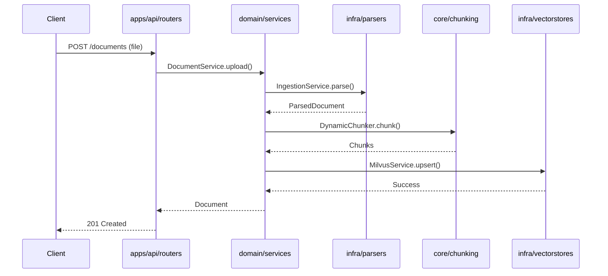

# 🏗️ Architecture Overview

> **Clean Architecture for Production RAG Systems**

Tender-RAG-Lab follows **Clean Architecture** principles to ensure maximum reusability, clear separation of concerns, zero vendor lock-in, and easy migration between use cases.

---

## 🎯 Design Philosophy

This architecture is built on **four core principles**:

1. **🔄 Maximum Reusability** — Core RAG logic can be extracted and reused across projects
2. **🎭 Clear Separation** — Generic logic lives separate from domain-specific code  
3. **📦 Zero Lock-in** — Easy migration between use cases without painful refactors
4. **🚀 Copy-Paste Friendly** — Domain code can be moved between projects seamlessly

> ⚠️ **This structure is intentional.** Violating these rules leads to tight coupling, vendor lock-in, and technical debt.

---

## 📐 High-Level Architecture

```
src/
├── core/      # 🧠 Generic RAG engine (reusable everywhere)
├── infra/     # 🔌 Concrete integrations (Milvus, parsers, storage)
├── domain/    # 💼 Business logic (tender-specific)
└── api/       # 🌐 Application layer (API, UI)
```

### Dependency Rules

```mermaid
flowchart LR
    Apps[🌐 apps/api] --> Domain[💼 domain/tender]
    Domain --> Infra[🔌 infra]
    Domain --> Core[🧠 core]
    Infra --> Core
    
    Core -.x Apps
    Core -.x Domain
    Core -.x Infra
    
    style Core fill:#e1f5e1
    style Infra fill:#e1e5f5
    style Domain fill:#f5e1e1
    style Apps fill:#f5f5e1
```

### ✅ Allowed Dependencies

```
apps    →  domain, core, infra
domain  →  core, infra (interfaces only)
infra   →  core
core    →  NOTHING ⛔
```

### ❌ Forbidden Dependencies

- `core` importing from `domain`, `infra`, or `apps`
- `domain` knowing about FastAPI or HTTP protocols
- `infra` containing business logic
- `apps` accessing database models directly

---

## 🧠 Layer 1: `core/` — RAG Engine

**Purpose:** Generic, reusable RAG logic. Zero domain knowledge. Zero vendor dependencies.

### What Belongs Here

- **RAG Pipeline** — retrieve → rerank → answer orchestration
- **Abstract Interfaces** — `VectorStore`, `EmbeddingClient`, `Chunker`, `LLMClient` Protocols
- **Query Engine** — Pipeline coordination, query rewriting
- **Evaluation** — Citation builder, scoring, metrics (planned)
- **Domain-agnostic utilities** — File helpers, text processing

### What Does NOT Belong

- Concrete Milvus/Pinecone clients
- PDF parsing implementations
- FastAPI dependencies
- Database models
- Business rules
- Tender-specific logic

### Structure

```
core/
├── chunking/        # Document chunking strategies
├── embedding/       # Embedding abstractions
├── llm/             # LLM abstractions
├── index/           # Vector store abstractions
├── ingestion/       # Document parsing abstractions
├── rag/             # RAG pipeline orchestration
├── eval/            # Evaluation framework (planned)
└── utils/           # Generic utilities
```

**Key Principle:** If another project needs this code, it belongs in `core/`.

---

## 🔌 Layer 2: `infra/` — Infrastructure & Adapters

**Purpose:** Concrete implementations of `core/` interfaces. Vendor-specific code.

### What Belongs Here

- **Vector Store Adapters** — Milvus, Pinecone, Weaviate implementations
- **Database Adapters** — Supabase, Postgres, SQLite connections
- **Storage Adapters** — S3, Azure Blob, Supabase Storage
- **Document Parsers** — PyMuPDF, python-docx, Tesseract OCR
- **Language Detectors** — fastText integration
- **Factory Functions** — `create_milvus_service()`, `create_ingestion_service()`

### What Does NOT Belong

- Business logic
- RAG orchestration
- Domain concepts
- HTTP request handling

### Structure

```
infra/
├── vectorstores/
│   ├── factory.py           # Production factories
│   └── milvus/              # Milvus implementation
│       ├── service.py       # MilvusService (facade)
│       ├── connection.py    # Connection management
│       ├── collection.py    # Collection operations
│       ├── data.py          # Data operations
│       └── config.py        # Configuration
└── parsers/
    ├── factory.py           # Parser factories
    ├── pdf/                 # PDF parsing
    ├── docx/                # DOCX parsing
    └── text/                # Language detection
```

**Key Principle:** Implementations of `core/` Protocols live here.

---

## 💼 Layer 3: `domain/` — Business Logic

**Purpose:** Use-case specific logic. **This layer changes between projects.**

### What Belongs Here

- **Domain Entities** — `Tender`, `Lot`, `Document` (SQLAlchemy models)
- **Business Services** — CRUD operations + domain rules
- **Domain Validation** — Business constraints
- **Orchestration** — Coordinating `core` and `infra` for domain needs
- **Domain Schemas** — Pydantic DTOs (TenderCreate, TenderOut)

### What Does NOT Belong

- FastAPI routers
- HTTP Request/Response handling
- Direct vector store or database clients
- Generic RAG logic

### Structure

```
domain/
└── tender/
    ├── entities/            # SQLAlchemy models
    │   ├── tenders.py
    │   ├── lots.py
    │   └── documents.py
    ├── schemas/             # Pydantic DTOs
    │   ├── tenders.py
    │   ├── lots.py
    │   └── documents.py
    ├── services/            # Business services
    │   ├── tenders.py       # TenderService (CRUD)
    │   ├── lots.py
    │   └── documents.py
    ├── search/              # Domain-specific search
    │   └── searcher.py      # TenderSearcher
    └── indexing/            # Domain-specific indexing
        └── indexer.py       # TenderMilvusIndexer
```

**Key Principle:** If it's specific to Tender business, it belongs here.

---

## 🌐 Layer 4: `apps/` — Application Layer

**Purpose:** Thin entry points. HTTP, CLI, UI. **Glues everything together.**

### What Belongs Here

- **FastAPI Routers** — HTTP endpoints
- **Dependency Injection** — `providers.py` with `@lru_cache` singletons
- **Authentication & Middleware** — JWT, rate limiting
- **Request/Response DTOs** — (optional, can reuse domain schemas)
- **Admin UIs** — Milvus Explorer, monitoring dashboards

### What Does NOT Belong

- Business logic
- Direct database or vector store access
- RAG orchestration (use `core/rag/pipeline.py`)
- Document parsing (use `infra/parsers/`)

### Structure

```
api/
├── deps.py              # FastAPI dependencies
├── providers.py         # Singleton service providers
└── routers/
    ├── ingestion.py     # /api/ingestion/*
    ├── tenders.py       # /api/tenders
    ├── lots.py          # /api/lots
    ├── documents.py     # /api/documents
    ├── milvus_route.py  # /api/milvus (admin)
    └── ui.py            # HTML page serving
```

**Key Principle:** Routers should be thin. Delegate to domain services.

---

## 📜 Import Rules (Strictly Enforced)

### ✅ Valid Imports

```python
# apps → domain
from domain.tender.services.tenders import TenderService

# domain → core / infra
from core.rag.pipeline import RagPipeline
from infra.vectorstores.factory import create_milvus_service

# infra → core
from core.index.base import VectorStore
```

### ❌ Invalid Imports

```python
# core importing domain ❌
from domain.tender.entities.tenders import Tender

# domain importing FastAPI ❌
from fastapi import APIRouter

# core importing infra ❌
from infra.vectorstores.milvus import MilvusService
```

---

## 🔀 Example: Document Upload Flow



**Notice:** Each layer stays in its lane. API doesn't parse, Domain doesn't know HTTP details.

---

## 🏷️ Naming Conventions

The same concept exists in multiple layers. **Naming prevents chaos.**

| Layer      | Type                  | Naming Convention      | Example |
|------------|-----------------------|------------------------|---------|
| `infra`    | Database model        | `{Entity}ORM`          | `DocumentORM` |
| `domain`   | Domain entity         | `{Entity}`             | `Document` |
| `domain`   | Business service      | `{Entity}Service`      | `DocumentService` |
| `domain`   | Pydantic DTO          | `{Entity}Create/Out`   | `DocumentCreate` |
| `apps`     | HTTP request/response | `{Entity}Request/Response` | `DocumentRequest` |

**Why?** Prevents confusion when the same concept appears in multiple layers.

---

## 🎓 Guiding Principle

> **"The domain changes. The core survives."**

If you need something in multiple use cases, **it's not domain logic** — it belongs in `core` or `infra`.

---

## 📚 Related Documentation

- [Layer Responsibilities](layers.md) - Deep dive on each layer
- [Design Decisions](decisions.md) - Why we chose this architecture
- [File Placement Guide](where-to-put-code.md) - Decision tree for new code

---

**[⬆️ Documentation Home](../README.md) | [Layer Details ➡️](layers.md)**

*Last updated: 2025-12-18*
