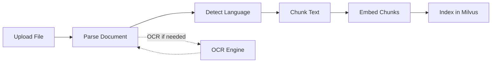

# 🧩 Core Layer: Ingestion

> **Document parsing and preprocessing abstractions**

The ingestion module provides protocols for extracting text from various document formats.

---

## 📍 Location

**Directory:** `src/core/ingestion/`

**Files:**
- `ingestion_service.py` - High-level ingestion orchestration
- `core/` - Protocol definitions

---

## 🎯 Purpose

**What ingestion does:**
- Extract text from PDF, DOCX, TXT files
- OCR for scanned documents
- Language detection (Italian vs English)
- Metadata extraction (title, author, dates)

**Core abstraction:** Parse documents, vendor-agnostic.

---

## 🏗️ Architecture

### Key Protocols

#### DocumentParser Protocol

```python
class DocumentParser(Protocol):
    """Abstract document parser"""
    
    def parse(self, file_path: str) -> list[Page]:
        """Parse document → pages with text"""
        ...
    
    def supports(self, file_path: str) -> bool:
        """Check if parser supports file type"""
        ...
```

**Implementations:**
- `PyPDFParser` - Extract text from digital PDFs
- `UnstructuredParser` - Multi-format (PDF, DOCX, HTML)
- `OCRParser` - Scanned documents with Tesseract

---

#### OCREngine Protocol

```python
class OCREngine(Protocol):
    """Abstract OCR engine"""
    
    def extract_text(self, image: bytes) -> str:
        """Extract text from image"""
        ...
    
    @property
    def languages(self) -> list[str]:
        """Supported languages"""
        ...
```

**Implementations:**
- `TesseractOCR` - Open-source, supports Italian
- `AzureOCR` - Cloud-based, high quality

---

#### LanguageDetector Protocol

```python
class LanguageDetector(Protocol):
    """Abstract language detection"""
    
    def detect(self, text: str) -> str:
        """Detect language code (e.g., 'it', 'en')"""
        ...
    
    def detect_with_confidence(self, text: str) -> tuple[str, float]:
        """Detect with confidence score"""
        ...
```

**Implementations:**
- `LangdetectDetector` - Fast, supports 55 languages
- `FastTextDetector` - More accurate, slower

---

## 📦 IngestionService

High-level orchestration for document processing pipeline.

### Core Methods

```python
class IngestionService:
    def __init__(
        self,
        parser: DocumentParser,
        chunker: DocumentChunker,
        embedding_client: EmbeddingClient,
        language_detector: LanguageDetector | None = None,
        ocr_engine: OCREngine | None = None
    ):
        self._parser = parser
        self._chunker = chunker
        self._embed = embedding_client
        self._lang_detector = language_detector
        self._ocr = ocr_engine
    
    async def process_document(
        self,
        file_path: str,
        metadata: dict | None = None
    ) -> ProcessingResult:
        """Full pipeline: parse → chunk → embed → index"""
        ...
    
    async def parse_only(self, file_path: str) -> list[Page]:
        """Just extract text (no indexing)"""
        ...
```

---

## 🔄 Processing Pipeline

### Standard Flow



### Step-by-Step

1. **Parse:** Extract text from file
2. **Language Detection:** Identify IT/EN
3. **Chunking:** Split into semantic units
4. **Embedding:** Convert to vectors
5. **Indexing:** Store in Milvus

---

## 🎯 Usage Examples

### Example 1: Process PDF Document

```python
from src.infra.factories import get_ingestion_service

service = get_ingestion_service()

# Full pipeline
result = await service.process_document(
    file_path="/path/to/tender.pdf",
    metadata={"tender_id": "123", "source": "ANAC"}
)

print(f"Processed {result.total_chunks} chunks")
print(f"Language detected: {result.language}")
print(f"Total pages: {result.total_pages}")
```

---

### Example 2: Parse Without Indexing

```python
# Just extract text (testing, preview)
pages = await service.parse_only(file_path="tender.pdf")

for i, page in enumerate(pages):
    print(f"Page {i+1}:")
    print(page.text[:200])
    print("---")
```

---

### Example 3: OCR Scanned PDF

```python
# Service automatically detects if OCR is needed
result = await service.process_document(
    file_path="scanned_tender.pdf",
    metadata={"needs_ocr": True}
)

# OCR metadata in result
if result.used_ocr:
    print(f"OCR language: {result.ocr_language}")
    print(f"OCR confidence: {result.ocr_confidence:.2f}")
```

---

### Example 4: Multi-Format Support

```python
# Service automatically selects parser based on extension
files = [
    "tender.pdf",
    "requirements.docx",
    "notes.txt"
]

for file_path in files:
    result = await service.process_document(file_path)
    print(f"{file_path}: {result.total_chunks} chunks")
```

---

## 📄 Supported Formats

### Digital Documents

| Format | Parser | Quality | Speed |
|--------|--------|---------|-------|
| PDF (digital) | PyPDF | ⭐⭐⭐ High | ⚡⚡⚡ Fast |
| DOCX | Unstructured | ⭐⭐⭐ High | ⚡⚡ Medium |
| TXT | Built-in | ⭐⭐⭐ Perfect | ⚡⚡⚡ Instant |
| HTML | Unstructured | ⭐⭐ Good | ⚡⚡ Medium |

### Scanned Documents

| Format | Parser | Quality | Speed |
|--------|--------|---------|-------|
| PDF (scanned) | Tesseract OCR | ⭐⭐ Variable | 🐢 Slow (5-10s/page) |
| Images (PNG, JPG) | Tesseract OCR | ⭐⭐ Variable | 🐢 Slow |

**OCR quality depends on:**
- Image resolution (300+ DPI recommended)
- Text clarity (no artifacts, good contrast)
- Language model (Italian vs English)

---

## 🌍 Language Detection

### Automatic Detection

**IngestionService automatically detects language:**

```python
result = await service.process_document("tender.pdf")

if result.language == "it":
    print("Italian document detected")
elif result.language == "en":
    print("English document detected")
```

### Manual Override

```python
# Force specific language
result = await service.process_document(
    file_path="tender.pdf",
    metadata={"language": "it"}  # Skip detection
)
```

### Supported Languages

**Langdetect (default):**
- 55 languages including Italian, English, Spanish, French

**Detection accuracy:**
- ⭐⭐⭐ Excellent (>95%) for text >100 chars
- ⭐⭐ Good (>85%) for text >50 chars
- ⭐ Poor (<70%) for very short text

**Recommendation:** Detect at document level, not chunk level.

---

## 🛠️ Implementation Details

### Page Schema

```python
@dataclass
class Page:
    number: int              # Page index (1-based)
    text: str                # Extracted text
    metadata: dict           # {fonts, images_count, ...}
```

### ProcessingResult Schema

```python
@dataclass
class ProcessingResult:
    total_pages: int
    total_chunks: int
    language: str
    used_ocr: bool
    processing_time: float
    metadata: dict
```

### Error Handling

**Common errors:**

1. **File not found:**
   ```python
   try:
       result = await service.process_document("missing.pdf")
   except FileNotFoundError:
       print("File does not exist")
   ```

2. **Unsupported format:**
   ```python
   if not parser.supports(file_path):
       raise ValueError(f"Unsupported format: {file_path}")
   ```

3. **OCR failure:**
   ```python
   if result.used_ocr and result.ocr_confidence < 0.5:
       logger.warning("Low OCR quality, results may be unreliable")
   ```

---

## 🚀 Performance Best Practices

### 1. Batch Processing

**Process multiple documents efficiently:**

```python
import asyncio

files = ["tender1.pdf", "tender2.pdf", "tender3.pdf"]

# Parallel processing (limit concurrency)
sem = asyncio.Semaphore(3)  # Max 3 concurrent

async def process_with_limit(file_path):
    async with sem:
        return await service.process_document(file_path)

results = await asyncio.gather(*[process_with_limit(f) for f in files])
```

---

### 2. Caching Parsed Text

**Avoid re-parsing same document:**

```python
from functools import lru_cache

@lru_cache(maxsize=100)
def cached_parse(file_path: str) -> list[Page]:
    return parser.parse(file_path)
```

---

### 3. OCR Optimization

**OCR is slow (~5s per page). Optimize:**

1. **Detect if OCR is needed:**
   ```python
   # Check if PDF has text layer
   pages = parser.parse("document.pdf")
   if not any(p.text.strip() for p in pages):
       # No text → use OCR
       pages = ocr_parser.parse("document.pdf")
   ```

2. **Limit OCR pages:**
   ```python
   # Only OCR first 10 pages (preview)
   pages = ocr_parser.parse("document.pdf", max_pages=10)
   ```

3. **Use cloud OCR for high volume:**
   - Azure Computer Vision
   - Google Cloud Vision
   - AWS Textract

---

## 🐛 Common Issues

### Issue: Garbled Text from PDF

**Symptom:** Extracted text has weird characters

**Causes:**
- Embedded fonts not supported
- Encrypted PDF
- Scanned PDF (needs OCR)

**Solutions:**
1. **Try different parser:**
   ```python
   # Try Unstructured instead of PyPDF
   parser = UnstructuredParser()
   ```

2. **Use OCR:**
   ```python
   ocr_parser = OCRParser(engine=tesseract)
   pages = ocr_parser.parse("document.pdf")
   ```

---

### Issue: Slow Processing

**Symptom:** Takes >30s per document

**Causes:**
- Large PDF (>100 pages)
- OCR enabled
- Embedding batching not used

**Solutions:**
1. **Increase batch size:**
   ```python
   # Embed in larger batches
   EMBED_BATCH_SIZE = 64  # Instead of 16
   ```

2. **Skip OCR if not needed:**
   ```python
   # Only use OCR for scanned docs
   if has_text_layer:
       parser = PyPDFParser()
   else:
       parser = OCRParser()
   ```

3. **Process async:**
   ```python
   # Don't block on indexing
   asyncio.create_task(service.process_document(file_path))
   ```

---

### Issue: Wrong Language Detected

**Symptom:** Italian detected as Spanish

**Causes:**
- Short text sample
- Mixed languages
- Similar language families

**Solutions:**
1. **Use longer text sample:**
   ```python
   # Use full document text, not just first page
   full_text = " ".join([p.text for p in pages])
   language = detector.detect(full_text)
   ```

2. **Manual override:**
   ```python
   metadata = {"language": "it"}  # Force Italian
   ```

3. **Use better detector:**
   ```python
   # FastText is more accurate
   detector = FastTextDetector()
   ```

---

## 🚀 Adding a New Parser

**Example:** Add support for Excel files.

### 1. Implement Protocol (Infra Layer)

```python
# src/infra/parsers/excel_parser.py
import openpyxl

class ExcelParser:
    """Parse Excel files"""
    
    def parse(self, file_path: str) -> list[Page]:
        workbook = openpyxl.load_workbook(file_path)
        pages = []
        
        for i, sheet in enumerate(workbook.worksheets):
            # Extract text from cells
            text = "\n".join([
                " ".join([str(cell.value or "") for cell in row])
                for row in sheet.rows
            ])
            
            pages.append(Page(
                number=i+1,
                text=text,
                metadata={"sheet_name": sheet.title}
            ))
        
        return pages
    
    def supports(self, file_path: str) -> bool:
        return file_path.lower().endswith((".xlsx", ".xls"))
```

### 2. Add to Factory

```python
# src/infra/factories/parser_factory.py
from src.infra.parsers.excel_parser import ExcelParser

def get_document_parser(file_path: str) -> DocumentParser:
    if file_path.endswith((".xlsx", ".xls")):
        return ExcelParser()
    elif file_path.endswith(".pdf"):
        return PyPDFParser()
    # ... other formats
```

### 3. Use in Service

```python
# Automatically selects ExcelParser
result = await service.process_document("data.xlsx")
```

**See:** [Adding Integrations](../infra/adding-integrations.md)

---

## 📚 Related Documentation

- [Core Layer Overview](README.md)
- [Chunking Module](chunking.md) - Split parsed text
- [Domain: Ingestion](../domain/ingestion.md) - Business logic layer
- [Infra: Parsers](../infra/parsers.md) - Concrete implementations

---

**[⬅️ Indexing](indexing.md) | [⬆️ Documentation Home](../README.md) | [RAG ➡️](rag.md)**

*Last updated: 2025-12-18*
