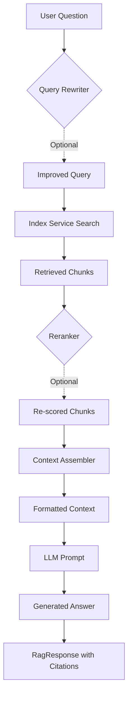

# 🧩 Core Layer: RAG

> **End-to-end Retrieval-Augmented Generation pipeline**

The RAG module orchestrates the complete question-answering flow: query → retrieve → generate.

---

## 📍 Location

**Directory:** `src/core/rag/`

**Files:**
- `pipeline.py` - `RagPipeline` orchestration
- `rewriter.py` - Query improvement
- `assembler.py` - Context management
- `rerankers.py` - Result re-scoring
- `models.py` - Data models

---

## 🎯 Purpose

**What RAG does:**
- Accept natural language questions
- Retrieve relevant document chunks
- Generate accurate answers with citations
- Stream responses to UI
- Handle multi-turn conversations

**Core abstraction:** Question → Answer pipeline, vendor-agnostic.

---

## 🏗️ Architecture

### RagPipeline

Main orchestrator connecting all components.

```python
class RagPipeline:
    def __init__(
        self,
        index_service: IndexService,
        llm_client: LLMClient,
        reranker: Reranker | None = None,
        query_rewriter: QueryRewriter | None = None,
        context_assembler: ContextAssembler | None = None
    ):
        self._index = index_service
        self._llm = llm_client
        self._reranker = reranker
        self._rewriter = query_rewriter
        self._assembler = context_assembler
    
    async def query(
        self,
        question: str,
        collection_name: str,
        top_k: int = 10,
        stream: bool = False
    ) -> RagResponse:
        """Execute full RAG pipeline"""
        ...
```

---

## 🔄 Pipeline Flow

### Standard RAG Flow



### Step-by-Step

1. **Query Rewriting (Optional):** Improve query quality
2. **Retrieval:** Search vector database (hybrid search)
3. **Re-ranking (Optional):** Re-score results with better model
4. **Context Assembly:** Format retrieved chunks
5. **Prompt Construction:** Build LLM prompt with context
6. **Answer Generation:** LLM generates response
7. **Citation Extraction:** Link answer to source chunks

---

## 🎯 Usage Examples

### Example 1: Basic RAG Query

```python
from src.infra.factories import get_rag_pipeline

pipeline = get_rag_pipeline()

response = await pipeline.query(
    question="Quali sono i requisiti tecnici per partecipare?",
    collection_name="tender_chunks",
    top_k=10
)

print(f"Answer: {response.answer}")
print(f"Sources: {len(response.sources)} chunks")
print(f"Confidence: {response.confidence:.2f}")

# Print citations
for i, source in enumerate(response.sources, 1):
    print(f"\n[{i}] {source.text[:100]}...")
    print(f"    Doc: {source.metadata['doc_id']}, Page: {source.metadata['page']}")
```

---

### Example 2: Streaming Response

```python
# Stream tokens to UI in real-time
async for chunk in pipeline.stream_query(
    question="Describe the tender scope",
    collection_name="tender_chunks"
):
    if chunk.type == "token":
        print(chunk.content, end="", flush=True)
    elif chunk.type == "source":
        print(f"\nSource: {chunk.content}")
```

---

### Example 3: Multi-Turn Conversation

```python
# Maintain conversation history
conversation = []

# Turn 1
response1 = await pipeline.query(
    question="What is the tender budget?",
    collection_name="tender_chunks"
)
conversation.append({"role": "user", "content": "What is the tender budget?"})
conversation.append({"role": "assistant", "content": response1.answer})

# Turn 2 (with context)
response2 = await pipeline.query(
    question="How does that compare to previous years?",
    collection_name="tender_chunks",
    conversation_history=conversation  # Include previous context
)
```

---

### Example 4: Custom Configuration

```python
response = await pipeline.query(
    question="Tender requirements",
    collection_name="tender_chunks",
    top_k=20,                    # Retrieve more chunks
    rerank=True,                 # Enable re-ranking
    rerank_top_k=5,              # Final top-5
    temperature=0.1,             # More deterministic
    max_tokens=300,              # Shorter answer
    search_strategy="hybrid"     # Semantic + keyword
)
```

---

## 🧩 Components

### 1. QueryRewriter

**Purpose:** Improve query quality before retrieval.

```python
class QueryRewriter:
    def __init__(self, llm_client: LLMClient):
        self._llm = llm_client
    
    async def rewrite(self, query: str) -> str:
        """Expand and clarify query"""
        prompt = f"""Improve this search query to be more specific and detailed:

Original: {query}

Improved:"""
        return await self._llm.agenerate(prompt, temperature=0.5)
```

**Example:**
- Input: "tender requirements"
- Output: "detailed technical and administrative requirements for tender participation including qualifications and certifications"

**When to use:**
- ✅ Short, vague queries
- ✅ Conversational follow-ups ("what about this?")
- ❌ Already specific queries (adds latency)

---

### 2. ContextAssembler

**Purpose:** Format retrieved chunks into coherent context.

```python
class ContextAssembler:
    def assemble(
        self,
        chunks: list[SearchResult],
        max_tokens: int = 3000
    ) -> str:
        """Format chunks with deduplication and truncation"""
        
        # 1. Deduplicate similar chunks
        unique_chunks = self._deduplicate(chunks)
        
        # 2. Sort by relevance
        sorted_chunks = sorted(unique_chunks, key=lambda x: x.score, reverse=True)
        
        # 3. Format with citations
        context = ""
        for i, chunk in enumerate(sorted_chunks, 1):
            context += f"[{i}] {chunk.text}\n\n"
            
            # Check token limit
            if self._count_tokens(context) > max_tokens:
                break
        
        return context
```

**Features:**
- Deduplication (remove near-duplicate chunks)
- Token budget management
- Citation numbering
- Relevance sorting

---

### 3. Reranker

**Purpose:** Re-score results with more expensive model.

**Available implementations:**

#### CrossEncoderReranker

Uses sentence-transformer cross-encoder.

```python
from src.core.rag.rerankers import CrossEncoderReranker

reranker = CrossEncoderReranker(
    model="cross-encoder/ms-marco-MiniLM-L-6-v2"
)

# Re-rank top-100 to top-10
reranked = await reranker.rerank(
    query="tender requirements",
    results=initial_results,  # Top-100 from search
    top_k=10
)
```

**Performance:** ~200ms for 100 results

#### LLMReranker

Uses LLM for relevance scoring.

```python
from src.core.rag.rerankers import LLMReranker

reranker = LLMReranker(llm_client=llm)

reranked = await reranker.rerank(
    query="tender requirements",
    results=initial_results,
    top_k=10
)
```

**Performance:** ~2s for 100 results (slower but more accurate)

**Comparison:**

| Reranker | Speed | Quality | Cost |
|----------|-------|---------|------|
| None | ⚡⚡⚡ Instant | ⭐⭐ Basic | Free |
| CrossEncoder | ⚡⚡ Fast | ⭐⭐⭐ Good | Free |
| LLM | 🐢 Slow | ⭐⭐⭐⭐ Excellent | $$ (API) |

---

## 📊 Response Models

### RagResponse

```python
@dataclass
class RagResponse:
    answer: str                        # Generated answer
    sources: list[SearchResult]        # Source chunks with citations
    confidence: float                  # Confidence score (0-1)
    retrieval_time: float              # Search latency (ms)
    generation_time: float             # LLM latency (ms)
    total_time: float                  # End-to-end latency (ms)
    metadata: dict                     # Additional info
```

### StreamChunk

```python
@dataclass
class StreamChunk:
    type: str              # "token", "source", "metadata"
    content: str           # Chunk content
    metadata: dict | None  # Optional metadata
```

---

## 🚀 Performance Optimization

### 1. Retrieval Optimization

**Reduce retrieval latency:**

```python
# Use filters to narrow search space
response = await pipeline.query(
    question="...",
    collection_name="tender_chunks",
    filters={"doc_id": "tender-123"}  # Search only 1 tender
)
```

**Effect:** Search time: 500ms → 50ms

---

### 2. Re-ranking Strategy

**Choose re-ranker based on requirements:**

```python
# Fast (no re-ranking)
pipeline = RagPipeline(
    index_service=index,
    llm_client=llm,
    reranker=None  # Skip re-ranking
)

# Balanced (cross-encoder)
pipeline = RagPipeline(
    index_service=index,
    llm_client=llm,
    reranker=CrossEncoderReranker()  # +200ms
)

# Best quality (LLM)
pipeline = RagPipeline(
    index_service=index,
    llm_client=llm,
    reranker=LLMReranker(llm)  # +2s
)
```

---

### 3. Context Size Management

**Limit context to avoid slow LLM generation:**

```python
# Smaller context = faster generation
assembler = ContextAssembler(max_tokens=2000)  # Instead of 4000

pipeline = RagPipeline(
    ...,
    context_assembler=assembler
)
```

**Guidelines:**
- 1000 tokens: Very fast, may lack context
- 2000 tokens: Balanced (recommended)
- 4000 tokens: Comprehensive, slower
- 8000+ tokens: Very slow, expensive

---

### 4. Streaming for UX

**Use streaming for better perceived performance:**

```python
# Non-streaming: user waits 3-5s for full answer
response = await pipeline.query(question, ...)

# Streaming: user sees first tokens in 500ms
async for chunk in pipeline.stream_query(question, ...):
    display(chunk)  # Real-time display
```

---

## 🐛 Common Issues

### Issue: Irrelevant Answers

**Symptom:** Answer doesn't match question

**Causes:**
- Poor retrieval quality
- Weak context assembly
- LLM hallucination

**Solutions:**
1. **Enable re-ranking:**
   ```python
   pipeline = RagPipeline(..., reranker=CrossEncoderReranker())
   ```

2. **Increase top_k:**
   ```python
   response = await pipeline.query(..., top_k=20)
   ```

3. **Use query rewriter:**
   ```python
   pipeline = RagPipeline(..., query_rewriter=QueryRewriter(llm))
   ```

4. **Lower LLM temperature:**
   ```python
   response = await pipeline.query(..., temperature=0.1)
   ```

---

### Issue: Slow Response Time

**Symptom:** Takes >5s to respond

**Breakdown:**
- Retrieval: ~500ms
- Re-ranking: ~200ms (if enabled)
- LLM generation: ~2-4s
- Total: ~3-5s

**Solutions:**
1. **Use faster LLM:**
   ```python
   # Ollama: llama3.2 instead of llama3.1
   # OpenAI: gpt-4o-mini instead of gpt-4o
   ```

2. **Reduce context size:**
   ```python
   assembler = ContextAssembler(max_tokens=1500)
   ```

3. **Skip re-ranking:**
   ```python
   reranker=None  # Save 200ms
   ```

4. **Use streaming:**
   ```python
   async for chunk in pipeline.stream_query(...):
       # Faster perceived performance
   ```

---

### Issue: No Sources Cited

**Symptom:** Answer provided but no citations

**Causes:**
- No results found in retrieval
- Context assembler filtering out all results

**Solutions:**
1. **Check retrieval:**
   ```python
   results = await index_service.search(query, top_k=10)
   if not results:
       print("No documents found!")
   ```

2. **Lower similarity threshold:**
   ```python
   # Include lower-scoring results
   results = [r for r in results if r.score > 0.3]  # Instead of 0.5
   ```

3. **Use hybrid search:**
   ```python
   search_strategy="hybrid"  # Better recall
   ```

---

## 🎓 Advanced Patterns

### Pattern 1: Self-Querying RAG

**Dynamically generate filters from query:**

```python
# Extract filters from natural language
query = "Show me tenders from Milan with budget over 1M EUR"

# LLM extracts: {"location": "Milan", "budget": {"$gte": 1000000}}
filters = await extract_filters_from_query(query, llm)

# Use filters in search
response = await pipeline.query(
    question=query,
    collection_name="tender_chunks",
    filters=filters
)
```

---

### Pattern 2: Multi-Hop Reasoning

**Answer requires multiple retrieval steps:**

```python
# Question: "How does Milan's budget compare to Rome?"

# Step 1: Retrieve Milan tender
milan_results = await index_service.search(
    "Milan tender budget",
    filters={"location": "Milan"}
)

# Step 2: Retrieve Rome tender
rome_results = await index_service.search(
    "Rome tender budget",
    filters={"location": "Rome"}
)

# Step 3: Compare in LLM
context = assemble_context(milan_results + rome_results)
answer = await llm.agenerate(comparison_prompt)
```

---

### Pattern 3: Agentic RAG

**Let LLM decide when to retrieve:**

```python
async def agentic_rag(question: str):
    conversation = [{"role": "user", "content": question}]
    
    while True:
        # LLM decides: answer or retrieve
        action = await llm.decide_action(conversation)
        
        if action == "retrieve":
            query = await llm.generate_search_query(conversation)
            results = await index_service.search(query)
            conversation.append({"role": "system", "content": format_results(results)})
        
        elif action == "answer":
            answer = await llm.agenerate(format_prompt(conversation))
            return answer
```

---

## 📚 Related Documentation

- [Core Layer Overview](README.md)
- [Indexing Module](indexing.md) - Retrieval layer
- [LLM Module](llm.md) - Answer generation
- [Domain: RAG](../domain/rag.md) - Business logic

---

**[⬅️ Ingestion](ingestion.md) | [⬆️ Documentation Home](../README.md) | [Infra Layer ➡️](../infra/README.md)**

*Last updated: 2025-12-18*
